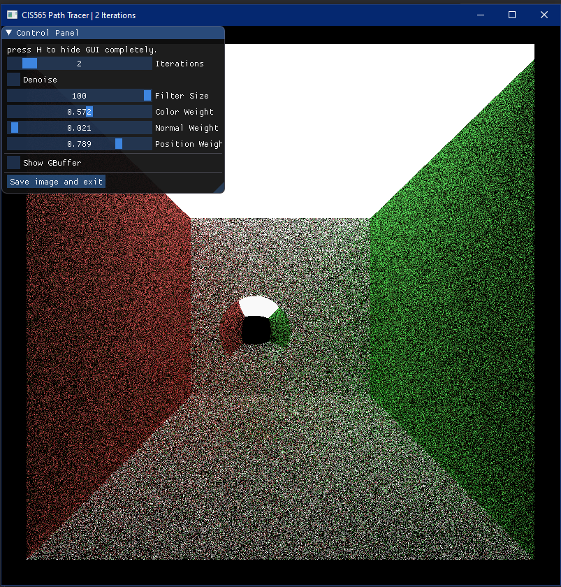
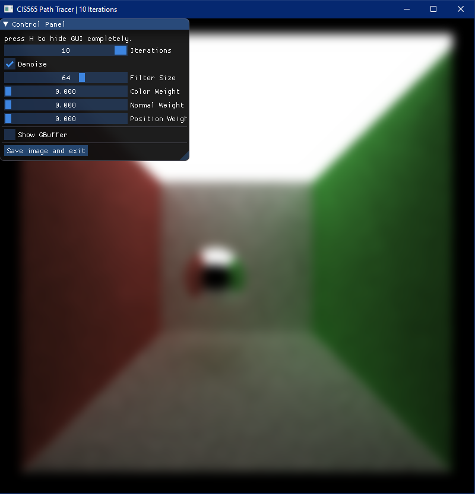
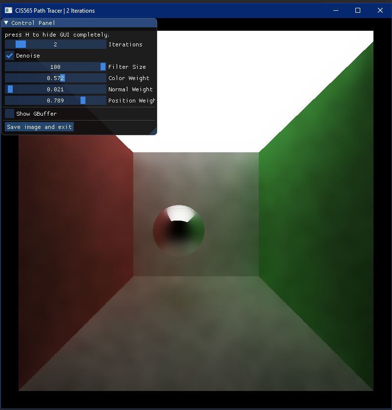
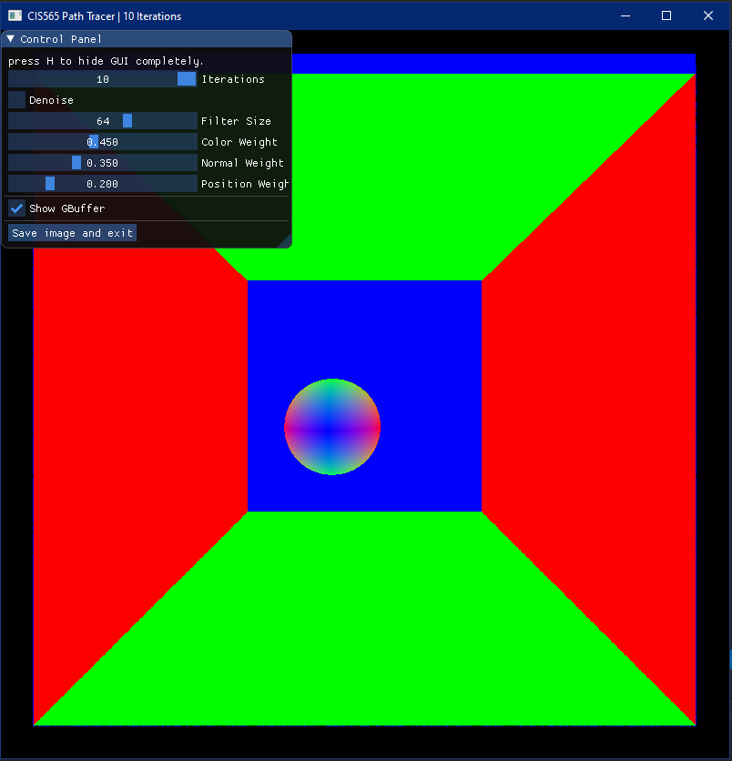
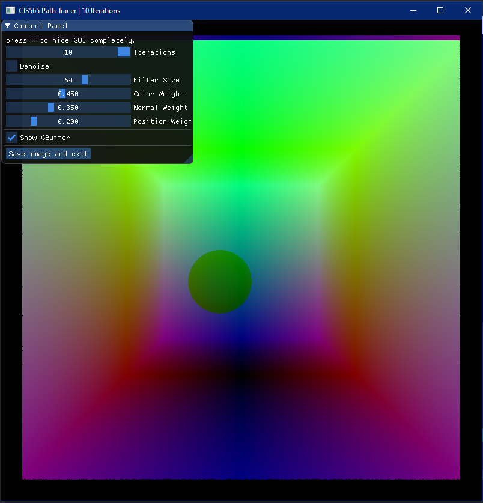
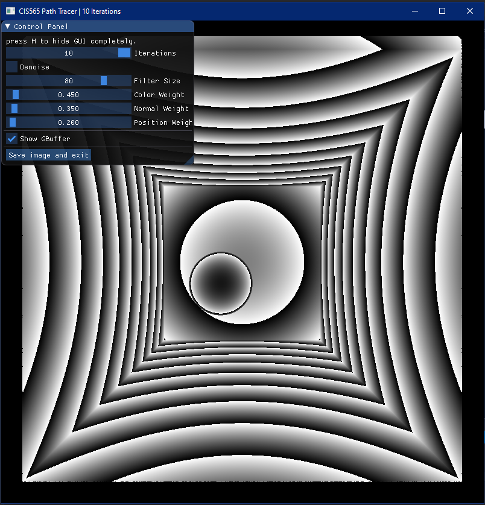

- [Proj 3 CUDA Path Tracer - Instructions](#proj-3-cuda-path-tracer---instructions)
  - [Contents](#contents)
  - [Running the code](#running-the-code)
    - [Controls](#controls)
  - [Requirements](#requirements)
    - [Part 1 - Core Features](#part-1---core-features)
    - [Part 2 - Make Your Pathtracer Unique!](#part-2---make-your-pathtracer-unique)
      - [Visual Improvements](#visual-improvements)
      - [Mesh Improvements](#mesh-improvements)
      - [Performance Improvements](#performance-improvements)
  - [Base Code Tour](#base-code-tour)
    - [Generating random numbers](#generating-random-numbers)
    - [Imperfect specular lighting](#imperfect-specular-lighting)
    - [Hierarchical spatial datastructures](#hierarchical-spatial-datastructures)
    - [Handling Long-Running CUDA Threads](#handling-long-running-cuda-threads)
    - [Scene File Format](#scene-file-format)
  - [Third-Party Code Policy](#third-party-code-policy)
  - [README](#readme)
    - [Analysis](#analysis)
  - [Submit](#submit)
  - [References](#references)
- [Project 4 CUDA Denoiser - Instructions](#project-4-cuda-denoiser---instructions)
  - [Building on Project 3 CUDA Path Tracer](#building-on-project-3-cuda-path-tracer)
    - [Working with Git](#working-with-git)
  - [Contents](#contents-1)
  - [Running the code](#running-the-code-1)
    - [Controls](#controls-1)
- [Requirements](#requirements-1)
  - [Part 1 - Read!](#part-1---read)
  - [Part 2 - A-trous wavelet filter](#part-2---a-trous-wavelet-filter)
  - [Base Code Tour](#base-code-tour-1)
  - [Part 3 - Performance Analysis](#part-3---performance-analysis)
- [Extra Credit](#extra-credit)
  - [G-Buffer optimization](#g-buffer-optimization)
  - [Comparing A-trous and Gaussian filtering](#comparing-a-trous-and-gaussian-filtering)
  - [Shared Memory Filtering](#shared-memory-filtering)
  - [Implement Temporal Sampling](#implement-temporal-sampling)
- [Submission](#submission)
- [References](#references-1)

# Proj 3 CUDA Path Tracer - Instructions

This is due **Monday October 4th** at 11:59pm.

This project involves a significant bit of running time to generate high-quality images, so be sure to take that into account. You will receive an additional 2 days (due Wednesday, October 6th) for "README and Scene" only updates. However, the standard project requirements for READMEs still apply for the October 4th deadline. You may use these two extra days to improve your images, charts, performance analysis, etc.

If you plan to use late days on this project (which we recommend), they will apply to the October 4th deadline. Once you have used your extra days and submitted the project, you will recieve the additional 2 days for "README and Scene" updates only.

[Link to "Pathtracing Primer" Slides](https://1drv.ms/p/s!AiLXbdZHgbemhe02FCjXap5whSuYBQ?e=QxnlpM)

**Summary:**

In this project, you'll implement a CUDA-based path tracer capable of rendering globally-illuminated images very quickly.  Since in this class we are concerned with working in GPU programming, performance, and the generation of actual beautiful images (and not with mundane programming tasks like I/O), this project includes base code for loading a scene description file, described below, and various other things that generally make up a framework for previewing and saving images.

The core renderer is left for you to implement. Finally, note that, while this base code is meant to serve as a strong starting point for a CUDA path tracer, you are not required to use it if you don't want to. You may also change any part of the base code as you please. **This is YOUR project.**

**Recommendations:**

* Every image you save should automatically get a different filename. Don't delete all of them! For the benefit of your README, keep a bunch of them around so you can pick a few to document your progress at the end. Outtakes are highly appreciated!
* Remember to save your debug images - these will make for a great README.
* Also remember to save and share your bloopers. Every image has a story to tell and we want to hear about it.

## Contents

* `src/` C++/CUDA source files.
* `scenes/` Example scene description files.
* `img/` Renders of example scene description files. (These probably won't match precisely with yours.)
* `external/` Includes and static libraries for 3rd party libraries.

## Running the code

The main function requires a scene description file. Call the program with one as an argument: `cis565_path_tracer scenes/sphere.txt`. (In Visual Studio, `../scenes/sphere.txt`.)

If you are using Visual Studio, you can set this in the `Debugging > Command Arguments` section in the `Project Properties`. Make sure you get the path right - read the console for errors.

### Controls

* Esc to save an image and exit.
* S to save an image. Watch the console for the output filename.
* Space to re-center the camera at the original scene lookAt point.
* Left mouse button to rotate the camera.
* Right mouse button on the vertical axis to zoom in/out.
* Middle mouse button to move the LOOKAT point in the scene's X/Z plane.

## Requirements

In this project, you are given code for:

* Loading and reading the scene description format.
* Sphere and box intersection functions.
* Support for saving images.
* Working CUDA-GL interop for previewing your render while it's running.
* A skeleton renderer with:
  * Naive ray-scene intersection.
  * A "fake" shading kernel that colors rays based on the material and intersection properties but does NOT compute a new ray based on the BSDF.

**Ask in piazza for clarifications.**

### Part 1 - Core Features

Follow all the same guidelines for README and Pull Request for your mid-project submission, except that you should create a branch called `mid-project-submission` and open a pull request with that branch. This way you can continue to work on your projects in the master branch.

You will need to implement the following features:

* A shading kernel with BSDF evaluation for:
  * Ideal Diffuse surfaces (using provided cosine-weighted scatter function, see below.) [PBRT 8.3].
  * Perfectly specular-reflective (mirrored) surfaces (e.g. using `glm::reflect`).
  * See notes on diffuse/specular in `scatterRay` and on imperfect specular below.
* Path continuation/termination using Stream Compaction from Project 2.
* After you have a [basic pathtracer up and running](img/REFERENCE_cornell.5000samp.png),
implement a means of making rays/pathSegments/intersections contiguous in memory by material type. This should be easily toggleable.
  * Consider the problems with coloring every path segment in a buffer and performing BSDF evaluation using one big shading kernel: different materials/BSDF evaluations within the kernel will take different amounts of time to complete.
  * Sort the rays/path segments so that rays/paths interacting with the same material are contiguous in memory before shading. How does this impact performance? Why?
* A toggleable option to cache the first bounce intersections for re-use across all subsequent iterations. Provide performance benefit analysis across different max ray depths.

### Part 2 - Make Your Pathtracer Unique!

The following features are a non-exhaustive list of features you can choose from based on your own interests and motivation. Each feature has an associated score (represented in emoji numbers, eg. :five:).

**You are required to implement additional features of your choosing from the list below totalling up to minimum 10 score points.**

An example set of optional features is:

* Mesh Loading - :four: points
* Refraction - :two: points
* Anti-aliasing - :two: points
* Final rays post processing - :three: points

This list is not comprehensive. If you have a particular idea you would like to implement (e.g. acceleration structures, etc.), please post on Piazza.

**Extra credit**: implement more features on top of the above required ones, with point value up to +20/100 at the grader's discretion (based on difficulty and coolness), generally .

#### Visual Improvements

* :two: Refraction (e.g. glass/water) [PBRT 8.2] with Frensel effects using [Schlick's approximation](https://en.wikipedia.org/wiki/Schlick's_approximation) or more accurate methods [PBRT 8.5]. You can use `glm::refract` for Snell's law.
  * Recommended but not required: non-perfect specular surfaces. (See below.)
* :two: Physically-based depth-of-field (by jittering rays within an aperture). [PBRT 6.2.3]
* :two: Stochastic Sampled Antialiasing. See Paul Bourke's [notes](http://paulbourke.net/miscellaneous/aliasing/). Keep in mind how this influences the first-bounce cache in part 1.
* :four: Procedural Shapes & Textures.
  * You must generate a minimum of two different complex shapes procedurally. (Not primitives)
  * You must be able to shade object with a minimum of two different textures
* :five: (:six: if combined with Arbitrary Mesh Loading) Texture mapping [PBRT 10.4] and Bump mapping [PBRT 9.3].
  * Implement file-loaded textures AND a basic procedural texture
  * Provide a performance comparison between the two
* :two: Direct lighting (by taking a final ray directly to a random point on an emissive object acting as a light source). Or more advanced [PBRT 15.1.1].
* :four: Subsurface scattering [PBRT 5.6.2, 11.6].
* :three: [Better hemisphere sampling methods](https://cseweb.ucsd.edu/classes/sp17/cse168-a/CSE168_07_Random.pdf)
* :three: Some method of defining object motion, and motion blur by averaging samples at different times in the animation.
* :three: Use final rays to apply post-processing shaders. Please post your ideas on Piazza before starting.

#### Mesh Improvements

* :four: Arbitrary mesh loading and rendering (e.g. glTF 2.0 (preferred) or `obj` files) with toggleable bounding volume intersection culling
  * You can find models online or export them from your favorite 3D modeling application.  With approval, you may use a third-party loading code to bring the data into C++.
    * [tinygltf](https://github.com/syoyo/tinygltf/) is highly recommended for glTF.
    * [tinyObj](https://github.com/syoyo/tinyobjloader) is highly recommended for OBJ.
    * [obj2gltf](https://github.com/CesiumGS/obj2gltf) can be used to convert OBJ to glTF files. You can find similar projects for FBX and other formats.
  * You can use the triangle intersection function `glm::intersectRayTriangle`.
  * Bounding volume intersection culling: reduce the number of rays that have to be checked against the entire mesh by first checking rays against a volume that completely bounds the mesh. For full credit, provide performance analysis with and without this optimization.
  > Note: This goes great with the Hierarcical Spatial Data Structures.

#### Performance Improvements

* :two: Work-efficient stream compaction using shared memory across multiple blocks. (See [*GPU Gems 3*, Chapter 39](https://developer.nvidia.com/gpugems/gpugems3/part-vi-gpu-computing/chapter-39-parallel-prefix-sum-scan-cuda).)
  * Note that you will NOT receieve extra credit for this if you implemented shared memory stream compaction as extra credit for Project 2.
* :six: Hierarchical spatial data structures - for better ray/scene intersection testing
  * Octree recommended - this feature is more about traversal on the GPU than perfect tree structure
  * CPU-side data structure construction is sufficient - GPU-side construction was a [final project.](https://github.com/jeremynewlin/Accel)
  * Make sure this is toggleable for performance comparisons
  * If implemented in conjunction with Arbitrary mesh loading (required for this year), this qualifies as the toggleable bounding volume intersection culling.
  * See below for more resources
* :six: [Wavefront pathtracing](https://research.nvidia.com/publication/megakernels-considered-harmful-wavefront-path-tracing-gpus):
Group rays by material without a sorting pass. A sane implementation will require considerable refactoring, since every supported material suddenly needs its own kernel.
* :five: [*Open Image AI Denoiser*](https://github.com/OpenImageDenoise/oidn) Open Image Denoiser is an image denoiser which works by applying a filter on Monte-Carlo-based pathtracer output. The denoiser runs on the CPU and takes in path tracer output from 1spp to beyond. In order to get full credit for this, you must pass in at least one extra buffer along with the [raw "beauty" buffer](https://github.com/OpenImageDenoise/oidn#open-image-denoise-overview). **Ex:** Beauty + Normals.
  * Part of this extra credit is figuring out where the filter should be called, and how you should manage the data for the filter step.
  * It is important to note that integrating this is not as simple as it may seem at first glance. Library integration, buffer creation, device compatibility, and more are all real problems which will appear, and it may be hard to debug them. Please only try this if you have finished the Part 2 early and would like extra points. While this is difficult, the result would be a significantly faster resolution of the path traced image.
* :five: Re-startable Path tracing: Save some application state (iteration number, samples so far, acceleration structure) so you can start and stop rendering instead of leaving your computer running for hours at end (which will happen in this project)
* :five: Switch the project from using CUDA-OpenGL Interop to using CUDA-Vulkan interop (this is a really great one for those of you interested in doing Vulkan). Talk to Janine or Shehzan if you are planning to pursue this.

For each extra feature, you must provide the following analysis:

* Overview write-up of the feature along with before/after images.
* Performance impact of the feature
* If you did something to accelerate the feature, what did you do and why?
* Compare your GPU version of the feature to a HYPOTHETICAL CPU version (you don't have to implement it!)? Does it benefit or suffer from being implemented on the GPU?
* How might this feature be optimized beyond your current implementation?

## Base Code Tour

You'll be working in the following files. Look for important parts of the code:

* Search for `CHECKITOUT`.
* You'll have to implement parts labeled with `TODO`. (But don't let these constrain you - you have free rein!)

* `src/pathtrace.cu`: path tracing kernels, device functions, and calling code
  * `pathtraceInit` initializes the path tracer state - it should copy scene data (e.g. geometry, materials) from `Scene`.
  * `pathtraceFree` frees memory allocated by `pathtraceInit`
  * `pathtrace` performs one iteration of the rendering - it handles kernel launches, memory copies, transferring some data, etc.
    * See comments for a low-level path tracing recap.
* `src/intersections.h`: ray intersection functions
  * `boxIntersectionTest` and `sphereIntersectionTest`, which take in a ray and a geometry object and return various properties of the intersection.
* `src/interactions.h`: ray scattering functions
  * `calculateRandomDirectionInHemisphere`: a cosine-weighted random direction in a hemisphere. Needed for implementing diffuse surfaces.
  * `scatterRay`: this function should perform all ray scattering, and will call `calculateRandomDirectionInHemisphere`. See comments for details.
* `src/main.cpp`: you don't need to do anything here, but you can change the program to save `.hdr` image files, if you want (for postprocessing).
* `stream_compaction`: A dummy folder into which you should place your Stream Compaction implementation from Project 2. It should be sufficient to copy the files from [here](https://github.com/CIS565-Fall-2018/Project2-Stream-Compaction/tree/master/stream_compaction)

### Generating random numbers

```cpp
thrust::default_random_engine rng(hash(index));
thrust::uniform_real_distribution<float> u01(0, 1);
float result = u01(rng);
```

There is a convenience function for generating a random engine using a
combination of index, iteration, and depth as the seed:

```cpp
thrust::default_random_engine rng = makeSeededRandomEngine(iter, index, path.remainingBounces);
```

### Imperfect specular lighting

In path tracing, like diffuse materials, specular materials are simulated using a probability distribution instead computing the strength of a ray bounce based on angles.

Equations 7, 8, and 9 of [*GPU Gems 3*, Chapter 20](https://developer.nvidia.com/gpugems/gpugems3/part-iii-rendering/chapter-20-gpu-based-importance-sampling) give the formulas for generating a random specular ray. (Note that there is a typographical error: χ in the text = ξ in the formulas.)

Also see the notes in `scatterRay` for probability splits between diffuse/specular/other material types.

See also: PBRT 8.2.2.

### Hierarchical spatial datastructures

One method for avoiding checking a ray against every primitive in the scene or every triangle in a mesh is to bin the primitives in a hierarchical spatial datastructure such as an [octree](https://en.wikipedia.org/wiki/Octree).

Ray-primitive intersection then involves recursively testing the ray against bounding volumes at different levels in the tree until a leaf containing a subset of primitives/triangles is reached, at which point the ray is checked against all the primitives/triangles in the leaf.

* We highly recommend building the datastructure on the CPU and encapsulating the tree buffers into their own struct, with its own dedicated GPU memory management functions.
* We highly recommend working through your tree construction algorithm by hand with a couple cases before writing any actual code.
  * How does the algorithm distribute triangles uniformly distributed in space?
  * What if the model is a perfect axis-aligned cube with 12 triangles in 6 faces? This test can often bring up numerous edge cases!
* Note that traversal on the GPU must be coded iteratively!
* Good execution on the GPU requires tuning the maximum tree depth. Make this configurable from the start.
* If a primitive spans more than one leaf cell in the datastructure, it is sufficient for this project to count the primitive in each leaf cell.

### Handling Long-Running CUDA Threads

By default, your GPU driver will probably kill a CUDA kernel if it runs for more than 5 seconds. There's a way to disable this timeout. Just beware of infinite loops - they may lock up your computer.

> The easiest way to disable TDR for Cuda programming, assuming you have the NVIDIA Nsight tools installed, is to open the Nsight Monitor, click on "Nsight Monitor options", and under "General" set "WDDM TDR enabled" to false. This will change the registry setting for you. Close and reboot. Any change to the TDR registry setting won't take effect until you reboot. [Stack Overflow](http://stackoverflow.com/questions/497685/cuda-apps-time-out-fail-after-several-seconds-how-to-work-around-this)

### Scene File Format

> Note: The Scene File Format and sample scene files are provided as a starting point. You are encouraged to create your own unique scene files, or even modify the scene file format in its entirety. Be sure to document any changes in your readme.

This project uses a custom scene description format. Scene files are flat text files that describe all geometry, materials, lights, cameras, and render settings inside of the scene. Items in the format are delimited by new lines, and comments can be added using C-style `// comments`.

Materials are defined in the following fashion:

* MATERIAL (material ID) //material header
* RGB (float r) (float g) (float b) //diffuse color
* SPECX (float specx) //specular exponent
* SPECRGB (float r) (float g) (float b) //specular color
* REFL (bool refl) //reflectivity flag, 0 for no, 1 for yes
* REFR (bool refr) //refractivity flag, 0 for no, 1 for yes
* REFRIOR (float ior) //index of refraction for Fresnel effects
* EMITTANCE (float emittance) //the emittance strength of the material. Material is a light source iff emittance > 0.

Cameras are defined in the following fashion:

* CAMERA //camera header
* RES (float x) (float y) //resolution
* FOVY (float fovy) //vertical field of view half-angle. the horizonal angle is calculated from this and the reslution
* ITERATIONS (float interations) //how many iterations to refine the image
* DEPTH (int depth) //maximum depth (number of times the path will bounce)
* FILE (string filename) //file to output render to upon completion
* EYE (float x) (float y) (float z) //camera's position in worldspace
* LOOKAT (float x) (float y) (float z) //point in space that the camera orbits around and points at
* UP (float x) (float y) (float z) //camera's up vector

Objects are defined in the following fashion:

* OBJECT (object ID) //object header
* (cube OR sphere OR mesh) //type of object, can be either "cube", "sphere", or "mesh". Note that cubes and spheres are unit sized and centered at the origin.
* material (material ID) //material to assign this object
* TRANS (float transx) (float transy) (float transz) //translation
* ROTAT (float rotationx) (float rotationy) (float rotationz) //rotation
* SCALE (float scalex) (float scaley) (float scalez) //scale

Two examples are provided in the `scenes/` directory: a single emissive sphere, and a simple cornell box made using cubes for walls and lights and a sphere in the middle. You may want to add to this file for features you implement. (DOF, Anti-aliasing, etc...)

## Third-Party Code Policy

* Use of any third-party code must be approved by asking on our Piazza.
* If it is approved, all students are welcome to use it. Generally, we approve use of third-party code that is not a core part of the project. For example, for the path tracer, we would approve using a third-party library for loading models, but would not approve copying and pasting a CUDA function for doing refraction.
* Third-party code **MUST** be credited in README.md.
* Using third-party code without its approval, including using another student's code, is an academic integrity violation, and will, at minimum, result in you receiving an F for the semester.
* You may use third-party 3D models and scenes in your projects. Be sure to provide the right attribution as requested by the creators.

## README

Please see: [**TIPS FOR WRITING AN AWESOME README**](https://github.com/pjcozzi/Articles/blob/master/CIS565/GitHubRepo/README.md)

* Sell your project.
* Assume the reader has a little knowledge of path tracing - don't go into detail explaining what it is. Focus on your project.
* Don't talk about it like it's an assignment - don't say what is and isn't "extra" or "extra credit." Talk about what you accomplished.
* Use this to document what you've done.
* *DO NOT* leave the README to the last minute!
  * It is a crucial part of the project, and we will not be able to grade you without a good README.
  * Generating images will take time. Be sure to account for it!

In addition:

* This is a renderer, so include images that you've made!
* Be sure to back your claims for optimization with numbers and comparisons.
* If you reference any other material, please provide a link to it.
* You wil not be graded on how fast your path tracer runs, but getting close to real-time is always nice!
* If you have a fast GPU renderer, it is very good to show case this with a video to show interactivity. If you do so, please include a link!

### Analysis

* Stream compaction helps most after a few bounces. Print and plot the effects of stream compaction within a single iteration (i.e. the number of unterminated rays after each bounce) and evaluate the benefits you get from stream compaction.
* Compare scenes which are open (like the given cornell box) and closed (i.e. no light can escape the scene). Again, compare the performance effects of stream compaction! Remember, stream compaction only affects rays which terminate, so what might you expect?
* For optimizations that target specific kernels, we recommend using stacked bar graphs to convey total execution time and improvements in individual kernels. For example:

  

  Timings from NSight should be very useful for generating these kinds of charts.

## Submit

If you have modified any of the `CMakeLists.txt` files at all (aside from the list of `SOURCE_FILES`), mentions it explicity.

Beware of any build issues discussed on the Piazza.

Open a GitHub pull request so that we can see that you have finished.

The title should be "Project 3: YOUR NAME".

The template of the comment section of your pull request is attached below, you can do some copy and paste:

* [Repo Link](https://link-to-your-repo)
* (Briefly) Mentions features that you've completed. Especially those bells and whistles you want to highlight
  * Feature 0
  * Feature 1
  * ...
* Feedback on the project itself, if any.

## References

* [PBRT] Physically Based Rendering, Second Edition: From Theory To Implementation. Pharr, Matt and Humphreys, Greg. 2010.
* Antialiasing and Raytracing. Chris Cooksey and Paul Bourke, http://paulbourke.net/miscellaneous/aliasing/
* [Sampling notes](http://graphics.ucsd.edu/courses/cse168_s14/) from Steve Rotenberg and Matteo Mannino, University of California, San Diego, CSE168: Rendering Algorithms
* Path Tracer Readme Samples (non-exhaustive list):
  * https://github.com/byumjin/Project3-CUDA-Path-Tracer
  * https://github.com/lukedan/Project3-CUDA-Path-Tracer
  * https://github.com/botforge/CUDA-Path-Tracer
  * https://github.com/taylornelms15/Project3-CUDA-Path-Tracer
  * https://github.com/emily-vo/cuda-pathtrace
  * https://github.com/ascn/toki
  * https://github.com/gracelgilbert/Project3-CUDA-Path-Tracer
  * https://github.com/vasumahesh1/Project3-CUDA-Path-Tracer


Project 4 CUDA Denoiser - Instructions
=======================================

This is due **Thursday October 21st** at 11:59pm EST.

**Summary:**

In this project, you'll implement a pathtracing denoiser that uses geometry buffers (G-buffers) to guide a smoothing filter.

We would like you to base your technique on the paper "Edge-Avoiding A-Trous Wavelet Transform for fast Global Illumination Filtering," by Dammertz, Sewtz, Hanika, and Lensch.
You can find the paper here: https://jo.dreggn.org/home/2010_atrous.pdf

Denoisers can help produce a smoother appearance in a pathtraced image with fewer samples-per-pixel/iterations, although the actual improvement often varies from scene-to-scene.
Smoothing an image can be accomplished by blurring pixels - a simple pixel-by-pixel blur filter may sample the color from a pixel's neighbors in the image, weight them by distance, and write the result back into the pixel.

However, just running a simple blur filter on an image often reduces the amount of detail, smoothing sharp edges. This can get worse as the blur filter gets larger, or with more blurring passes.
Fortunately in a 3D scene, we can use per-pixel metrics to help the filter detect and preserve edges.

| raw pathtraced image | simple blur              | blur guided by G-buffers |
| -------------------- | ------------------------ | ------------------------ |
|    |  |     |

These per-pixel metrics can include scene geometry information (hence G-buffer), such as per-pixel normals and per-pixel positions, as well as surface color or albedo for preserving detail in mapped or procedural textures. For the purposes of this assignment we will only require per-pixel metrics from the "first bounce."

 | per-pixel normals    | per-pixel positions (scaled down) | ???! (dummy data, time-of-flight) |
 | -------------------- | --------------------------------- | --------------------------------- |
 |  |             |        |

## Building on Project 3 CUDA Path Tracer

**We highly recommend that you integrate denoising into your Project 3 CUDA Path Tracers.**

This project's base code is forked from the CUDA Path Tracer basecode in Project 3, and exists so that the
assignment can stand on its own as well as provide some guidance on how to implement some useful tools.
The main changes are that we have added some GUI controls, a *very* simple pathtracer without stream
compaction, and G-buffer with some dummy data in it.

You may choose to use the base code in this project as a reference, playground, or as the base code for your denoiser. Using it as a reference or playground will allow you to understand the changes that you need for integrating the denoiser.
Like Project 3, you may also change any part of the base code as you please. **This is YOUR project.**

### Working with Git

We expect that most of you will integrate the denoiser into Project 3. So here is how we want you to handle working with Git/GitHub as GitHub will not allow you to open a PR from Project 3 into Project 4.

1. Fork Project 4 as you have done with all other projects. You are free to use the base code as previously discussed.
2. In your Project 3 repos, create a branch called `denoiser` using `git checkout -b denoiser`. Use this as your main denoiser branch, you may create any number of additional branches as you need to.
3. You will build the denoiser in your Project 3 until submission.
4. When you are ready to submit your project, do the following:
    1. Add your Project 4 fork as a remote using `git remote add project4 git@github.com:<your-username>/Project4-CUDA-Denoiser.git` (you may replace `git@github.com:` with `https://github.com/`).
    2. Push your denoiser branch to Project 4 using `git push project4 denoiser`. Here `project4` is the remote repo, and `denoiser` is your branch for submission.
    3. Open your Project 4 repo on GitHub and confirm that the branch you have just pushed is present.
    4. Open [https://github.com/CIS565-Fall-2020/Project4-CUDA-Denoiser](https://github.com/CIS565-Fall-2020/Project4-CUDA-Denoiser) in your browser, and open a Pull Request where the source branch is your branch in GitHub.
5. All other instructions for submission and opening a pull request remain consistent with other projects. See the submission section towards the end of this document.

## Contents

* `src/` C++/CUDA source files.
* `scenes/` Example scene description files.
* `img/` Renders of example scene description files. (These probably won't match precisely with yours.)
  * note that we have added a `cornell_ceiling_light` scene
  * simple pathtracers often benefit from scenes with very large lights
* `external/` Includes and static libraries for 3rd party libraries.
* `imgui/` Library code from https://github.com/ocornut/imgui

## Running the code

The main function requires a scene description file. Call the program with one as an argument: `cis565_denoiser scenes/cornell_ceiling_light.txt`. (In Visual Studio, `../scenes/cornell_ceiling_light.txt`.)

If you are using Visual Studio, you can set this in the `Debugging > Command Arguments` section in the `Project Properties`. Make sure you get the path right - read the console for errors.

### Controls

* Esc to save an image and exit.
* S to save an image. Watch the console for the output filename.
* Space to re-center the camera at the original scene lookAt point.
* Left mouse button to rotate the camera.
* Right mouse button on the vertical axis to zoom in/out.
* Middle mouse button to move the LOOKAT point in the scene's X/Z plane.

We have also added simple GUI controls that change variables in the code, letting you tune denoising
parameters without having to recompile the project.

Requirements
===

**Ask in piazza for clarifications.**

## Part 1 - Read!

One meta-goal for this project is to help you gain some experience in reading technical papers and implementing their concepts. This is an important skill in graphics software engineering, and will also be helpful for your final projects.

For part one, try to skim the paper, and then read through it in depth a couple times: https://jo.dreggn.org/home/2010_atrous.pdf

Try to look up anything that you don't understand, and feel free to discuss with your fellow students on Piazza. We were also able to locate presentation slides for this paper that may be helpful: https://www.highperformancegraphics.org/previous/www_2010/media/RayTracing_I/HPG2010_RayTracing_I_Dammertz.pdf

This paper is also helpful in that it includes a code sample illustrating some of the math, although not
all the details are given away - for example, parameter tuning in denoising can be very implementation-dependent.

This project will focus on this paper, however, it may be helpful to read some of the references as well as
more recent papers on denoising, such as "Spatiotemporal Variance-Guided Filtering" from NVIDIA, available here: https://research.nvidia.com/publication/2017-07_Spatiotemporal-Variance-Guided-Filtering%3A

## Part 2 - A-trous wavelet filter

Implement the A-trous wavelet filter from the paper. :shrug:

It's always good to break down techniques into steps that you can individually verify.
Such a breakdown for this paper could include:
1. add UI controls to your project - we've done this for you in this base code, but see `Base Code Tour`
1. implement G-Buffers for normals and positions and visualize them to confirm (see `Base Code Tour`)
1. implement the A-trous kernel and its iterations without weighting and compare with a a blur applied from, say, GIMP or Photoshop
1. use the G-Buffers to preserve perceived edges
1. tune parameters to see if they respond in ways that you expect
1. test more advanced scenes

## Base Code Tour

This base code is derived from Project 3. Some notable differences:

* `src/pathtrace.cu` - we've added functions `showGBuffer` and `showImage` to help you visualize G-Buffer info and your denoised results. There's also a `generateGBuffer` kernel on the first bounce of `pathtrace`.
* `src/sceneStructs.h` - there's a new `GBufferPixel` struct
  * the term G-buffer is more common in the world of rasterizing APIs like OpenGL or WebGL, where many G-buffers may be needed due to limited pixel channels (RGB, RGBA)
  * in CUDA we can pack everything into one G-buffer with comparatively huge pixels.
  * at the moment this just contains some dummy "time-to-intersect" data so you can see how `showGBuffer` works.
* `src/main.h` and `src/main.cpp` - we've added a bunch of `ui_` variables - these connect to the UI sliders in `src/preview.cpp`, and let you toggle between `showGBuffer` and `showImage`, among other things.
* `scenes` - we've added `cornell_ceiling_light.txt`, which uses a much larger light and fewer iterations. This can be a good scene to start denoising with, since even in the first iteration many rays will terminate at the light.
* As usual, be sure to search across the project for `CHECKITOUT` and `TODO`

Note that the image saving functionality isn't hooked up to gbuffers or denoised images yet - you may need to do this yourself, but doing so will be considerably more usable than screenshotting every image.

There's also a couple specific git commits that you can look at for guidance on how to add some of these changes to your own pathtracer, such as `imgui`. You can view these changes on the command line using `git diff [commit hash]`, or on github, for example: https://github.com/CIS565-Fall-2020/Project4-CUDA-Denoiser/commit/0857d1f8f477a39a9ba28a1e0a584b79bd7ec466

* [0857d1f8f477a39a9ba28a1e0a584b79bd7ec466](https://github.com/CIS565-Fall-2020/Project4-CUDA-Denoiser/commit/0857d1f8f477a39a9ba28a1e0a584b79bd7ec466) - visualization code for a gbuffer with dummy data as time-to-intersection
* [1178307347e32da064dce1ef4c217ce0ca6153a8](https://github.com/CIS565-Fall-2020/Project4-CUDA-Denoiser/commit/1178307347e32da064dce1ef4c217ce0ca6153a8) - add iterations slider and save-and-exit button to UI
* [5feb60366e03687bfc245579523402221950c9c5](https://github.com/CIS565-Fall-2020/Project4-CUDA-Denoiser/commit/5feb60366e03687bfc245579523402221950c9c5) - add imgui and set up basic sliders for denoising parameters (all the gory cmake changes)

## Part 3 - Performance Analysis

The point of denoising is to reduce the number of samples-per-pixel/pathtracing iterations needed to achieve an acceptably smooth image. You should provide analysis and charts for the following:
* how much time denoising adds to your renders
* how denoising influences the number of iterations needed to get an "acceptably smooth" result
* how denoising at different resolutions impacts runtime
* how varying filter sizes affect performance

In addition to the above, you should also analyze your denoiser on a qualitative level:
* how visual results vary with filter size -- does the visual quality scale uniformly with filter size?
* how effective/ineffective is this method with different material types
* how do results compare across different scenes - for example, between `cornell.txt` and `cornell_ceiling_light.txt`. Does one scene produce better denoised results? Why or why not?

Note that "acceptably smooth" is somewhat subjective - we will leave the means for image comparison up to you, but image diffing tools may be a good place to start, and can help visually convey differences between two images.

Extra Credit
===

The following extra credit items are listed roughly in order of level-of-effort, and are just suggestions - if you have an idea for something else you want to add, just ask on Piazza!


## G-Buffer optimization

When starting out with gbuffers, it's probably easiest to start storing per-pixel positions and normals as glm::vec3s. However, this can be a decent amount of per-pixel data, which must be read from memory.

Implement methods to store positions and normals more compactly. Two places to start include:
* storing Z-depth instead of position, and reconstruct position based on pixel coordinates and an inverted projection matrix
* oct-encoding normals: http://jcgt.org/published/0003/02/01/paper.pdf

Be sure to provide performance comparison numbers between optimized and unoptimized implementations.

## Comparing A-trous and Gaussian filtering

Dammertz-et-al mention in their section 2.2 that A-trous filtering is a means for approximating gaussian filtering. Implement gaussian filtering and compare with A-trous to see if one method is significantly faster. Also note any visual differences in your results.

## Shared Memory Filtering

Filtering techniques can be somewhat memory-expensive - for each pixel, the technique reads several neighboring pixels to compute a final value. This only gets more expensive with the aditional data in G-Buffers, so these tecniques are likely to benefit from shared memory.

Be sure to provide performance comparison numbers between implementations with and without shared memory.
Also pay attention to how shared memory use impacts the block size for your kernels, and how this may change as the filter width changes.

## Implement Temporal Sampling

High-performance raytracers in dynamic applications (like games, or real-time visualization engines) now often use temporal sampling, borrowing and repositioning samples from previous frames so that each frame effectively only computes 1 sample-per-pixel but can denoise from many frames.

This will require additional buffers, as well as reprojection code to move samples from where they were in a previous frame to the current frame.

Note that our basic pathtracer doesn't do animation, so you will also need to implement some kind of dynamic aspect in your scene - this may be as simple as an automated panning camera, or as complex as translating models.

See https://research.nvidia.com/publication/2017-07_Spatiotemporal-Variance-Guided-Filtering%3A for more details.

Submission
===

If you have modified any of the `CMakeLists.txt` files at all (aside from the list of `SOURCE_FILES`), mentions it explicity. Beware of any build issues discussed on the Piazza.

Open a GitHub pull request so that we can see that you have finished.

The title should be "Project 4: YOUR NAME".
The template of the comment section of your pull request is attached below, you can do some copy and paste:

* [Repo Link](https://link-to-your-repo)
* (Briefly) Mentions features that you've completed. Especially those bells and whistles you want to highlight
    * Feature 0
    * Feature 1
    * ...
* Feedback on the project itself, if any.

References
===

* [Edge-Avoiding A-Trous Wavelet Transform for fast Global Illumination Filtering](https://jo.dreggn.org/home/2010_atrous.pdf)
* [Spatiotemporal Variance-Guided Filtering](https://research.nvidia.com/publication/2017-07_Spatiotemporal-Variance-Guided-Filtering%3A)
* [A Survey of Efficient Representations for Independent Unit Vectors](http://jcgt.org/published/0003/02/01/paper.pdf)
* ocornut/imgui - https://github.com/ocornut/imgui
