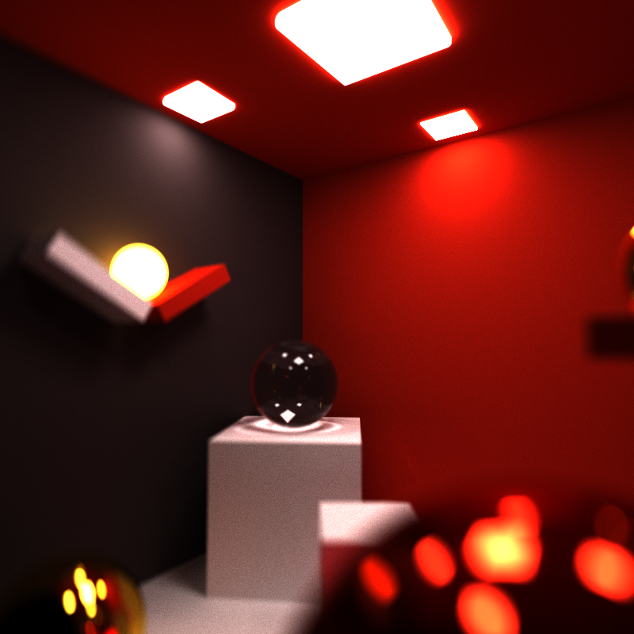
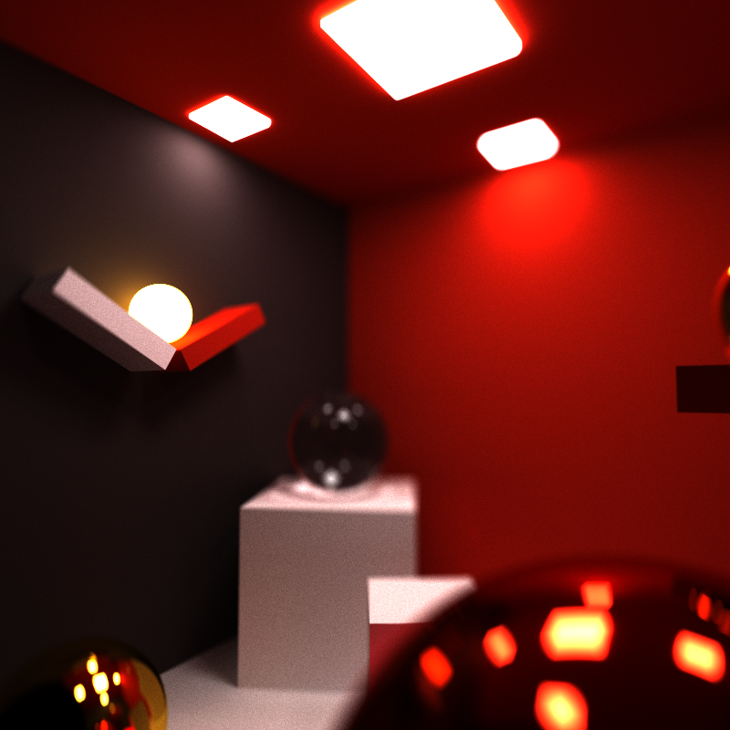
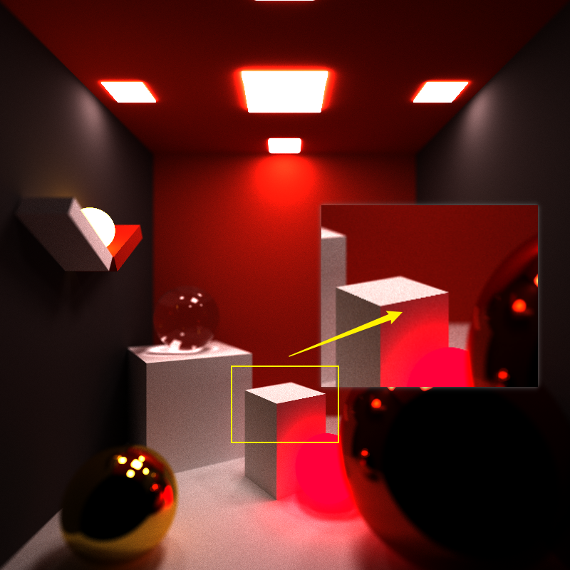
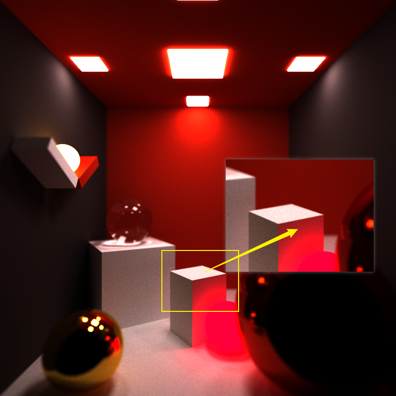
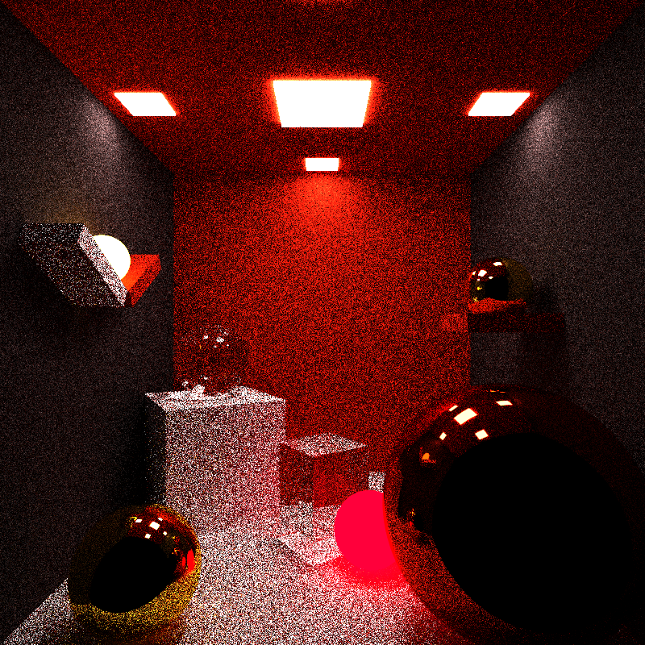
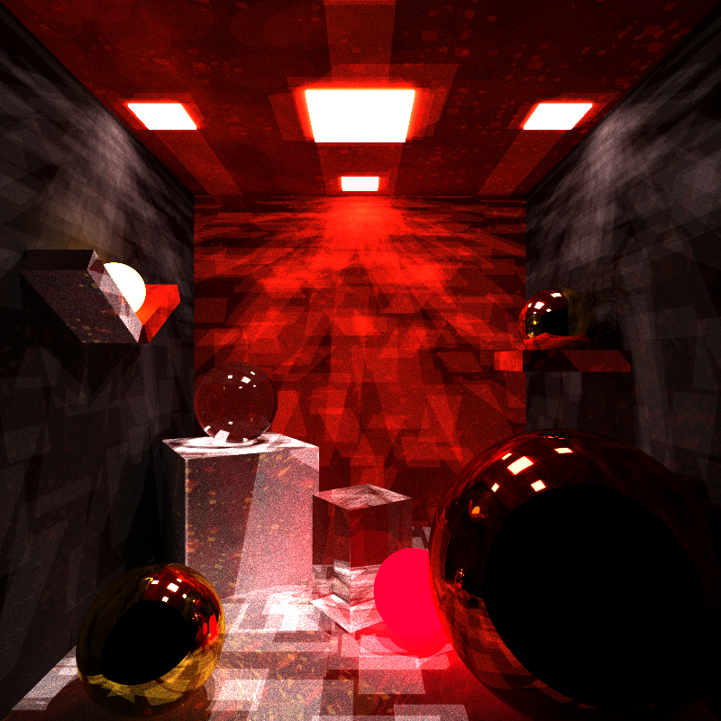
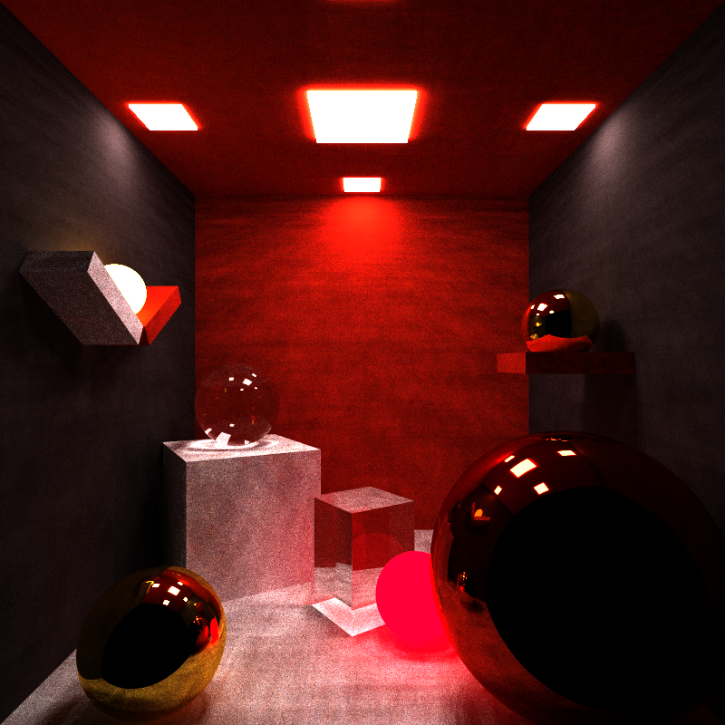

CUDA Path Tracer
================

**University of Pennsylvania, CIS 565: GPU Programming and Architecture, Project 2**

* **Name:**  Beini Gu

  * [LinkedIn](https://www.linkedin.com/in/rgu/), [personal website](https://www.seas.upenn.edu/~gubeini/), [twitter](https://twitter.com/scoutydren), etc.
* Tested on: Windows 10, AMD Ryzen 7 3700X 8-Core Processor 3.59 GHz 16GB, GTX 2060

## Project Description

This is a CUDA-based path tracer with global illumination able to render scenes utilizing the parallel computing power of GPU. 

## Table of Contents

[Features Overview](#overview-features)   
[Miscellaneous](#misc)   
[Performance Analysis](#performance-analysis)   
[Bloopers](#bloopers)

[Reference](#Reference)

<a name="overview-features"/> 

## Features Overview

#### Obj Mesh Loading

I use the [tinyObj](https://github.com/tinyobjloader/tinyobjloader) library for parsing and loading the custom triangulated meshes in obj format. Using the VBO data to get the position of the triangle vertices, calculate the normals and calculate their intersections with rays. 

To optimize performance and reduce number of ray-triangle intersection tests, I use a bounding box for the mesh which first checks if the ray hits anywhere inside the bounding box volume in order to reduce unnecessary rays which intersects somewhere outside the bounding box. 

| Bunny                   | Cow                 |
| ----------------------- | ------------------- |
|  |  |

#### Refraction

I implement refractive materials using Schlick's approximation and Snell's Law. This is how it looks

* Glass caustics on the floor (IOR = 1.52)

#### Depth of Field

I implement a togglable depth of field effect which simulates a realistic camera with focal distance and lens radius. 

| Without Depth of Field    | With Depth of Field (Focal distance = 10.0) | With Depth of Field (Focal Distance = 5.0) |
| ------------------------- | ------------------------------------------- | ------------------------------------------ |
|  |                    |                    |

#### Anti-aliasing

| Without Anti-Aliasing                    | With Anti-Aliasing                         |
| ---------------------------------------- | ------------------------------------------ |
|  |  |

#### Stratified and Halton Sampling

I implemented two other hemisphere sampling methods: stratified and Halton sampling. Under larger numbers of iterations, there won't be a lot of difference. 

| Random Sampling (iters = 20) | Stratified Sampling (iters = 20) | Halton Sampling (iters = 20) |
| ---------------------------- | -------------------------------- | ---------------------------- |
|     |     |     |

Halton sampling is quasi-random number generation, it leaves a pattern on the render when sample number is small. (The above image of Halton Sampling uses 1000 as the sample number, while stratified sampling uses 100 as the sample number. )

| Halton (Sequence length = 100) | Halton (Sequence length = 500) | Halton (Sequence length = 1000) |
| ------------------------------ | ------------------------------ | ------------------------------- |
|   |   |   |

<a name="misc"/> 

## Miscellaneous

I implemented material sort using thrust to improve the performance of path tracer. In addition, there is a togglable option for caching the first intersections (does not work together with anti-aliasing). 

<a name="performance-analysis"/> 
## Performance Analysis

<a name="blooper"/> 
## Bloopers

| Normal Error & Distance calculation error                    | Refraction calculation error                                 | Randomness error                                             |
| ------------------------------------------------------------ | ------------------------------------------------------------ | ------------------------------------------------------------ |
|  |  |  |

## Reference

* PBRT book [Physically Based Rendering: From Theory to Practice](https://www.pbr-book.org/3ed-2018/contents)
* en.wikipedia.org/wiki/Halton_sequence

