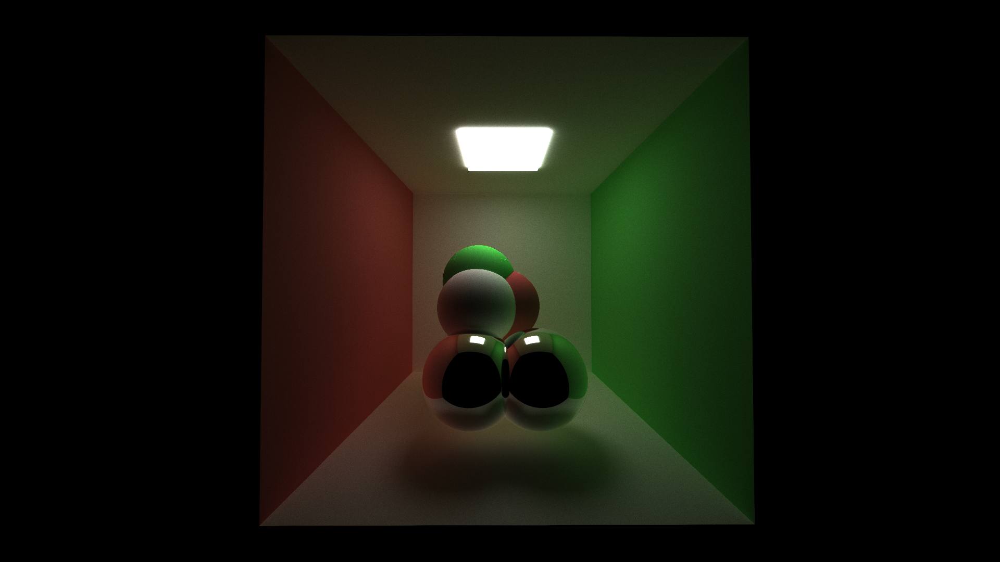
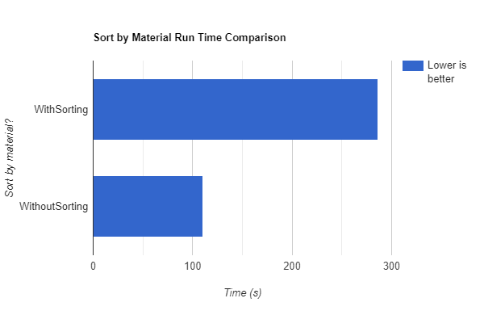
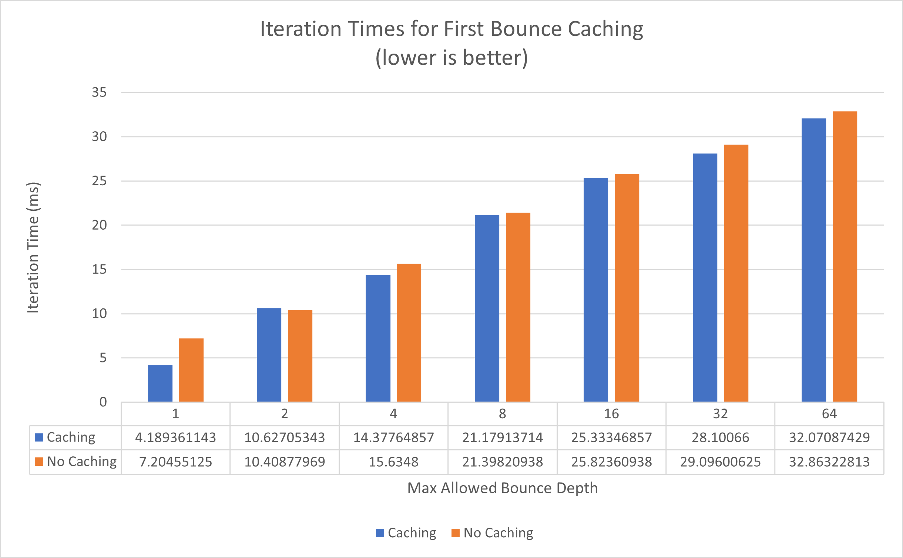
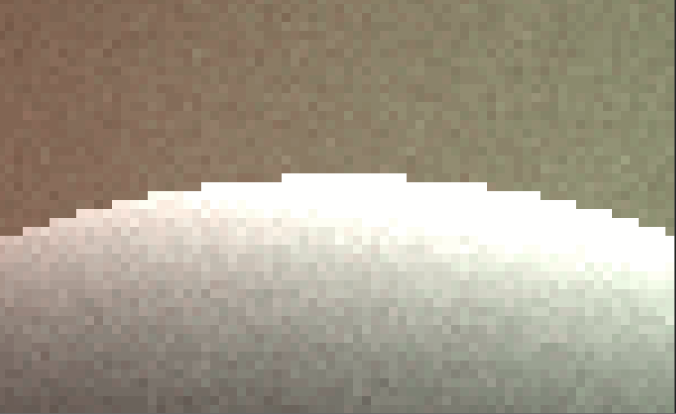
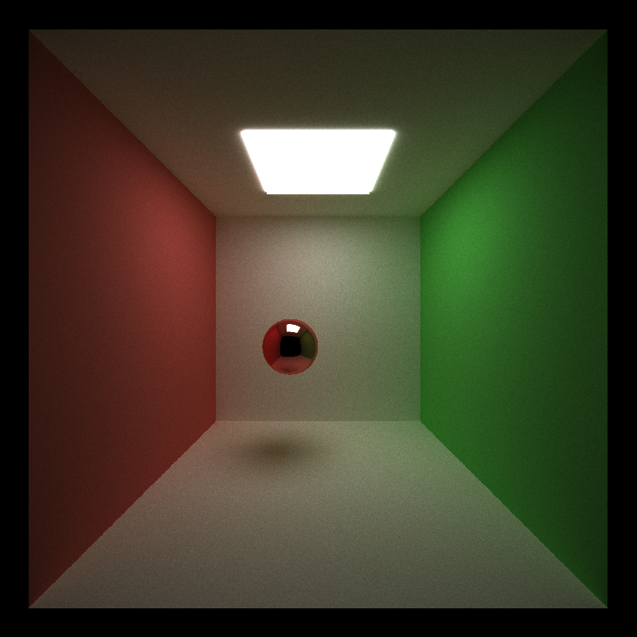

CUDA Path Tracer
================

## Sorting by Material

5000 iteration with a simple Cornell scene: 

Sorting by material worsened the performance when using the simple Cornell scene. I think that it is because the scene has so few materials that sorting itself would negatively affect the performance. I predict that if the scene is complex with lots of materials, sorting would improve the performance. 

## Caching the First Bounce

5000 iteration with a simple Cornell scene: 

Caching the first bounce gives us a huge performance boost as shown in the figure. Without considering anti-aliasing, it is critical that we cache the first bounce so that later iterations can reuse it whenever they need. 

## Anti-aliasing

Visual comparision:

Performance comparison:

# Notes

Changes to scene files: 

- Use FOVYH for half angle vertical field of view

### Notes to myself

ATTENTION: 

1. read access violation when using thrust::remove_if. Fix: use thrust::device as the first parameter to indicate the correct execution policy because dev_paths is in device memory

