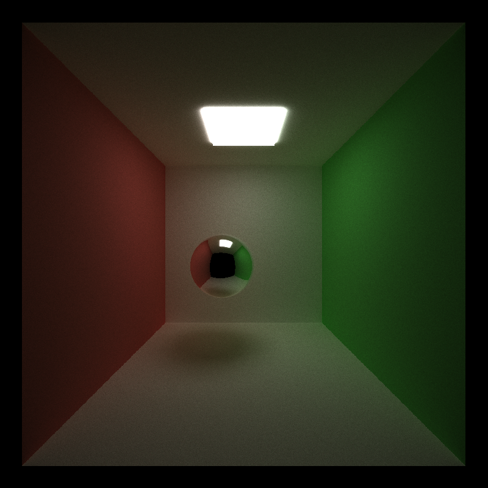

CUDA Path Tracer
================

**University of Pennsylvania, CIS 565: GPU Programming and Architecture, Project 3**

* Yichao Wang
  * [LinkedIn](https://www.linkedin.com/in/wangyic/) 
* Tested on: Windows 10 Home 64-bit (10.0, Build 18363)
  * Intel(R) Core(TM) i7-7700HQ CPU @ 2.80GHz (8 CPUs)
  * GeForce GTX 1060	6.1

## Description

A CUDA-based path tracer.

Feature Implemented:

* Visual
    * Shading kernel with BSDF evaluation (diffuse, reflect & refract)
    * Stochastic Sampled Antialiasing
    * Stratified Cosine hemisphere sampling
    * Texture mapping and Bump mapping
* Mesh
    * GLTF mesh loading using tinygltf
* Performance
    * Path termination using streaming compaction
    * Material sorting
    * First bounce cacheing


## Feature Analysis


## Visual

### Shading kernel with BSDF evaluation (diffuse, reflect & refract)

### Stochastic Sampled Antialiasing

### Stratified Cosine hemisphere sampling

### Texture mapping and Bump mapping

## Mesh

### GLTF mesh loading using tinygltf

## Performance

The following performance analysis uses [cornell.txt](scenes/cornell.txt).

### cornell.txt render result:



### Path termination using streaming compaction

I implemented streaming compaction by using ```thrust::partition``` to separate the paths based on their living status so that the path tracer will continue with only the alive path. Thus, it will save us recourses by running fewer CUDA threads as the depth increase. In addition, we can also end the path tracer earlier if no thread is alive.

|depth| # of remaining path |
|---|----|

### Material sorting

### First bounce cacheing