CUDA Path Tracer
================

**University of Pennsylvania, CIS 565: GPU Programming and Architecture, Project 3**

* Matt Elser
  * [LinkedIn](https://www.linkedin.com/in/matt-elser-97b8151ba/), [twitter](twitter.com/__mattelser__)
* Tested on: Tested on: Windows 10, i3-10100F @ 3.6GHz 16GB, GeForce 1660 Super 6GB

### Features
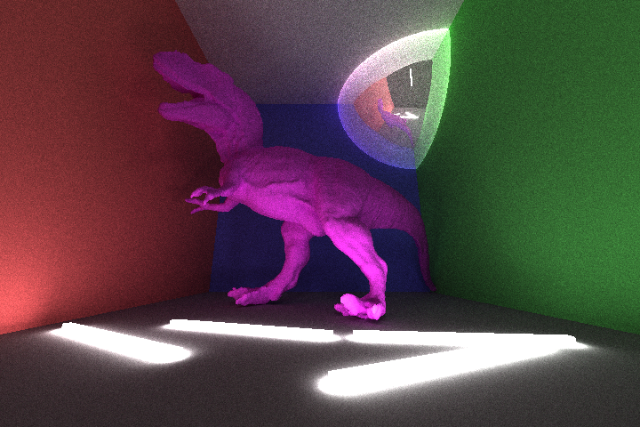
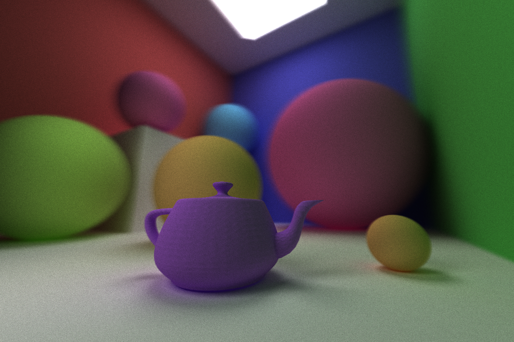

This is a GPU based forward path tracer, which renders scenes by calculating "camera rays" bouncing around the scene,
simulating individual light rays. The renderer supports the following features:
- Arbitrary mesh loading using .obj file format
- Multiple shader BSDFs, including refraction
- Anti-aliasing
- Depth of Field
- Several optimizations
- Adaptive Sampling* (not fully implemented)
- Bloopers

### Arbitrary mesh loading 
The renderer supports loading arbitrary meshes via .obj files using
(`tinyobjloader`)[https://github.com/tinyobjloader/tinyobjloader].

A bounding box is calculated at load time and used to optimize ray intersection
detection. The bounding box is a mesh itself, consisting of tris. Each ray in
the scene is initially tested for  intersection with these tris, and only if an
intersection is found will the ray be checked against the mesh's tris.

One issue discovered was that the triangle intersection detection function
initially used (`glm::intersectRayTriangle()`) does not compute intersections
with the "back" of faces. This caused problems for open meshes like the Newell Teapot
or for meshes assigned a refraction shader, as can be seen here:
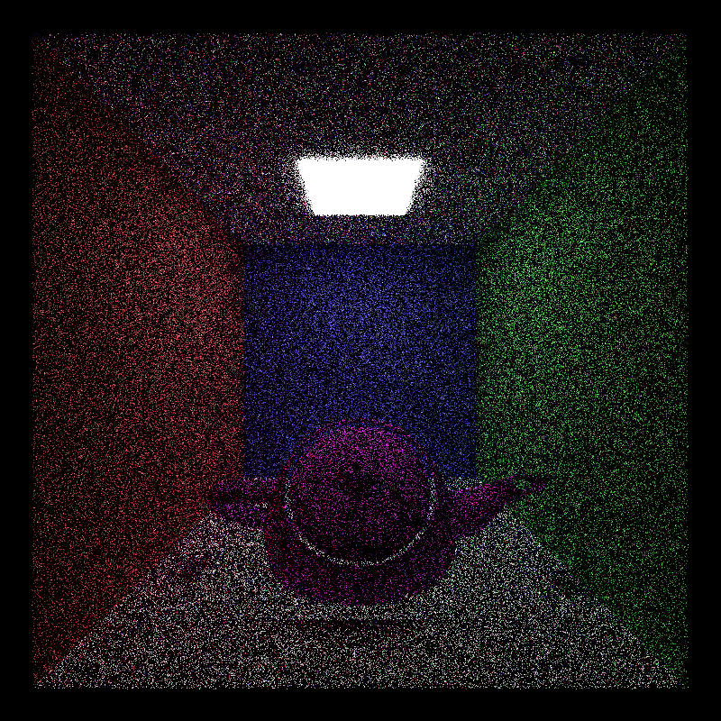
Also somewhat visible through the noise is a secondary effect of this back face
issue: collisions with the bounding box are not detected from within the
bounding box. Notice the sharp lines on the floor cutting off the diffuse
bounce close to the teapot. This is from rays on the floor near the teapot
casting outward and missing the  teapot bounding box, and therefore not
checking for collisions with any of the teapots actual tris.

Performance impacts:
- no spatial optimizations are made (other than the bounding box), so each
ray that hits the bounding box is checked against every triangle in the mesh.
As a result, large meshes can have a significant impact on render times.

Known limitations:
- only objs consisting entirely of triangles are supported. Quads are
interpreted with inconsistant results by tinyobjloader
- vertex normals must be included in the .obj file. Missing normals will
inherit whatever memory value the normals were initialized to.
### Multiple shaders 
BSDFs are implemented to allow for pure diffuse objects, objects with diffuse
and reflections, as well as objects with both reflection and refraction. The
Fresnel effect is calculated using Schlick's approximation

Since physically correct models do not always provide the preferred result, the
Fresnel effect is tuneable via a user parameter. Note this is separate from the
index of refraction (also tuneable), this is an additional parameter which controls
the power used in Schlick's approximation. 
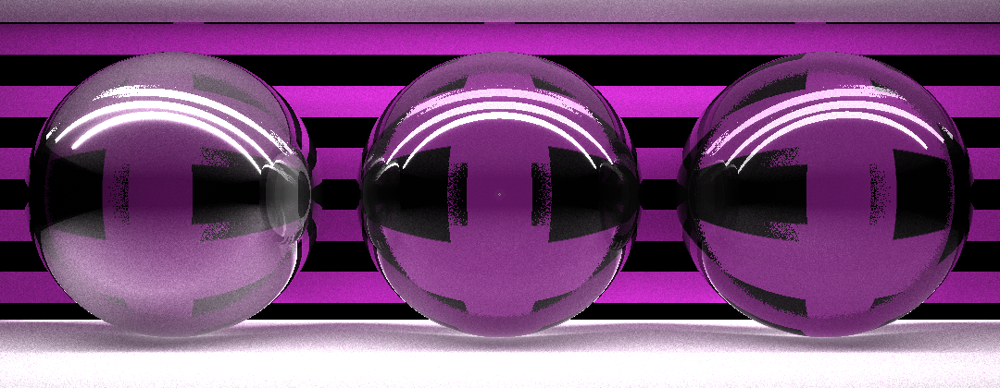
The sphere on the right has a Fresnel power of 1, which dramatically changes
the reflect/refract ratio in favor of reflection. The sphere in the middle has
a Fresnel power of 3, which is only a subltle change from the (standard)
Fresnel power of 5 on the rightmost sphere.

Known limitations:
- objects with refractions are assumed to have reflection. An object can be reflective without
refraction, but not vice-versa. 

### Anti-aliasing
anti-aliasing was accomplished by jittering the origin of camera rays for the initial bounce.

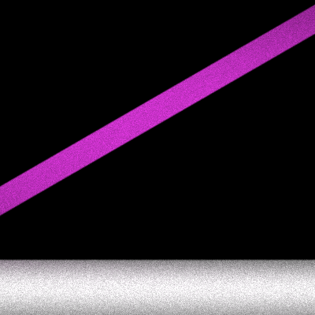
The first image has no antialiasing and has jagged pixelated edges along
horizontal lines. The second image has cleaner lines with no notable "jaggies".

Performance impacts:
- An unnoticeable impact to the time it takes each pixel to converge as a result of adding some small randomness.
Known limitations:
- This can not be combined with the "first bounce cache" optimization as it depends on 
slightly varied camera ray origins each iteration. 
### Depth of Field
Depth of field can optionally be simulated, with tuneable parameters for aperture size, lens radius,
and focal distance. 
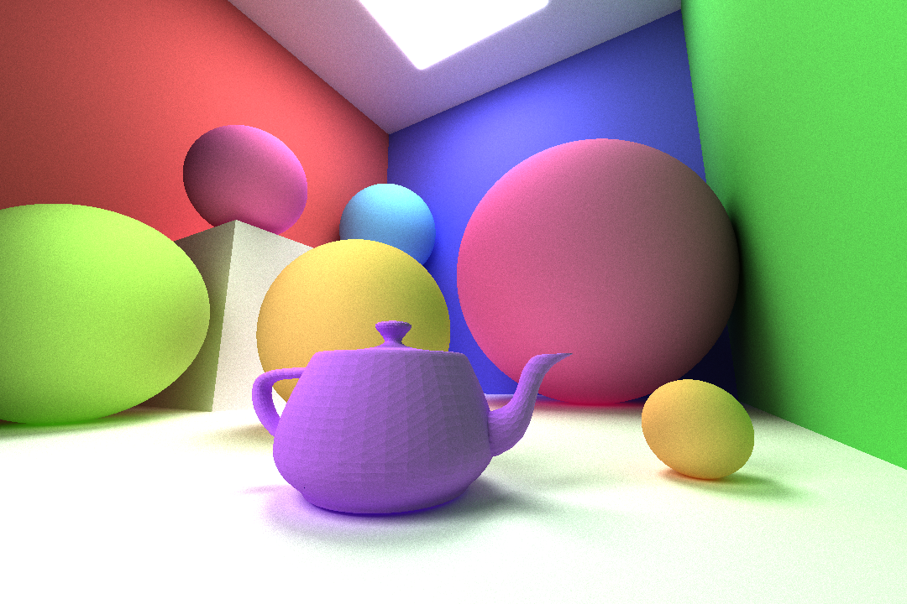

The first image shows a scene with no simulated depth of field. The second
image has depth of field turned on, simulating the blur according to distance
in the same way a physical camera lens would.

Performance impacts:
- Using DOF requires a greater number of iterations to produce a clean image. The blur is a result 
of a stochastic process, and as a result the greater the blur the larger the variance of each blurred pixel
Known limitations:
- This can not be combined with the "first bounce cache" optimization as it depends on 
slightly varied camera rays each iteration. 
### Optimizations
- first bounce cache
An option is provided to cache the first bounce of each camera ray from iteration 1, and use that cache
for each subsequent iteration (until the camera is moved, generating a new iteration 1 and a new cache).
- sort by materials
In order to decrease divergence (i.e. multiple threads in a warp taking
different code paths as a result of conditionals), rays can optionally be
sorted by their material id. This manimizes the number of warps with different
materials, which may take different amounts of time as a result of calculated
differing BSDFs.
- use stream compaction to cull dead bounces
Bounces that do not hit an object (i.e. which go off into space) are culled every iteration. 

The following data was gathered from a single test scene using multiple
shaders, across all available BRDFS. All renders were run to 100 iterations at
a resolution of 720x480. Here is the test scene at 5000 iterations:
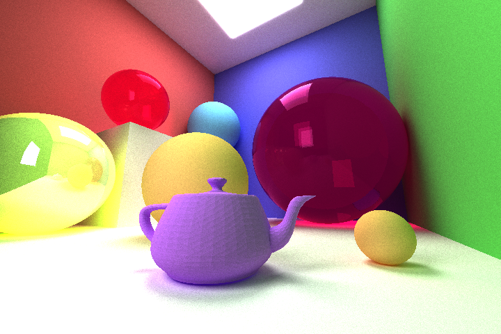

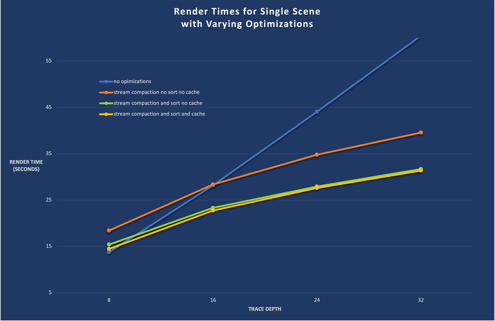
Performance impacts:
- notably, all optimizations are slightly worse for a trace depth of 8, when
the benefit of these optimizations has not yet outweighed their overhead.
- first bounce cache provides a steady, but minor improvement.
- Stream compaction provides the most dramatic improvement, even in a scene
that is mostly filled by collideable objects.
- sorting materials provides a notable decrease in render times which increases
slightly as the trace depth increases.
- All optimizations provide a performance increase of approximately 2x!

Known limitations:
- As noted above, first bounce cache cannot be combined with DOF or anti-aliasing.
### Adaptive Sampling* (incomplete)
(note, this feature is incomplete. All that is described is implemented, but a
bug prevents it from working properly)
Adaptive sampling is the process of determinig whether a pixel needs further
iterations, and only sampling further if so. To do this, each pixel's variance
is  tracked, and updated each time the pixel color is updated (at the "final
gather" stage). After a user-defined minimum number of samples, this variance
is compared with a user-defined value. Once the pixel's variance falls below
this threshold, its color is considered "converged" and it is marked for
culling.  Converged pixels are culled and rays for these pixels are no longer
cast, saving potentially significant resources.
As a result of this process, pixels take varying numbers of iterations. The
number of iterations needed by a pixel can be useful information, and so with
each saved image, a "heatmap" is saved alongside it. This heatmap shows the
number of iterations taken for each pixel, and can therefore be used to display 
areas where greater or fewer resources are spent. 

How this feature is incomplete:
As stated above, all of the aspects of adaptive sampling described are
implemented.  However, some misalignment exists between the culling of pixels
and the casting of rays in the following iteration. As a result, the last
pixels of the image are always culled instead of the pixels which have
converged. This is likely due to a sorting mismatch,  or using the wrong number
of paths when calling some relevant function. This has not been fixed in time.

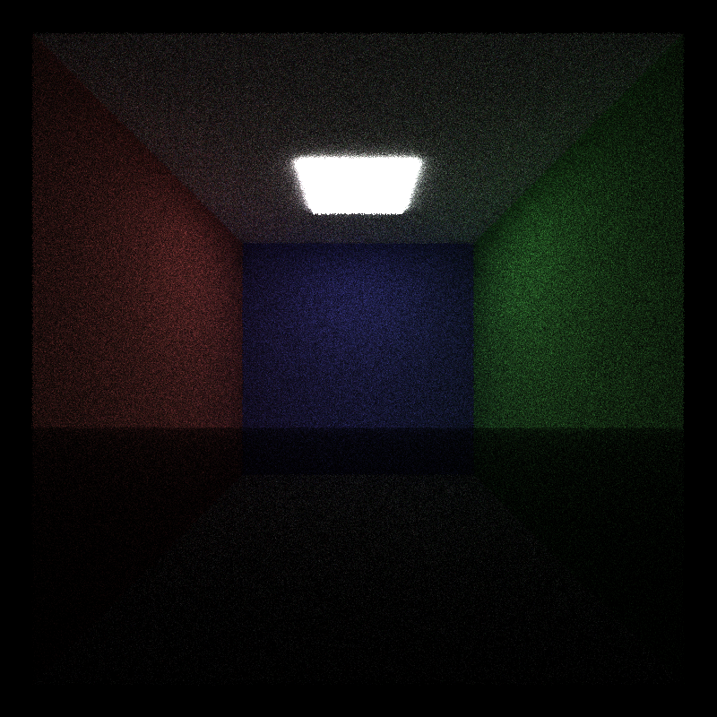
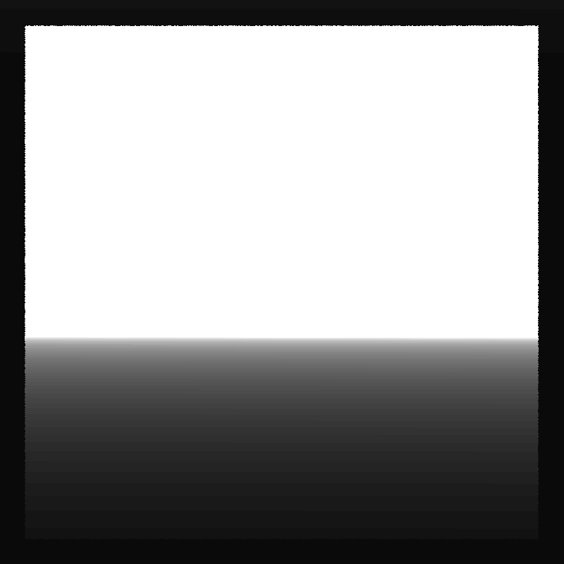
White represents pixels which required the maximum number of iterations, black
indicates immediate culling. Note the gradient in the heat map showing that
pixels are culled from the bottom up as iterations increase. This reflects what
can be seen in the render itself: the bottom is noisy and gets less noisy
towards the top.
### Bloopers
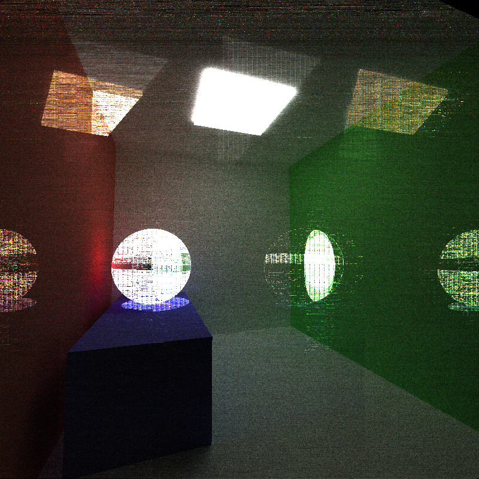
This image is the result of a stream compaction issue. The VHS-like look of it
is amplified by the banded noise at the top, which is the result of a race
condition when sorting paths.
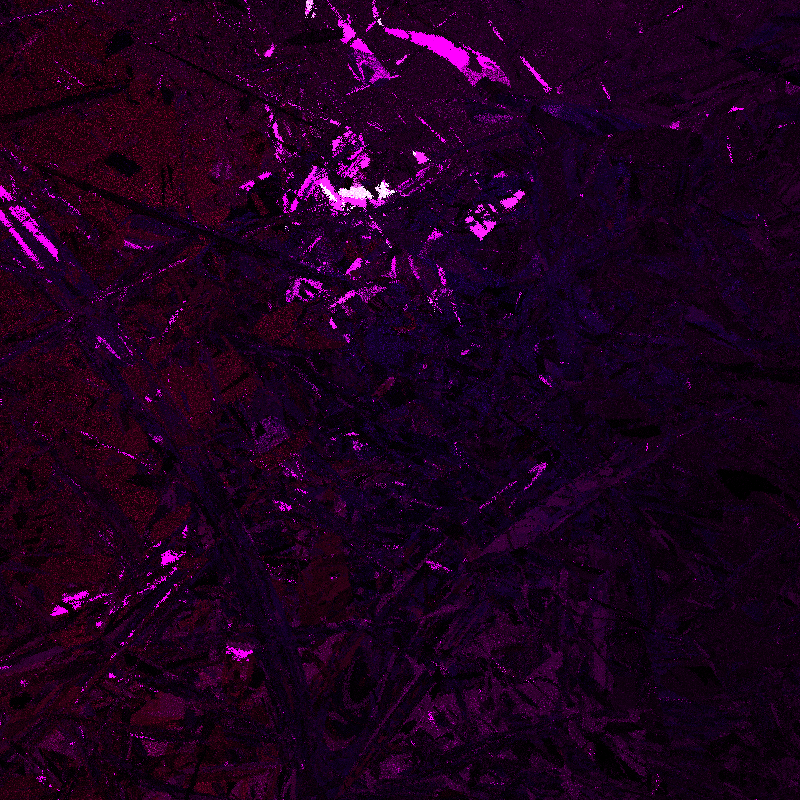
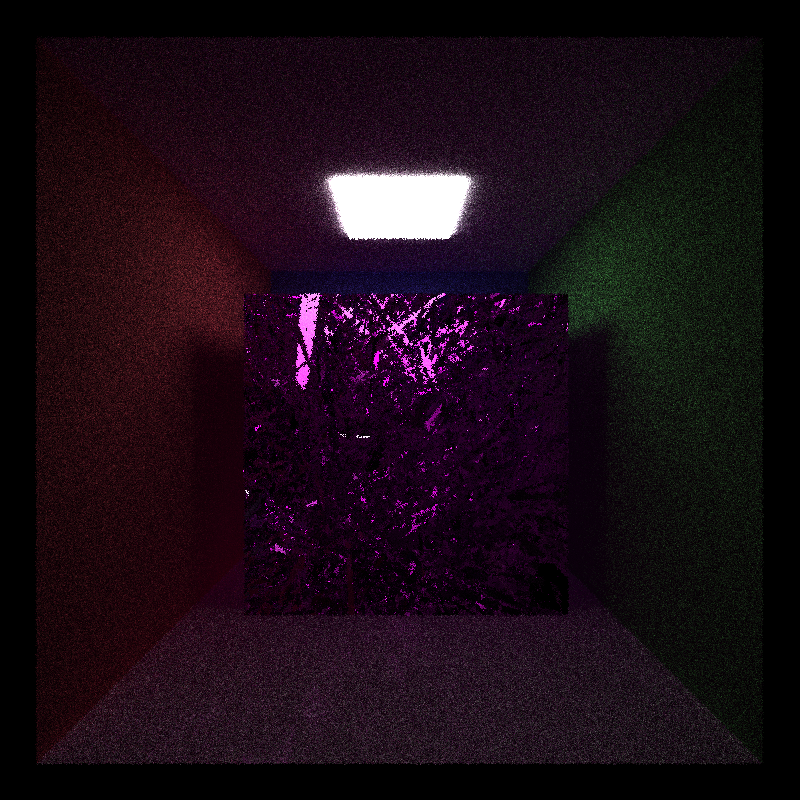
These works of art were created while attempting to fix the mesh back face
collision detection issue described above.

### Notable Sources
- As noted above,
(`tinyobjloader`)[https://github.com/tinyobjloader/tinyobjloader] was used for
mesh loading. 
- As noted in the comments, Stack Exchange and Stack overflow
provided the math for two vector manipulation methods
- Matt Pharr & Grep Humphreys Physically Based Rendering Texbook provided useful context

