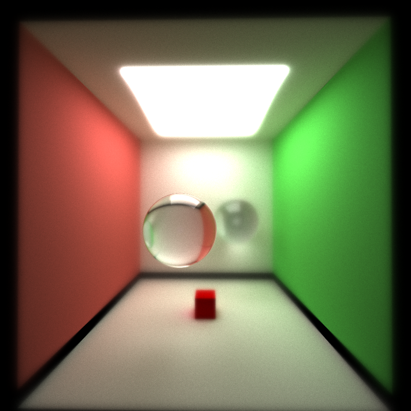

CUDA Path Tracer
================

**University of Pennsylvania, CIS 565: GPU Programming and Architecture, Project 3**

* Yuxuan Zhu
  * [LinkedIn](https://www.linkedin.com/in/andrewyxzhu/)
* Tested on: Windows 10, i7-7700HQ @ 2.80GHz 16GB, GTX 1050 4096MB (Personal Laptop)

**Demo**

**Introduction**
This is a image renderer with path tracing capability. 
Feature highlight:
1. Diffusion
2. Reflection
3. Refraction
4. Anti-aliasing
5. Depth of field effect
6. Arbitrary mesh loading

**Options**
1. Toggle 1 to enable/disable material sorting
2. Toggle 2 to enable/disable first bounce caching
3. Toggle 3 to enable/disable stochastic sampled anti-aliasing
4. Toggle 4 to enable/disable depth of field effect
5. Toggle 5 to enable/disable bounding volume intersection culling
Maybe I should use a struct to contain all the options.

**Performance Analysis**
Custom sorting in thrust is done with merge sort, which is slower than radix sort. In order to accelerate, I changed the data
structure to allow radix sort. I seperated out material ID from the material struct. I changed the material ID of terminating rays to
positive number as well
I compared three different implementation of material sorting
Three options for sorting
1. normal sort
2. sort by zip iterator
3. duplicate sort

For bounding volume intersection culling, I used a sphere to bound the object rather than a cube, since it is easier and faster.
The tradeoff is the volume contained by the cube is larger.

I tested for the existence of total internal reflection.

**Depth of Field**

**Mesh Loading**
Referenced https://github.com/syoyo/tinygltf/issues/71

roughness factor is reflection?
cite tesla cybertruck

