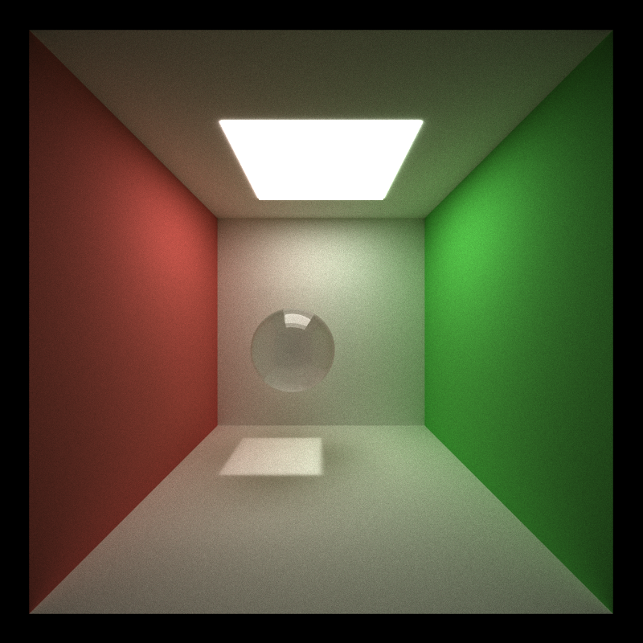
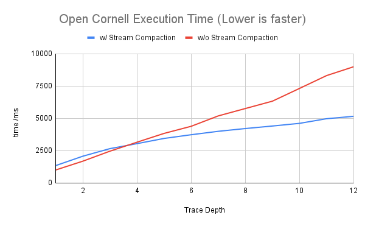
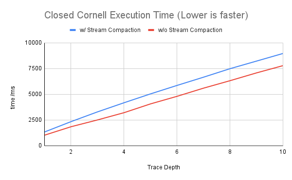
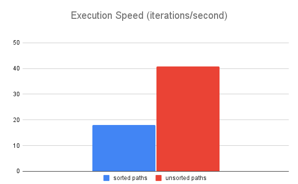
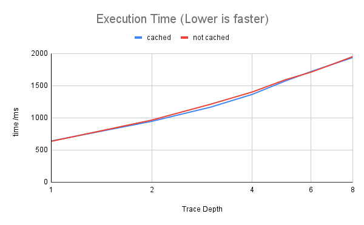

CUDA Path Tracer
================

**University of Pennsylvania, CIS 565: GPU Programming and Architecture, Project 3**

* Jiyu Huang
* Tested on: Windows 10, AMD Ryzen 7 5800H @ 3.20GHz 16GB, RTX 3070 Laptop 8GB

This project involves an implementation of GPU path tracing rendering algorithm in CUDA. Features include:

- BSDF shading for diffuse, specular and refractive materials
- Physically-based depth-of-field
- Stochastic sampled anti-aliasing
- glTF 2.0 object loading with bounding volume culling
- Texture mapping and bump mapping

# Features

## Materials

Diffuse, specular, refractive

## Depth of Field

Two properties are included in the camera model: focal distance and aperture size. To achieve depth-of-field effect, initial rays' origins are randomly offsetted in the aperture, with the updated direction still pointing to the focal point.
This way, objects around the focal distance are in focus while other objects are blurred.

## Anti-Aliasing

To render with smoother edges, we jitter the initial rays' direction slightly, so that over iterations, the result averages to an anti-aliased image with less discrete edges.

## glTF 2.0 Support

[tinygltf](https://github.com/syoyo/tinygltf/) library is used to parse glTF 2.0 files. Triangle meshes with indexed geometries are supported.

## Texture Mapping and Bump Mapping

The user can set a texture map and a normal map for materials in the scene files. If the mesh associated with the material has its texture coordinates (**TEXCOORD_0**) set, the path-tracer will use the texture information when rendering. If a normal map is set and the mesh doesn't have vertex normals or tangents set up, the renderer will compute them using vertex positions when loading the mesh.

# Performance Analysis

Execution time is measued after 100 iterations in milliseconds. The scene file [cornell_open.txt](scenes/cornell_open.txt) is used to measure the performances.

## Stream Compaction

To help performance, stream compaction is applied after ray bounce for eliminating terminated rays and avoid unnecessary computation. The following chart shows how after a couple bounces, the effect of stream compaction significantly outweighs the overhead of performing stream compaction itself.

It is worth noting that the scene used for this performance comparison is open on one end, allowing for rays to terminate early. However, when the scene is closed, no rays can escape the scene; therefore, the number of early terminating rays decrease significantly. Under such circumstances, the performance of path tracing with stream compaction can actually be slightly slower than without stream compaction. The following chart illustrates this situation.

## Sorting ray paths by material

During the shading stage, we need potentially different algorithms for different materials. This could lead to warp divergences and is also not the ideal memory access pattern on GPU. One way we could reduce the severity of this issue is by sorting the rays by their material ids. Theoretically, this enables contiguous memory access to material information reduces divergence.

However, the performance analysis result suggests that for the standard cornell scene, sorting paths by materials is actually slower. This is due to the fact the number of materials is small, and the performance gain from sorting by materials is vastly overshadowed by the overhead of sorting itself.

## Caching first ray bounce

We could also cache first ray bounce for future iterations. This ended up with minimal performance gains, and the performance gain eliminates as trace depth increases.

