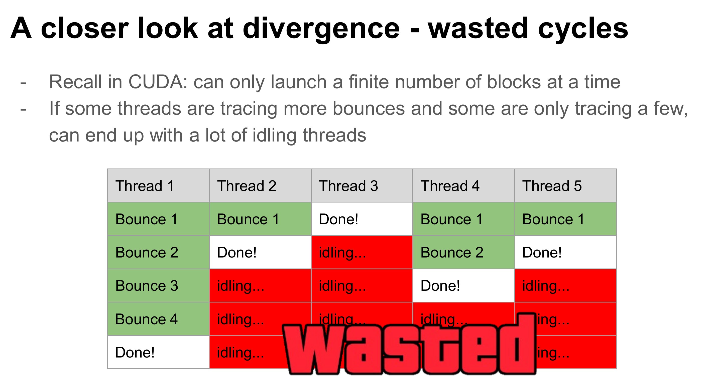
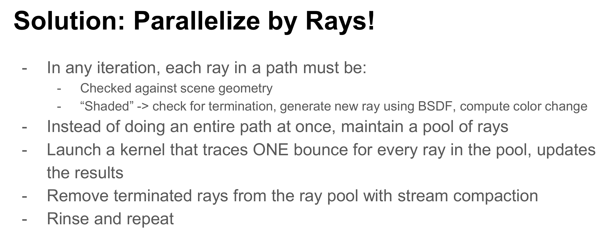
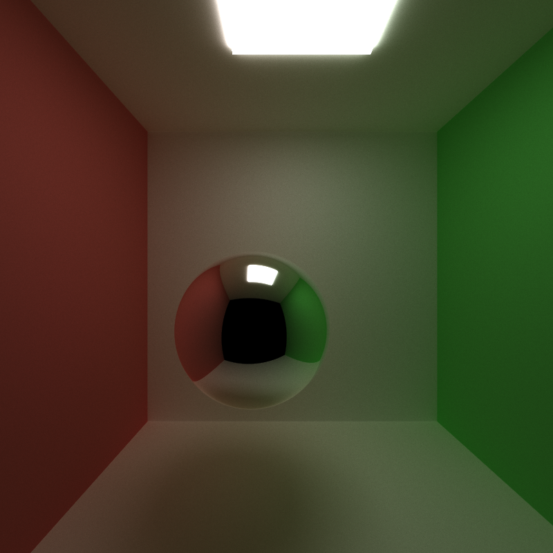
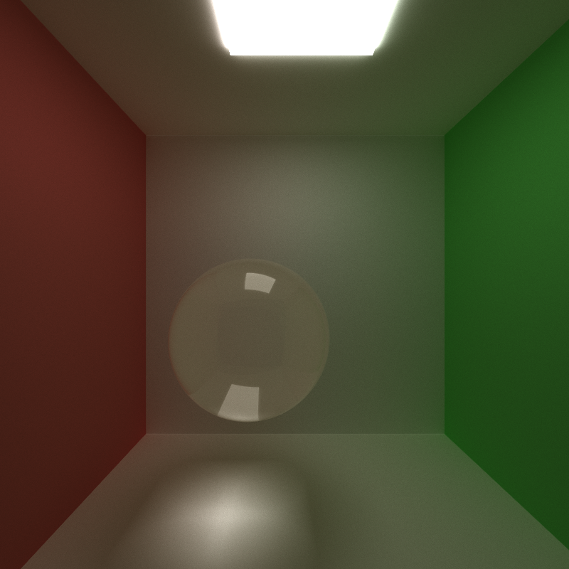
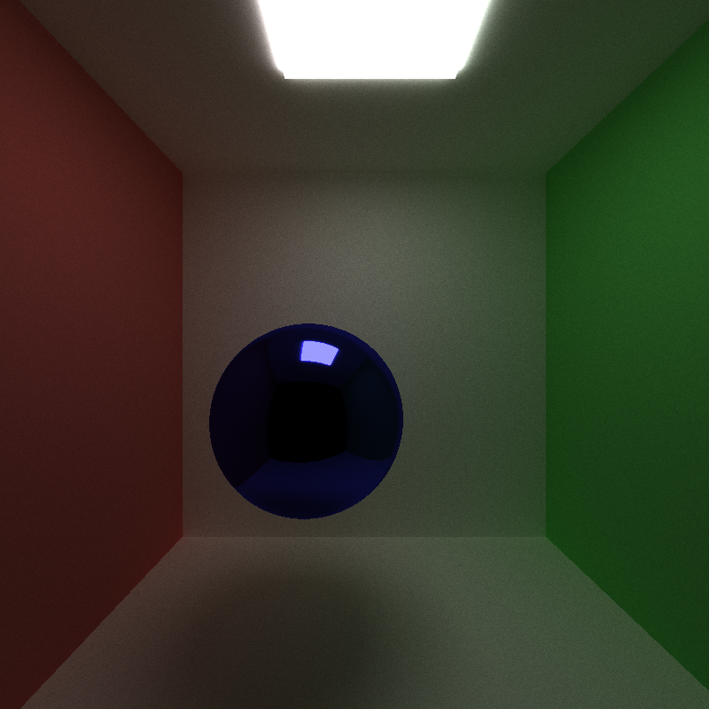
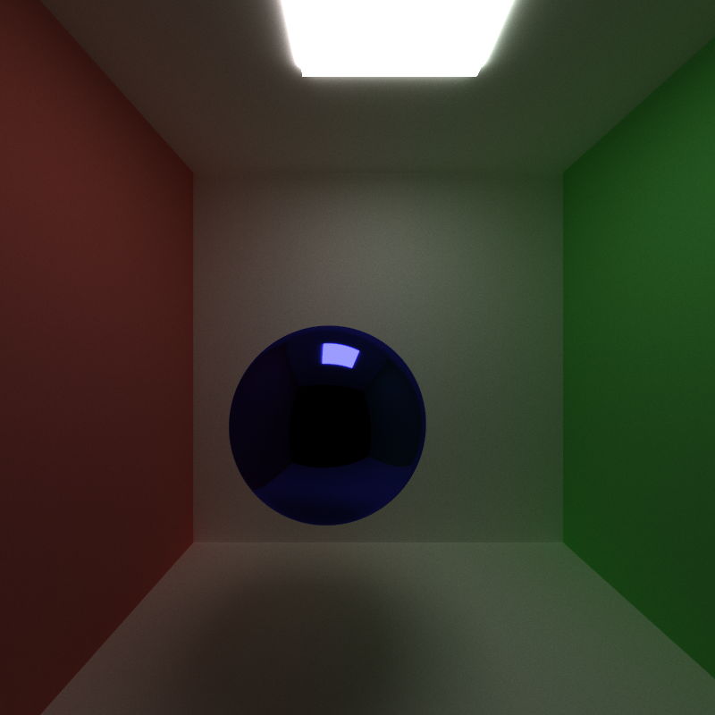
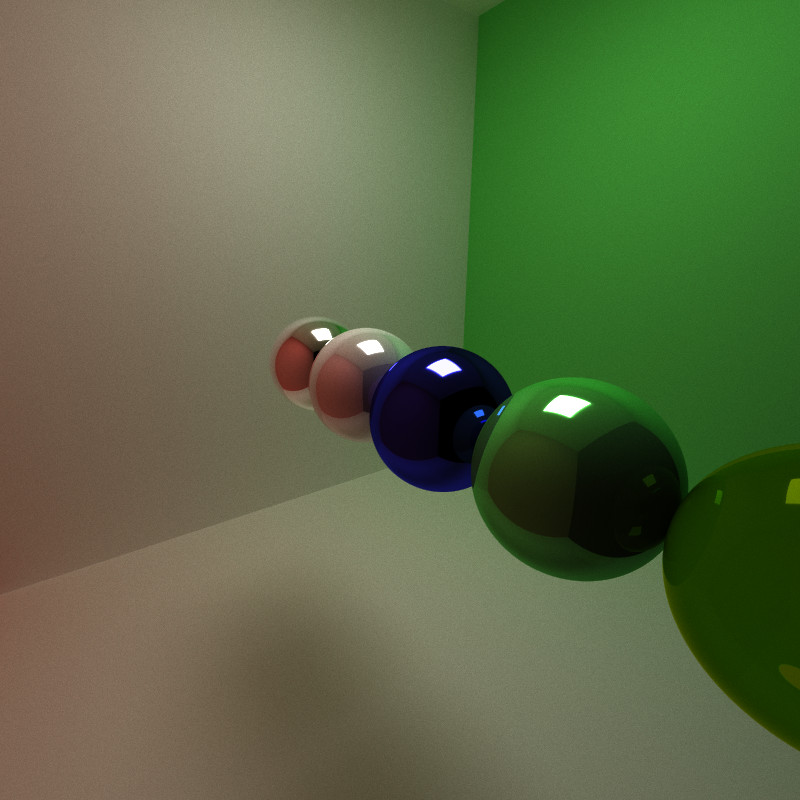
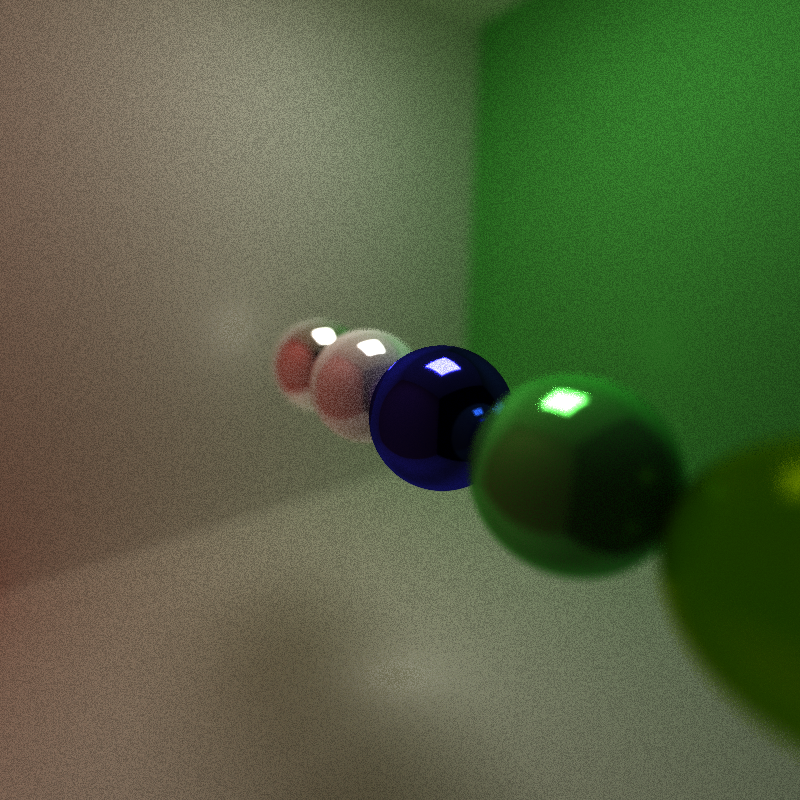
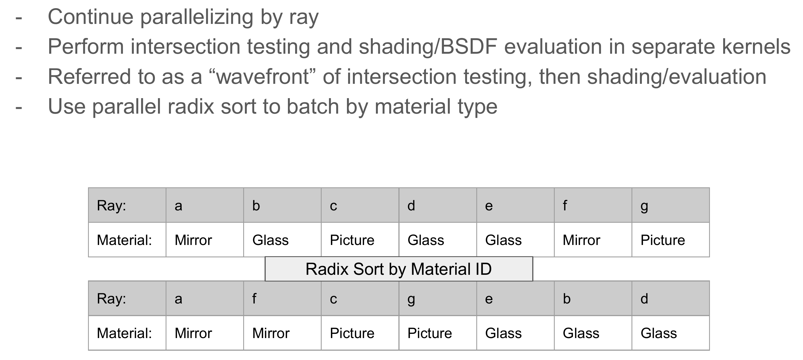
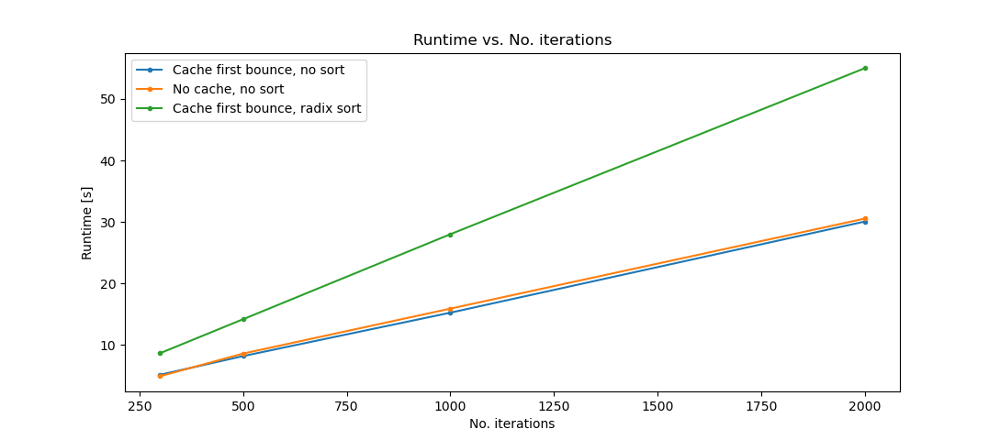

CUDA Path Tracer
================

**University of Pennsylvania, CIS 565: GPU Programming and Architecture, Project 3**

* Zhihao Ruan (ruanzh@seas.upenn.edu)
  * [LinkedIn](https://www.linkedin.com/in/zhihao-ruan-29b29a13a/), [personal website](https://zhihaoruan.xyz/)
* Tested on: Ubuntu 20.04 LTS, Ryzen 3700X @ 2.22GHz 48GB, RTX 2060 Super @ 7976MB

## Highlights
Finished path tracing core features:
- diffuse shaders
- perfect specular reflection
- 1st-bounce ray intersection caching
- radix sort by material type
- path continuation/termination by Thrust stream compaction 

Finished Advanced Features:
- Refraction with Fresnel effects using Schlick's approximation
- Stochastic sampled anti-aliasing
- Physically-based depth of field
- OBJ mesh loading with [tinyobjloader](https://github.com/tinyobjloader/tinyobjloader)

## Background: Ray Tracing
Ray tracing is a technique commonly used in rendering. Essentially it mimics the actual physical behavior of light: shoots a ray from every pixel in an image and calculates the final color of the ray by bouncing it off on every surface it hits in the world, until it reaches the light source. In practice a maximum number of depth (bouncing times) would be specified, so that we would not have to deal with infinitely bouncing rays.

Ray tracing is one of the applications considered as "embarrassingly parallel", given the fact that each ray is completely independent of other rays. Hence, it is best to run on an GPU which is capable of providing hundreds of thousands of threads for parallel algorithms. This project aims at developing a CUDA-based application for customized ray tracing, and a detailed instruction can be found [here](INSTRUCTION.md).

### BSDF: Bidirectional Scattering Distribution Functions
BSDF is a collection of models that approximates the light behavior in real world. It is commonly known to consist of BRDF (Reflection) models and BTDF (Transmission) models. Some typical reflection models include:
- *Ideal specular* (perfect mirror, `glm::reflect`)
- *Ideal diffuse.* It is a model that the direction of the reflected ray is randomly sampled from the incident hemisphere, along with other advanced sampling methods.
- *Microfacet,* such as [Disney model](https://media.disneyanimation.com/uploads/production/publication_asset/48/asset/s2012_pbs_disney_brdf_notes_v3.pdf).
- *Glossy specular.*
- *Subsurface scattering.*
- ...

Some typical transmission models include:
- *Fresnel effect refraction.* It consists of a regular transmission model based on [Snell's law](https://en.wikipedia.org/wiki/Snell%27s_law) and a partially reflective model based on [Fresnel effect](https://en.wikipedia.org/wiki/Fresnel_equations) and its [Schlick's approximations](https://en.wikipedia.org/wiki/Schlick%27s_approximation).
- ...

### CUDA Optimization for Ray Tracing
In order to better utilize CUDA hardware for ray tracing, it is not suggested to parallelize each pixel, as it would lead to a huge amount of divergence. 

Instead, one typical optimization people use is to parallelize each *ray*, and uses **stream compaction** to remove those rays that terminates early. By this means we could better recycle the early ending warps for ray tracing other pixels.

## Results and Demos
### Ray Refraction for Glass-like Materials
|            Perfect Specular Reflection             |               Glass-like Refraction                |
| :------------------------------------------------: | :------------------------------------------------: |
|  |  |

### Stochastic Sampled Anti-Aliasing
|                 1x Anti-Aliasing (Feature OFF)                  |                        4x Anti-Aliasing                         |
| :-------------------------------------------------------------: | :-------------------------------------------------------------: |
|  |  |

### Physically-Based Depth of Field
|         Pinhole Camera Model (Feature OFF)         |               Thin-Lens Camera Model               |
| :------------------------------------------------: | :------------------------------------------------: |
|  |  |

### Mesh Loading
Mesh loading has not been fully supported due to an incorrect normal vector parsing issue in [tinyobjloader](https://github.com/tinyobjloader/tinyobjloader). The runtime is also unoptimized and takes an unreasonable amount of time to run.

TODO:
- Bounding volume culling with AABB box/OBB box.

## Performance Analysis
Throughout the project two optimizations were done:
1. **Cache ray first bounce.** For every iteration in a rendering process, the first rays that shoot from camera to the first hit surface is always the same. Therefore we can cache the first shooting ray during the first iteration and reuse the results in all the following iterations.
2. **Radix-sort hit attributes by material type.** The calculation of resulting colors for each ray depends on the material of the object it hits, and thus we can sort the rays based on material type before shading to enforce CUDA memory coalescence.

The following experiments are conducted on a Cornell box scene as shown in [`cornell_profiling.txt`](scenes/cornell_profiling.txt) with varying iterations from 300 to 2000.

From the performance analysis we can see that caching the first bounce for the 1st iteration has a slight improvement on the performance, while radix-sorting the material type before shading have a great negative impact on the performance. This is possibly due to the reason that radix-sorting itself takes a lot amount of time in each iteration. 

