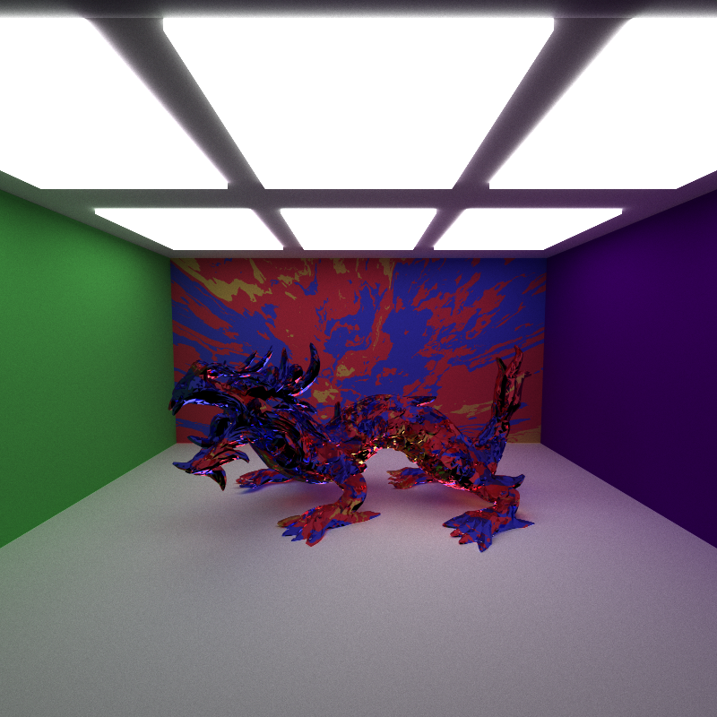
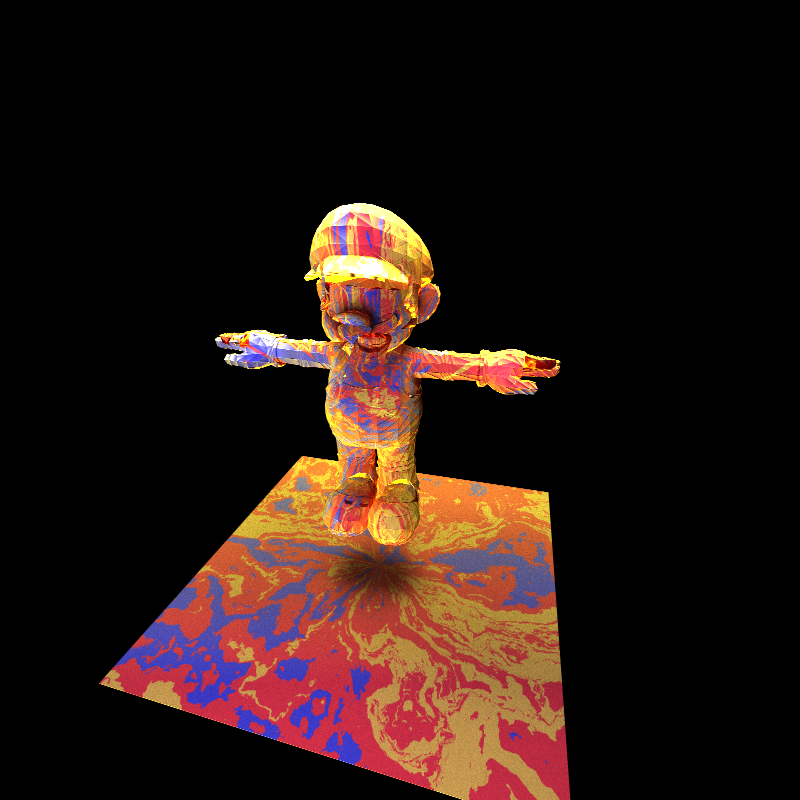

CUDA Path Tracer
================

**University of Pennsylvania, CIS 565: GPU Programming and Architecture, Project 3**

* Shubham Sharma
  * [LinkedIn](www.linkedin.com/in/codeshubham), [personal website](https://shubhvr.com/).
* Tested on: Windows 10, i7-9750H @ 2.26GHz, 16GB, GTX 1660ti 6GB (Personal Computer).
*GPU Compute Capability: 7.5

)

## Project Description

Path tracing is a computer graphics Monte Carlo method of rendering images of three-dimensional scenes such that the global illumination is faithful to reality. 

### Features
- Shading Kernel with BSDF Evaluation
- Uniform diffuse
- Perfect specular reflective (mirror)
- specular refractive (Fresnel dielectric)
- Path Continuation/Termination with Stream Compaction
- Toggleable Sorting of ray Paths by material type
- Toggleable first bounce intersection cache to be used by subsequent iterations
- Anti-aliasing rays with sub-pixel samples
- Arbitrary OBJ Mesh Loading with toggleable 7 Plane Bounding Volume intersection culling
- Camera depth of field
- Procedural Structure
- Procedural texture
- Subsurface Scattering

### Materials
Material shading is split into different BSDF evaluation functions based on material type. This project supported materials include **diffuse**, **reflective** and **refractive** (fresnel dielectric). Diffuse material scattering is computed by using cosine-weighted samples within a hemisphere. Reflective materials reflect the light ray about the surface nornmal and refractive materials refracts the ray through the material according to Snell's law of refraction and with added fresnel computation for better real life depiction. 
Here's an image sonsisting of tbove three materials.

Below, a compound reflective and refractive impact is executed through a Fresnel fabric, which reflects light beams that are more digression to its surface. This makes a light rays passing through the object refracted, whereas rays brushing the sides of the fabric are reflected. Rather than specifically calculating the Fresnel component, I assess it utilizing Schlick's guess.

### Depth Of Field
The scene camera can be set to enable Depth of Field effect which utilises focal distance and lens radius parameters to change the depth of this effect. Geometries located at the focal distance within the lens radius stay in focus while other geometry around the scene will be distorted.

### Stochastic Anti-Aliasing
Utilizing anti-aliasing for subpixel sampling brings in smoother geometry edges within the render. It is vital to note that anti-aliasing and first bounce cache don't work together, since the pixel tests will vary per iteration, and ached first bounces from the first iteration won't match the generated ray direction in further iterations. I added the flag for Cache Bounce which toggles off anti-aliasing and setting cache off in turn enables anti-aliasing,

### OBJ Loading
In order to bring the mesh data into C++, I used the tinyobj library. I build the polygon mesh using the position and normal data of the triangles triangles  from the imported data to create the mesh triangles and store triangle information per arbitrary mesh.

7 planar Bounding volume intersection culling as proposed by Kay and Kajiya in accelerated structeres, is applied at the ray-geometry intersection test to reduce the number of rays that have to be checked against the entire mesh by first checking rays against a volume that completely bounds the mesh. This feature is implemented as toggleable for performance analysis purposes. Pressing the 'B' key while running the GPU renderer will enable this feature.

In order to smoothen the triangles on round meshes, the intersection normal is computed from the barycentric interpolation of the 3 normals from the triangle vertices

### Procedural Structures
I have used L System grammar which generates complex patterns for procedural data. An L-system consists of an alphabet of symbols that can be used to make strings, It consist of an axiom: initial configuration, a collection of production rules that expand each symbol into some larger string of symbols and a mechanism for translating the generated strings into geometric structures.

### Procedural Textures
I have used a simple sinusoidal and cosine functions as well combination of different noise functions like Perlin, FBM and Worley to generate procedural textures. A spherical bi linear function which transforms positional coordinates to UV coordinates is used in turn with noise functions to apply these textures accross wide variety of mesh data. 

# Performance Analysis

## Optimisations

### Stream Compaction 

Stream compaction generally progress the execution by terminating the rays in case they are futile. Less threads  will be made and the execution quickened. The first-bounce cache moreover moves forward 13% execution by caching the primary crossing point of the beam. In expansion, the work puts the active rays closer together in memory, which ought to make getting to faster global memory access rates since they gets to will be continguous, rather than random. Underneath Values of remaining rays in Open and Closed Cornell Box shown in the chart.

### Material Sorting
In my case the material sorting slows down the execution time of program. I believe this can be attributed to less number of materials in my scene to begin with. The method in theory would sort the rays with similar material object intersections closer as they will have about the same lifetime. Since the scene doesn't have many materials the probablity of rays with same material behaviour being contiguous in memory is already high and sorting them only adds an overhead in this case. If the scene has a large number of materials then i believe the execution times will increase with Material Sorting.    

### Caching First Bounce
Since the first bounce intersections stays the same if the camera doesn't change, A cache can be implemented to save the intersection of the first bounce in the first iteration and the results can be directly used in later iterations. Since for antialiasing each iteration first bounce is different caching cant be done.
I have recorded an average of the exection time of my program for 3000 iterations below, with and without caching the first bounce. From the data we can depict an improvement of of 90ms in execution times.   

| Without Cache   |  With Cache  |
|---|---|
|  	2min 4.03s |  2min 3.08s |

### Volume Intersection Culling
I used 3 arbitrary mesh examples to analyze the peformance benefits of enabling volume intersection culling for complex meshes. The table below shows the mesh examples used for this analysis and how many triangles they contain.

| Cube  | Lucy  | XYZ Dragon  | 
|---|---|---|
| 12 | 19998 | 50000  |

Using volume intersection culling for simpler arbitrary meshes with low triangle count such as cube doesn't provide a significant performance improvement. However as the triangle count increases we can see significant improvement which can be attributed to number of triangles to check if bounding volume is hit. Each ray only performs 7 intersection check with 7 sided polygon volume heirarchy as compared to 50000 intersection checks with triangles for XYZ dragon. With BVH we save about 7 seconds in just 10 iterations.

### Bloopers
