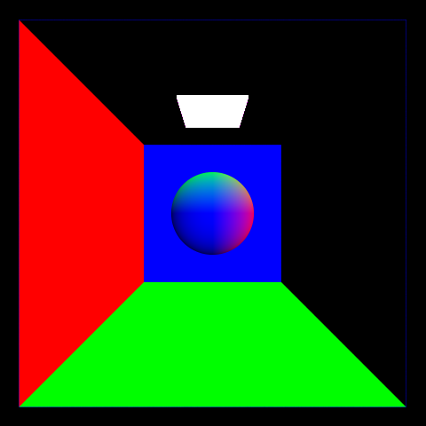

CUDA Path Tracer
================

**University of Pennsylvania, CIS 565: GPU Programming and Architecture, Project 3**

* Richard Chen
* Tested on: Windows 11, i7-10875H @ 2.3GHz 16GB, RTX 2060 MAX-Q 6GB (PC)

### (TODO: Your README)

*DO NOT* leave the README to the last minute! It is a crucial part of the
project, and we will not be able to grade you without a good README.

## Overview

## Features

* Diffuse surfaces

* Specular reflection

* Refraction with Snell's Law

* Dielectrics with Schlick's Approximation

* Anti Aliasing via Stochastic Sampling

TODO: noise vs aliasing trade off, notice the sphere's left edge is not nearly as jagged

* Obj Mesh Loading

* Textures from files

## Performance Analysis

## Debug Views

## Bloopers
* Initial mesh loading had triangle collision errors

Bug fixes:
seed the rng with the depth otherwise bad banding
offset new origin by surface normal not new direction

https://sketchfab.com/3d-models/ebon-hawk-7f7cd2b43ed64a4ba628b1bb5398d838
Ebon Hawk - sketchfab lemonaden

tinygltf insns by https://piazza.com/class/kqefit06npb37y?cid=134

diffuse vs specular
ray compaction
material sorting
cache bounce

gltf (also have debug views avalible for each)
    texture
    normal
    bump
refraction/fresnel/schlick
skylight???

4 mesh loading 
6 hierarchical spatial data structure 
2 refract 
2 depth of field 
2 antialiasing
5/6 texture/bump mapping
2 direct lighting
4 subsurface scattering
6 Wavefront pathtracing

// https://www.iquilezles.org/www/articles/intersectors/intersectors.htm
Scenes & Ray Intersection 
Steve Rotenberg CSE168: Rendering Algorithms 
UCSD, Winter 2017

COLORMAP ../scenes/ebon_hawk/textures/ebonhawk_V_EHawk01_baseColor.png
EMITMAP ../scenes/ebon_hawk/textures/ebonhawk_V_EHawk01_emissive.png
ROUGHMAP ../scenes/ebon_hawk/textures/ebonhawk_V_EHawk01_metallicRoughness.png
NORMALMAP ../scenes/ebon_hawk/textures/ebonhawk_V_EHawk01_normal.png

check t < 0
