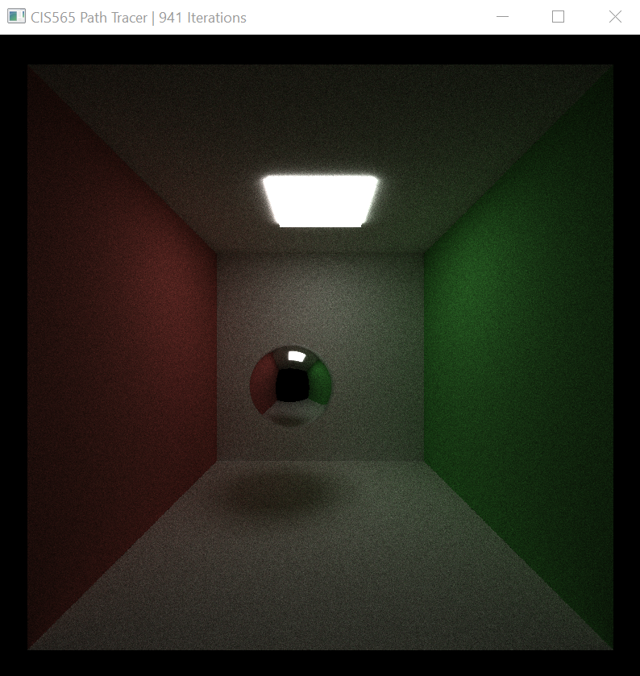
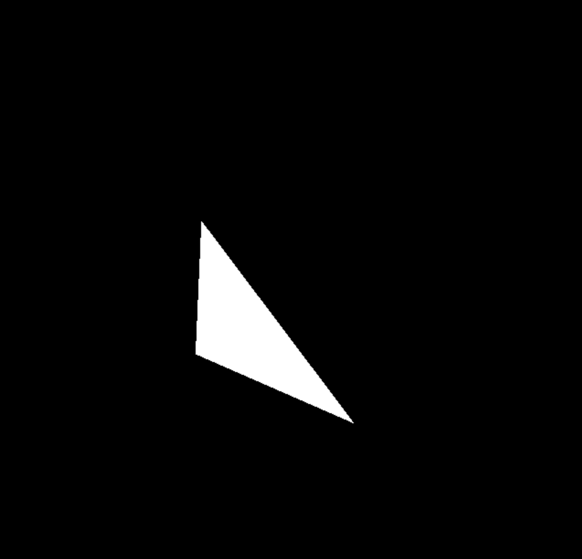
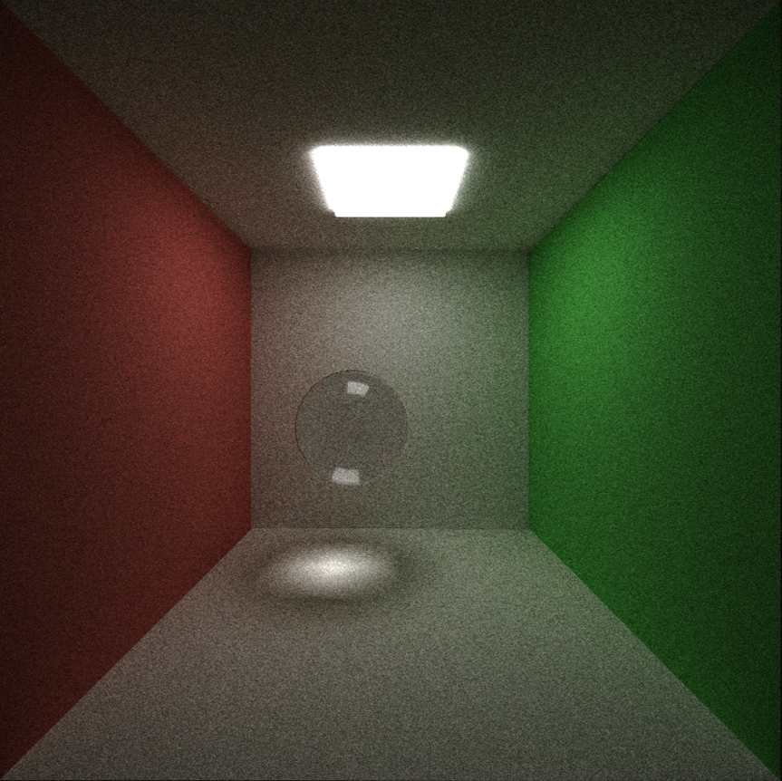
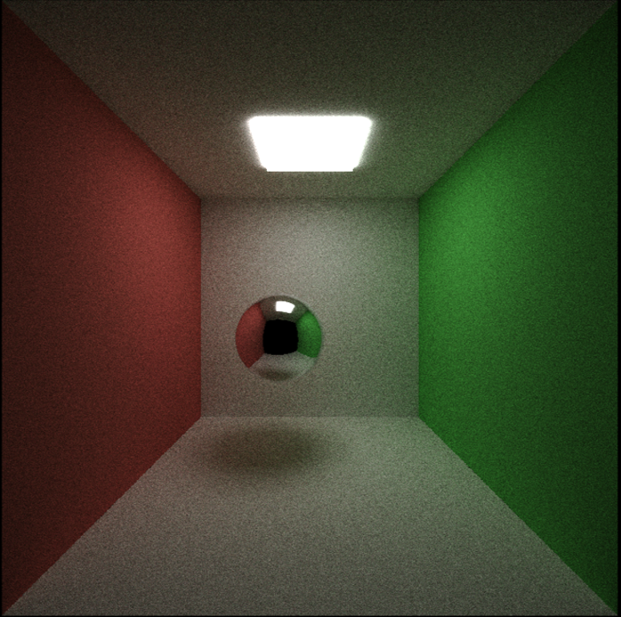
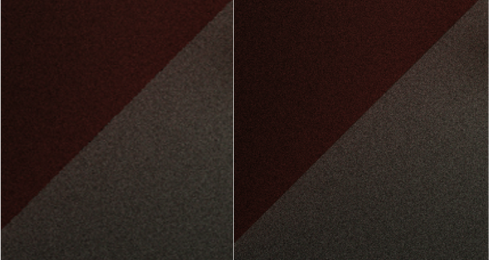
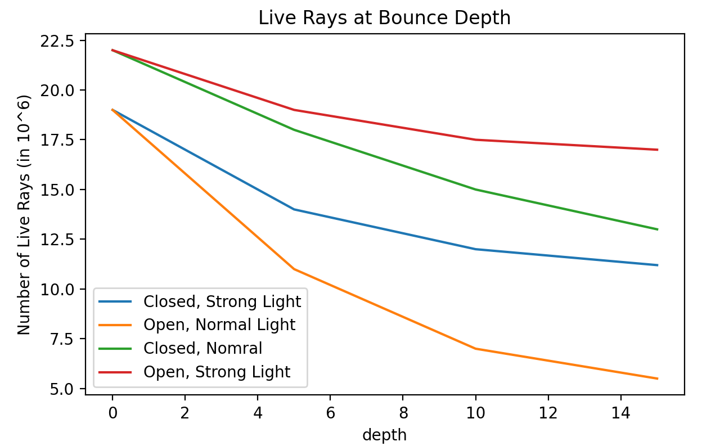

CUDA Path Tracer
================

**University of Pennsylvania, CIS 565: GPU Programming and Architecture, Project 3**

Nuofan Xu, Windows 10, AMD Ryzen 3800X, RTX2080 Super

A CUDA-accelerated path tracer: a global-illumination renderer.

*(The walls are implemented as diffusing surface, and the ball is implemented as perfect specular surface.)*
**

## Features
-Basic pathtracer
-Refractive, Reflective, and Diffused surfaces
-Depth of Field
-Direct Lighting

### Material Surfaces

The pathtracer supports the following material surfaces:

* diffuse: light scatters uniformly from the surface
* specular/reflective (perfect): light reflects perfectly off the surface.
* refractive (using [Schlick's Approximation][wiki-schlick] of the Fresnel
  effect to blend reflective and refractive light bounces).

  [wiki-schlick]: https://en.wikipedia.org/wiki/Schlick%27s_approximation

### Triangle checking ###

### Refractive Ball ###

*(The ball is implemented with 1.5 refraction rate)*

### Direct Light ### 
To get a direct lighting effect in our images we want to make the last bounce of each ray hit a light source. We do this by randomly selecting a point on a randomly selected light and setting the direction of the ray to that point. The first image is without direct lighting, and the second one we can see is overall brighter with the direct lighting enabled.

### Depth of Field

Depth of field simulates a physical aperture by varying the origin and direction
of rays shot from the camera. DOF is defined with a focal distance from the
camera, at which objects are perfectly in focus, and an aperture radius,
defining the amount of variance added to each ray.

*(no DOF; DOF with distance 5.5, aperture 0.4; around 1000 iterations each)*

### Antialiasing

Camera rays are shot from the camera's position in the direction of a pixel.
Antialiasing jitters the target of the ray within a pixel. This is a brief
computation that happens once per pixel per iteration; it has little impact on
performance.

*(Enlargement of antialiasing along wall corners (right) vs no antialiasing (left))*

### Stream compaction.

This pathtracer uses `thrust::stable_partition` to perform stream compaction on dead
rays. Reference: https://pbr-book.org/. The performance gain using stream compaction is analyzed using open scenes (room that has the front wall removed) vs closed scenes (room enclosed by walls as shown in previous images) and strong ceiling lighting (10x10, entire ceiling) and normal lighting (6x6).

As we can see from the graph, the type of scene has a large effect on the number of rays alive in a scene, as expected. The type of scene (closed/open) tends to define the trend line for how many rays terminate at each bounce (by leaving the scene). The type of light defines how many rays terminate on the very first ray shoot, but only has a small effect on the trend line on rays terminating. The effect of stream compaction, however, becomes obvious as the bounce depth increases regardless of the scenes, and at a depth of 14, we can at least expect a performance increase of 50% assuming the calculation of "dying rays" cost similar to that of normal rays.

## Run

To build: `make`

To run: `build/cis565_path_tracer SCENE_FILE.txt`.

Some sample scene files are found in `scenes/`.

## Feedback

Any feedback regarding the correctness of code or the pathtracer in general is welcome.