CUDA Path Tracer
================

**University of Pennsylvania, CIS 565: GPU Programming and Architecture, Project 3**

* Kaan Erdogmus
  * [LinkedIn](https://linkedin.com/in/kaanberk), [personal website](https://kaan9.github.io)
* Tested on: Windows 10, i7-8850H @ 2.592GHz 24GB, Quadro P1000

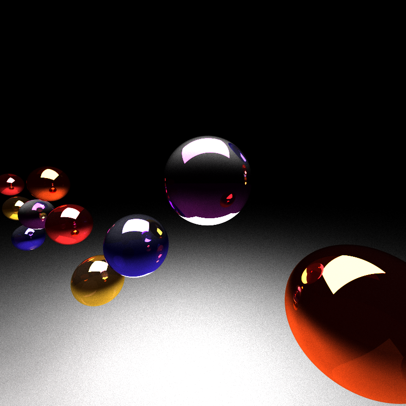

## Project Overview
A path tracer is a program that renders 3-dimensional scenes by mimicking, in reverse, the scattering of light from a
light source into a camera. In short, the path tracer generates rays from each camera pixel onto the scene, determines 
what they collide with and bounces them off repeatedly until they hit a light source or a maximum number of bounces is
reached. If the bounced ray eventually hits a light source, the properties of the surfaces hit (their colors,
for example) are combined to determine the color of the pixel sampled.

Path tracing allows for additional properties of surfaces to be observed. For example, a matte surface can bounce rays off in arbitrary directions whereas a specular (mirror) surface can always reflect with the same angle. More complex
surfaces can be rendered by combining such effects probabilistically. Additional effects such as refraction through surfaces are also possible, as implemented in this project.

This project implements a path tracer on the GPU using CUDA, parallelizing on the (non-terminated) rays in a bounce for each iteration.

## Features Implemented
* A basic path tracer using a Bidirectional Scattering Distribution Function
	* Ideal diffuse surfaces
	* Perfectly specular surfaces
	* For surfaces that are a mix of diffuse and specular, probabilistically chooses between the effects
* Removal of terminated rays using stream compaction
* Sorting of path segments and rays by material type on the GPU prior to shading
* Caching first bounces (since these are always the same when not using methods like antialiasing)
* Refraction with Fresnel effects using Schlick's approximation
* Stochastic Sampled Antialiasing
* Physically-based depth of field (partial implementation, work-in-progress)
* Arbitrary OBJ mesh loading (complete) and rendering (incomplete) with bounding boxes, using triangle intersections

## Visuals

### Ideal Diffuse surfaces
Simulates light bouncing from a surface in an arbitrary direction for non-reflective surfaces.
The incident ray is bounced of in a random direction using cosine-weighted hemisphere (which increases the expected
angle from the surface).
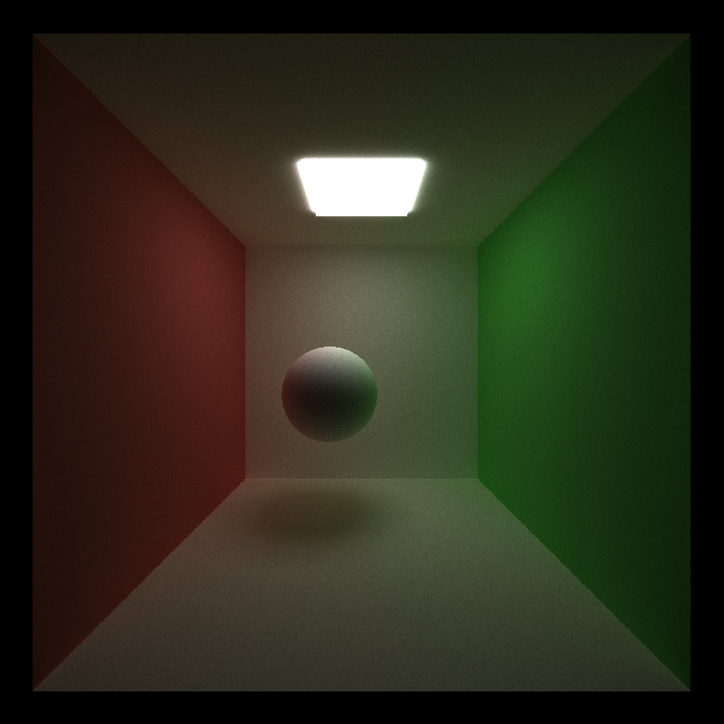

### Perfectly specular reflection
Simulates a perfect mirror, bouncing light off at the same angle as the incident ray.
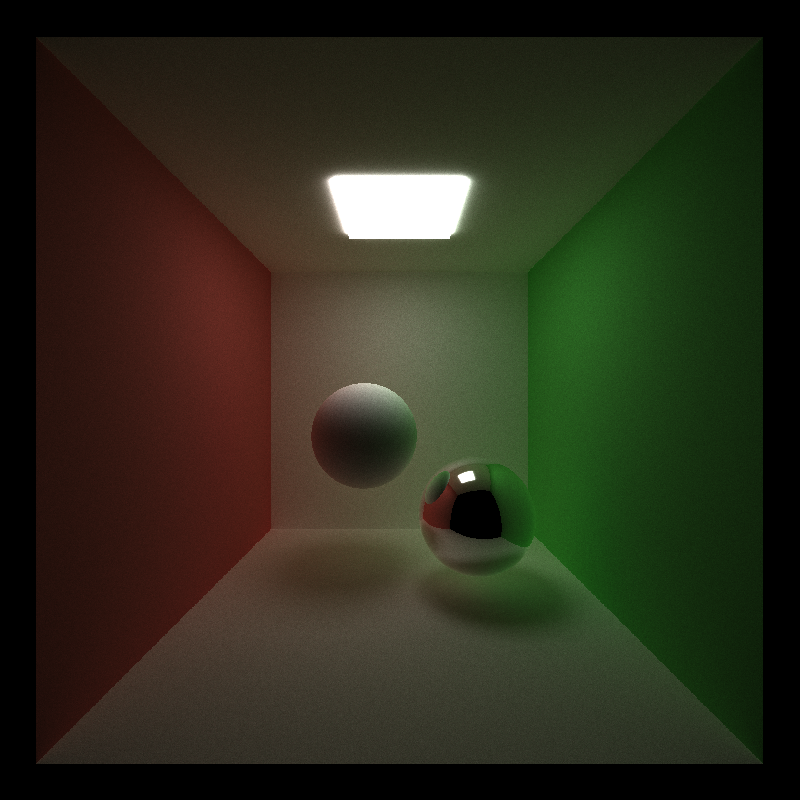

### Refraction
Refractive surfaces with Fresnel effects using Schlick's approximation.
The rendered image uses indices of refraction of 1.2, 1.5, and 2.0 (back-to-front) respectively for the spheres. 
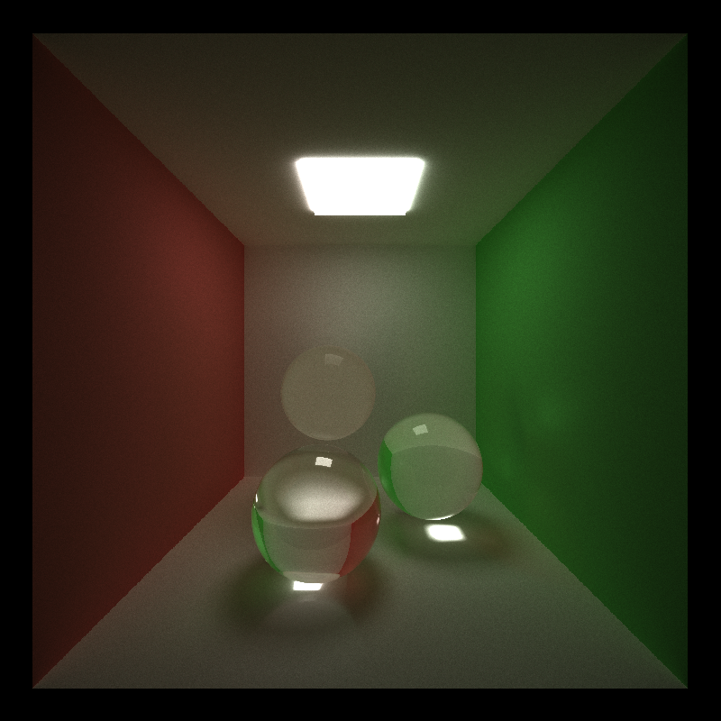

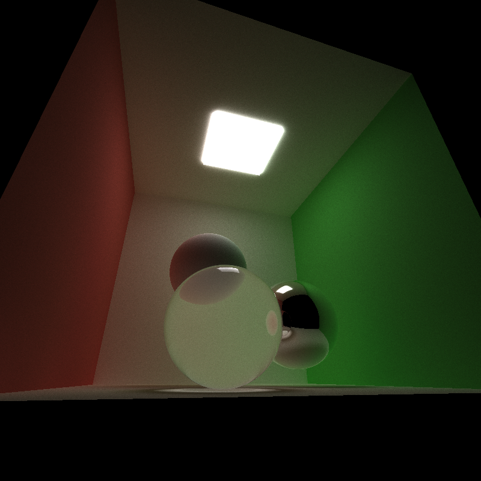

Multiple effects, such as refraction and reflection can be combined by probabilistically deciding which type of effect
to create depending on the incident ray.

The blue sphere is both refracting and reflecting.
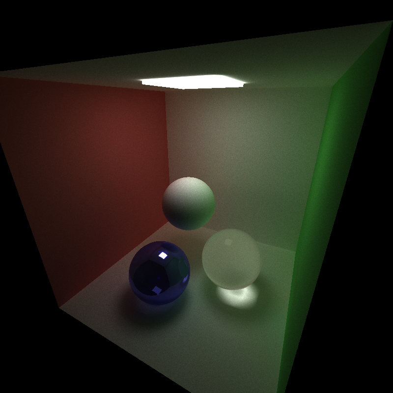

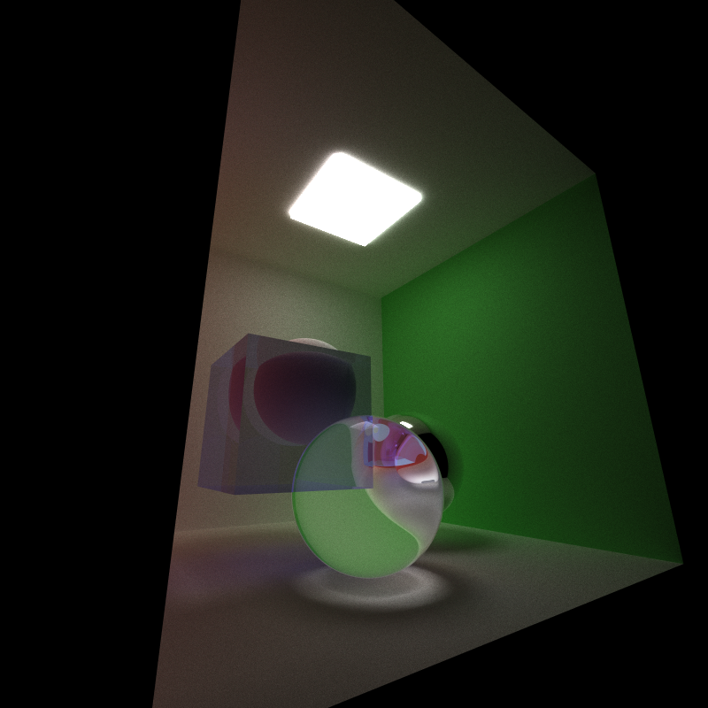

Refraction has a relatively small but nonzero performance hit: Specifically, the cornell box scene with 3 spheres (2
refractive) renders 10 iterations in 2202 milliseconds whereas if all 3 spheres are ideal diffuse surfaces, the runtime
for 10 iterations reduces to 2107 milliseconds.

A hypothetical CPU implementation of refraction would likely be significantly less efficient as it would not be taking
advantage of a number of opportunities at parallelization. Specifically, the many of the linear algebra operations
performed as part of the refraction calculation are branch-free arithmetic operations (including Schlick's approximation) and are therefore suitable to be parallelized on the GPU without a high divergence penalty.

This feature could be further optimized by finding ways of eliminating additional branches in the code (for example,
branching to determine inside or out and determining the index of refraction) which would make it more suitable to
be run on the GPU. Alternatively, the information of "inside" or "outside" incidence could be encoded as part of a material (that is, each material has two varieties: an inside and out), and the material sorting could be used to contiguously layout inside rays and outside rays, thus reducing divergence and improving performance.

### Stochasting Sampled Antialiasing
This is a method of antialiasing, where for each pixel in every iteration of the path-tracer, a small random offset less than the pixel's dimensions is added, effectively inserting noise to each created ray which smooths
(and slightly blurs) the image.

Without anti-aliasing:
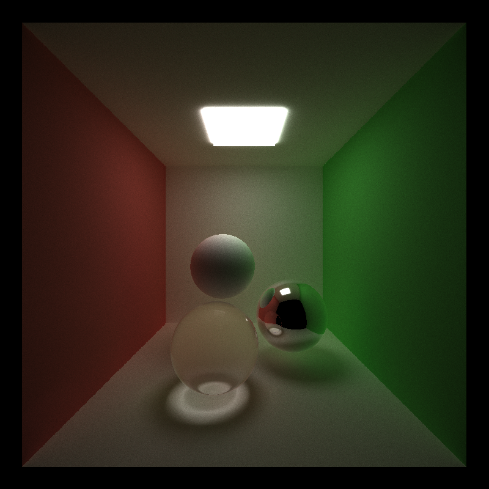

With anti-aliasing:
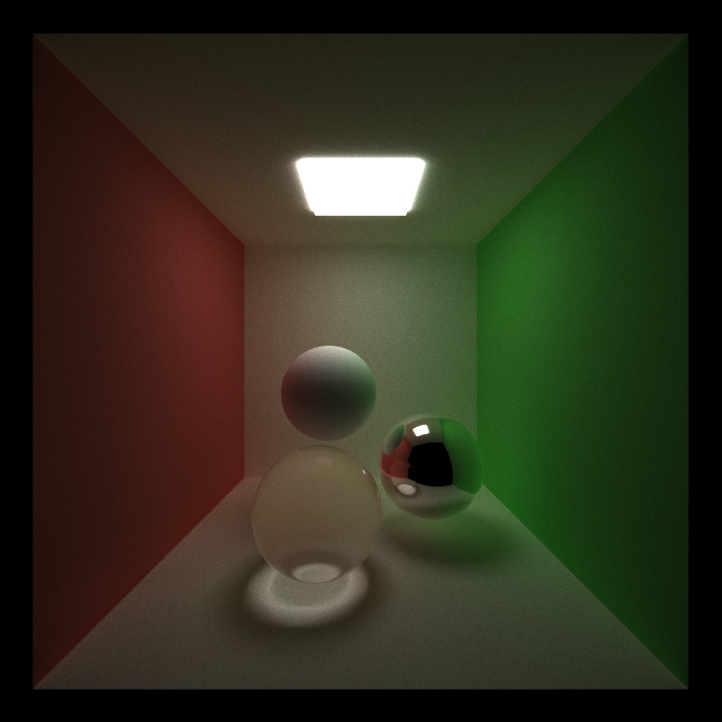

The difference is especially noticeable on the top edge of the ideal diffused surface,
where the antialiased version is much smoother. It is also visible in the edges of the cornell box.

There is a small performance penalty associated with stochastic sampled antialiasing, which is unsurprising as the
sampling requires the generation of random numbers per pixel for each iteration. Specifically, with 10 iterations, the
difference is 2219 milliseconds versus 2100 milliseconds without anti-aliasing.

Compared to a hypothetical CPU implementation, stochastic anti-aliasing would likely greatly benefit from being
implemented on the GPU since there is a blatant pixel-level parallelism, where each pixel (with relative independence)
chooses which subpixel to cast the ray from.

This feature might be optimized by choosing alternate methods of determining the subpixels. Currently, the subpixels
are determined through a pseudo-random number generator on the GPU. Performance could be potentially improved by
using a more deterministic method of sampling subpixels.

### Depth of field (work-in-progress)
Real cameras have a non-infinitesimal lens size and as a consequence have a focal length where the objects appear the
clearest and objects become blurier the further away they are. This implementation attempts to simulate this effect by
mapping each pixel to a point on a disk that acts as a lens and casting rays.

TODO: bugfixes

See bloopers for visual.

Similar to the anti-aliasing, depth-of-field also incurs a small performance penalty but unlike the stochastic sampling,
is deterministically implemented, mapping each pixel of the input to a point on a disk (which requires the usage of
the somewhat expensive `sin` and `cos` functions in CUDA). Overall, the runtime increases from the 2100 milliseconds to 
2206 milliseconds.

Similar to antialiasing, this is also a feature that will likely perform better on the GPU (in contrast to a
hypothetical CPU implementation) as there is an obvious parallelization over each pixel as each pixel's operations are
performed independently. So, the implementation would greatly benefit from being on the GPU.

This feature could be further optimized by consider alternative methods of sampling from the "lens". Currently, the
implementation maps pixels bijectively from the unit square to a unit disk (as described in PBRT).
However, such a precise mapping might not be in fact necessary, and more loose mappings, even those determined
probabilistically with less computation might be able to render appropriately.

### OBJ Mesh loading and Bounding boxes (work-in-progress)
Arbitrary meshes in the form of OBJ files can be loaded into the scene. The meshes are broken down into and represented as triangles. Specifically, a contiguous array of triangles is kept in memory (and later transferred to device memory for rendering). The meshes are loaded by iterating over the faces and breaking up and generating triangles for the faces,
then appending these triangles to the contiguous array. Each mesh stores the index in the triangle array of where its
triangles begin and the number of triangles it contains.

For efficiency, the mesh also stores the minimum and maximum coordinates in 3-dimensions. Specifically, when iterating
over the vertices of the faces, the smallest and largest encountered x, y, and z coordinates are stored which describe
the box that bounds the mesh entirely. Then, ray collisions with the mesh are performed first by checking for
intersections with the bounding box, and then by performing a triangle intersection test which every triangle in the
mesh.

Loading of OBJ files and triangle intersect is complete. TODO: bugfix in rendering

There is a very significant performance penalty associated with loading arbitary meshes into the scene. As the meshes
are broken down into and represented as triangles; complex meshes introduce a huge number of triangles into the scene
and since we are naively checking every ray against every object for collisions, this reduces performance by the order of the number of triangles in the meshes introduced.

The bounding box method accelerates the feature by first checking the rays against a box that encapsulates the mesh,
then only checking for triangles if the ray intersects the box, effectively eliminating a large portion (typically
a strong majority) of the intersection checks.

A hypothetical CPU implementation would not have significant advantages over the GPU implementation as we would still
have to check every ray against every object (with or without accelerators like bounding boxes) but would lose the
ability to make those checks massively parallel, likely resulting in a net slowdown.

The bounding box method eliminates many unnecessary checks but much more precise optimizations could be made on this
feature. Specifically, the mesh (and potentially the entire scene) could be represented by a hierarchical data
structure whose "cells" contain a much smaller number of triangles. Then, for each ray, we would first determine
the cells that the ray intersect and then only check the objects within those cells for intersection. We could
further start at the nearest cell and expand outwards, stopping when an object of a cell has an intersect as no
farther cells could be the nearest intersect for this ray. The hierarchical data structure would greatly increase
performance as our current implementation, if the ray intersects the bounding box, checks it against every triangle
in the mesh whereas a much smaller number can suffice.

## Performance Analysis
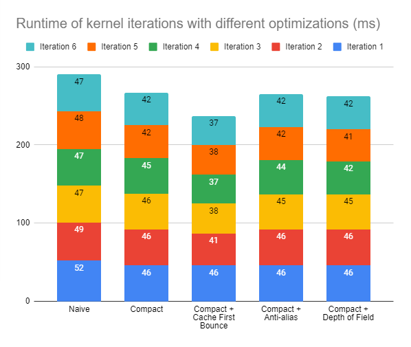

The above chart is the performance measurements of the Cornell box with three spheres (a perfect diffuse, a perfect
refract, and a blue mixed reflect-refract) whose image is shown under *Refraction*.

The above chart shows the runtimes for the same cornell box but with a "front" wall added, the blue sphere removed (to
maintain the same number of objects), and the camera moved forward into the now-closed box.

### Comparison of open and closed scenes
For closed scenes, unsurprisingly, stream compaction does not provide a performance benefit as the rays do not
terminate: they continue to bounce off until all of them reach the max depth limit. Therefore, stream compaction results
in a net performance negative in this case as we are wasting time running the stream compact algorithm without any
change in results.

### Stream Comparison in Single Iteration
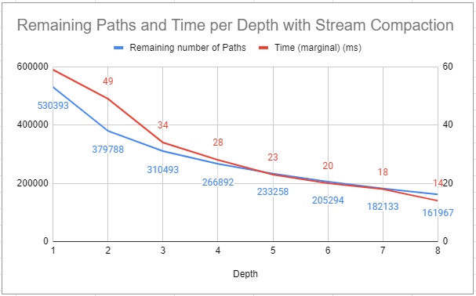

Stream compaction results in a clear decrease in the time elapsed per depth-level in an iteration, especially as the
depth increases. For the illustrated data, we begin with 600000 paths exactly, which takes about 60ms for depth-level 1. However, with stream compaction, we more than halve the runtime by the fourth depth-level and reach 14ms by depth 8.
As such, especially for renders with large depth-limits, stream compacting has a major runtime improvement as we
progress through each iteration. Note that these benefits only exist if rays terminate (otherwise, like the above
case with the closed scene, we waste time by running the stream compact algorithm).

### Material sorting
Sorting the rays and path-segments by material so that those with the same material are contiguous in memory
results in a performance benefit. This is primarily because of a reduction in divergence: The shading kernel's behavior
for each ray depends on its material and the kernel branches on the properties of the material. Therefore, by having
rays and path segments of the same material grouped together, we increase the chances of a warp having a more homogenous
makeup of material, resulting in a greater chance of executing the same intersect/shading routines and thus reducing
divergence.

### Caching first bounces
The above charts effectively show the change in performance for different max ray depths when the first bounce is
cached. That is, by observing the change in runtime of the subsequent kernel calls and comparing across an open versus a closed cornell box, we can analyze the performance benefit of the caching. There is a measurable improvement in
performance in both the open and the closed box case (almost every iteration except the first one is faster than the
corresponding iterations with other optimizations) but the improvement is quite small. We might expect there to be a
more significant improvement with greater depth limits but in either case, the difference is small to the point that
even if the rays bounce for a greater number of iterations (as in the closed box case), the benefits are small.
Furthermore, enabling this optimization prevents us from implementing various visual improvements like stochastic
anti-aliasing and depth-of-field lens.

## Bloopers

#### Buggy implementation of depth-of-field lens
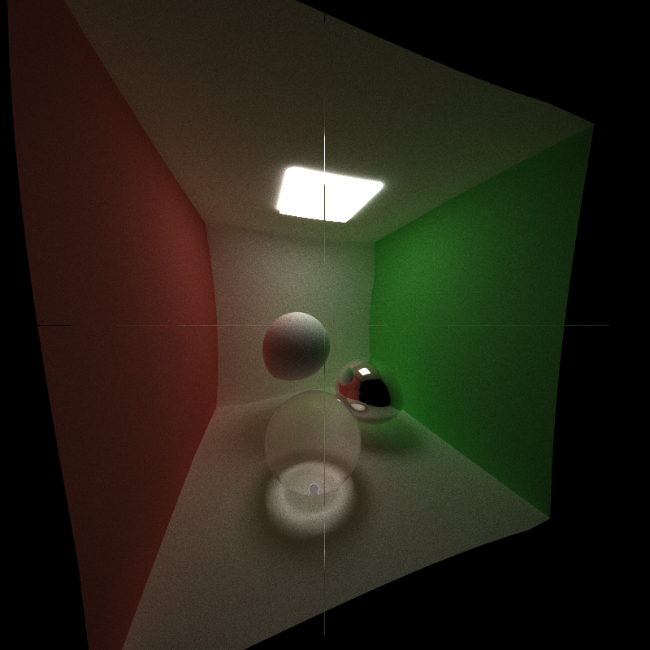

#### Incorrect refract implementations
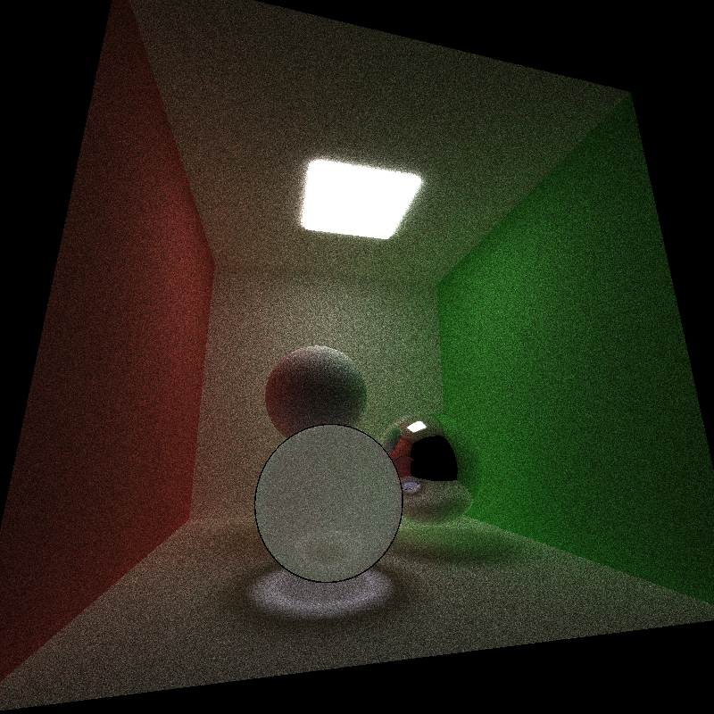      
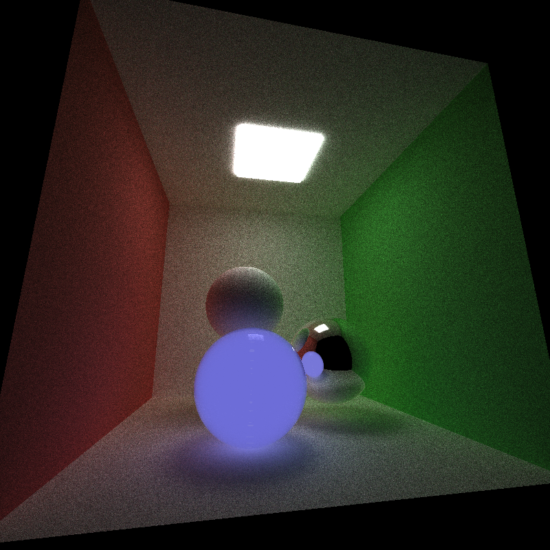
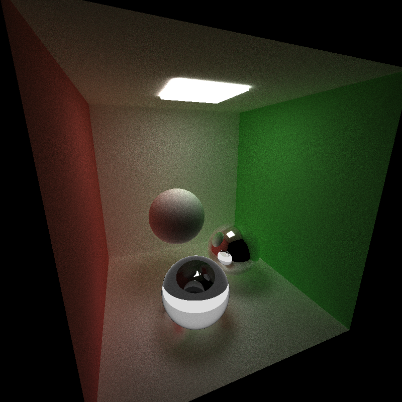

#### Incorrect reflection implementation
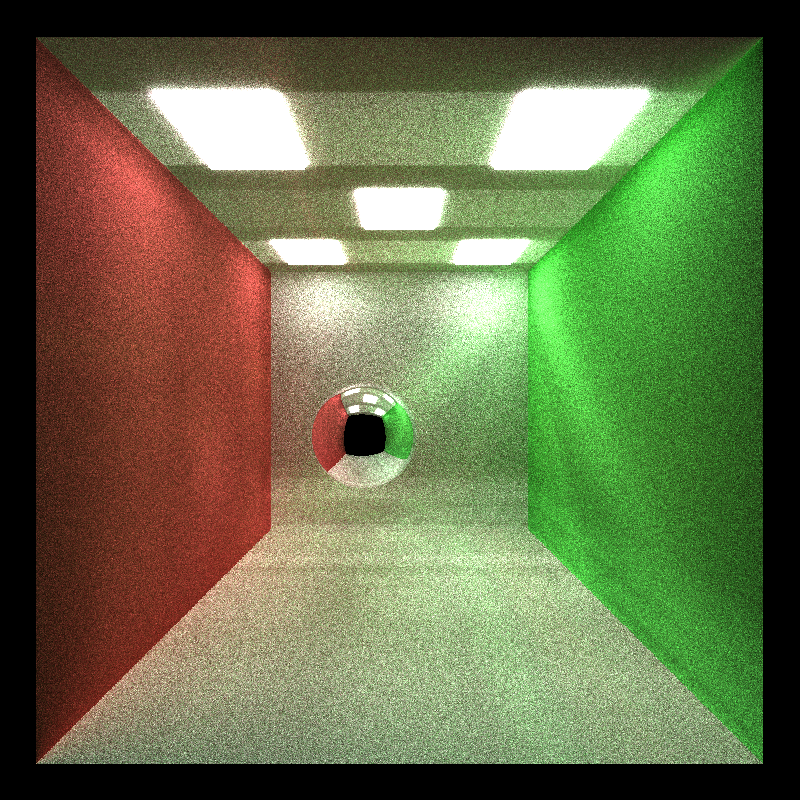

## Acknowledgments and External libraries
* Added [tiny object loader](https://github.com/tinyobjloader/tinyobjloader/).
* Physically Based Rendering 3rd edition
* Ray Tracing in One Weekend

