CUDA Path Tracer
================

**University of Pennsylvania, CIS 565: GPU Programming and Architecture, Project 3**

* Wayne Wu
  * [LinkedIn](https://www.linkedin.com/in/wayne-wu/), [Personal Website](https://www.wuwayne.com/)
* Tested on: Windows 10, AMD Ryzen 5 5600X @ 3.70GHz 32GB, RTX 3070 8GB (personal)

## Background

This is a GPU Path Tracer implemented in C++/CUDA with fundamental concepts from Physically-based Rendering (PBR) texts.
It allows loading GLTF files for meshes and their associated materials and textures.

## Screenshots
(COMING SOON)

## Basic Features

### Global Illumination
The first step was converting the naive shading method into a path tracer.
This allows for the global illumination effect to be achieved.

Before            |  After
:-------------------------:|:-------------------------:
   |  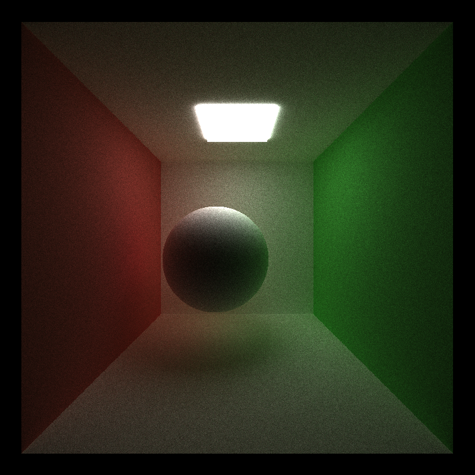

### Basic Shading
Two basic shadings were implemented first: diffuse and perfect specular.
The diffuse component is shaded by generating new ray using cosine weighted random direction in a hemisphere.
The perfect specular uses `glm::reflect` to generate a perfectly reflected ray.

Diffuse            |  Perfect Specular
:-------------------------:|:-------------------------:
   |  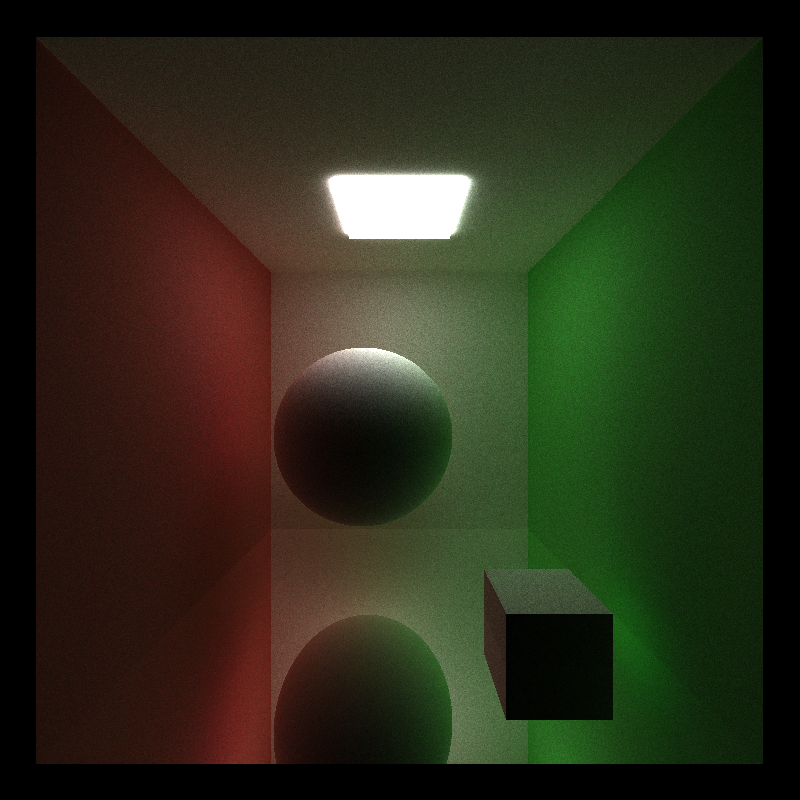

### Stream Compaction
The first optimization made is by removing the ray paths that have terminated using stream compaction.
In this case, we use the `thrust::stable_partition` kernel to partition paths based on completion.
This gives noticeable performance gain as less paths have to be processed by the kernel after each bounce.

Path Rays Remaining        |  Time
:-------------------------:|:-------------------------:
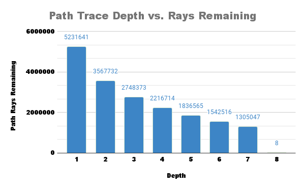   |  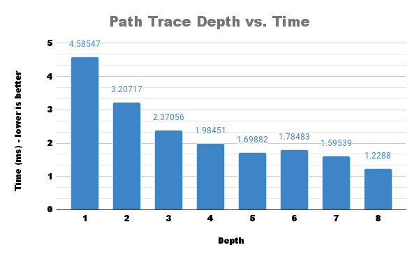

This optimization however is dependent on the scene being open, such that it is possible for a path to be terminated.
A closed scene will never allow the paths to terminate, therefore having no performance gain.

Path Rays Remaining        |  Time
:-------------------------:|:-------------------------:
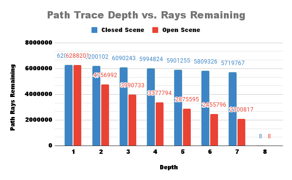   |  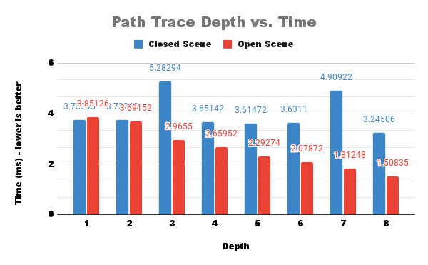

### Paths Sorting
An attempt was made to optimize by sorting the intersection and ray paths based on materials for memory coalescing.
For this, the kernel `thrust::sort_by_key` is used to do key-value sorting.
However, this does not seem to impact the performance of the shading kernel as shown below. As such, the overall performance decreases due to the cost of sorting.
Additionally, all shading is done in one kernel, therefore there should be high chances of warp divergence for processing different materials.
No performance gain indicates that there may be little divergences and most materials are processed in similar execution fashion.
Perhaps introducing very distinctively different materials would make a bigger difference.

Test Scene       |  Shading Kernel Performance
:-------------------------:|:-------------------------:
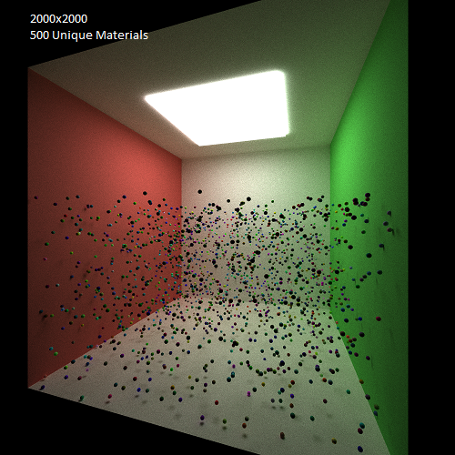   |  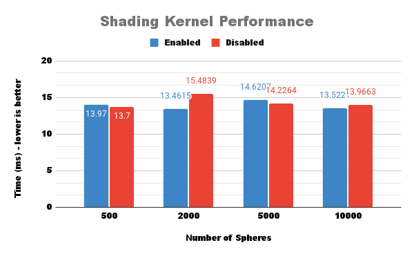


### First Bounce Caching
Another optimization that's made is caching the intersection data for the first bounce (i.e. depth = 1). 
Since each ray starts at the same spot for each pixel, the first bounce result will always be the same for all iterations.
Although not significant, first bounce caching does make things slightly faster on average as shown in the chart below.

Test Scene       |  Time to each iteration
:-------------------------:|:-------------------------:
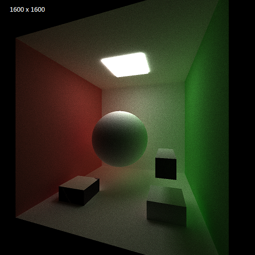   |  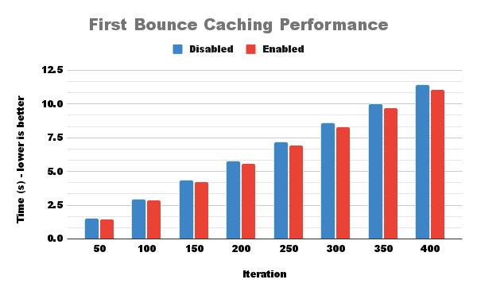

## GLTF Mesh Loading
In order to render more complex scenes, the system needs to support loading arbitrary mesh robustly.
As long as the system is sufficiently robust (e.g. able to handle multiple hierarchies), the complexity can be defined by the file format itself thus making the scene more visually interesting. **GLTF** was chosen as the scene description format as it is much more powerful than OBJ, and the fact that I have never worked with GLTF before and thought it would be a good opportunity to understand the specification.

To support GLTF mesh loading, I used tinygltf to load in the GLTF file and parsed the data into custom `struct` data defined in `sceneStruct.cpp`. This step is necessary since the tinygltf classes are not GPU-compatible.
Additionally, in order to not have to deal with passing nested Struct Arrays to the GPU, each mesh vertex data is flattened into its own giant buffer containing the data for **all** meshes. 
The actual Mesh struct would only store the index offset for each data. This is similar to how GLTF/OpenGL defines VBOs, therefore there is opportunity to make the GLTF to GPU translation more direct.

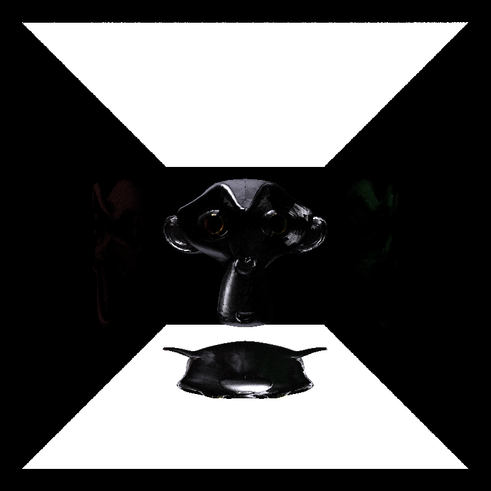

## Metallic-Roughness Model
In order to support the material definition in GLTF 2.0, the default specular-gloss model needs to be converted to the metallic-roughness model.
In this implementation, a simplified implementation is used based on the idea of importance sampling.

### Metallic
The `metallicFactor` is interpreted as the probability for a surface to be specular. Below is the pseudo-code for the metallic logic:
```
isMetallic = uniformRandom(0,1) < metallicFactor
if isMetallic:
    specularShade
else
    diffuseShade
```

### Roughness
The `roughnessFactor` is interpreted as the variation amount in the reflected specular ray. This is based on PBR's microfacet model which introduces an imperfect specular ray instead of a perfect one.
The calculation and implementation for the imperfect specular ray is adopted from [GPU Gem 3, Chapter 20](https://developer.nvidia.com/gpugems/gpugems3/part-iii-rendering/chapter-20-gpu-based-importance-sampling).

GLTF provides a useful testing scene for different metallic and roughness values, as shown below with the implemented renderer.

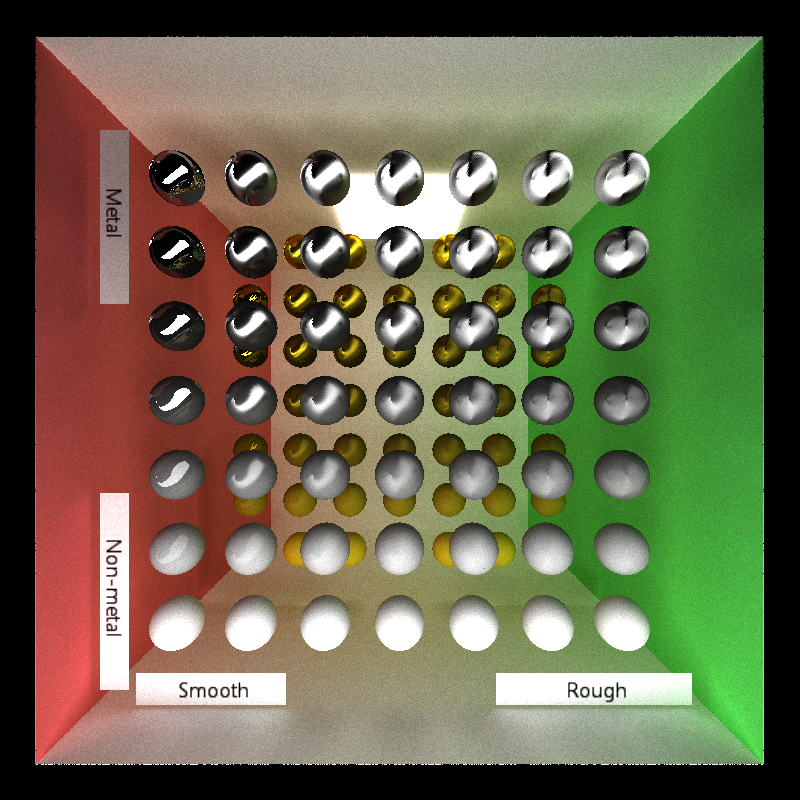


## Texture
Most GLTF materials use textures instead of hardcoded albedo, metallic-roughness values. Naturally, it is important to implement the ability to load textures with GLTF.
Textures are loaded using `cudaTextureObj` and `cudaArray`, which allows multiple textures to be loaded at once and more optimized texture sampling.

### Texture Image
To read textures, we use the `Tex2D` built-in CUDA kernel.

No Texture (Red)        |  Textured
:-------------------------:|:-------------------------:
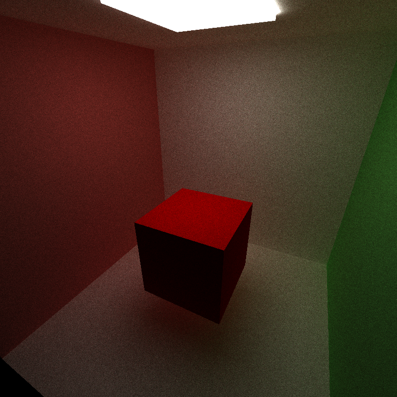   |  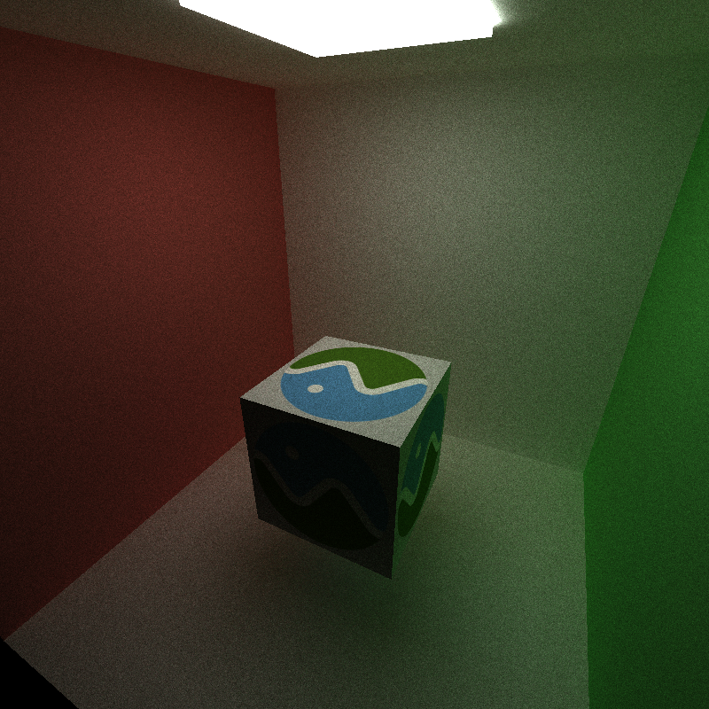

### Normal Mapping

Original       |  Normal Map              | Applied
:-------------------------:|:-------------------------:|:--------------------:
   |  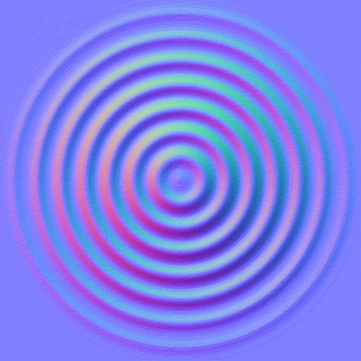  |  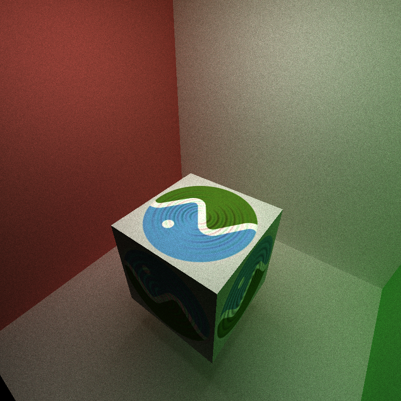

### Procedural Texture
Procedural texture can also be generated using a kernel. For example, a simple checkerboard pattern can be generated with the following algorithm:
```
(int(u) + int(v)) % 2 == 0 ? Color(1.f) : Color(0.f);
```

Baked       |  Procedural
:-------------------------:|:-------------------------:
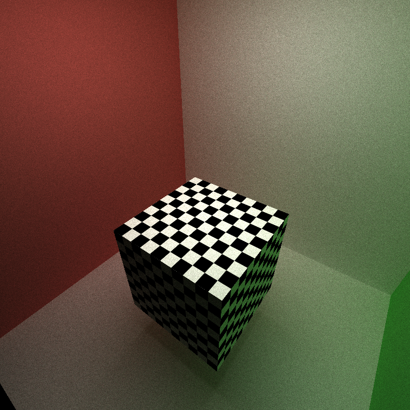   |  

On the right image, there's mildly noticeable aliasing indicating that it's the procedural generated one, whereas the baked texture is smoothly interpolated. Anti-aliasing can be fixed by optimizing the checkerboard algorithm, however it is not implemented here.

Performance Comparison

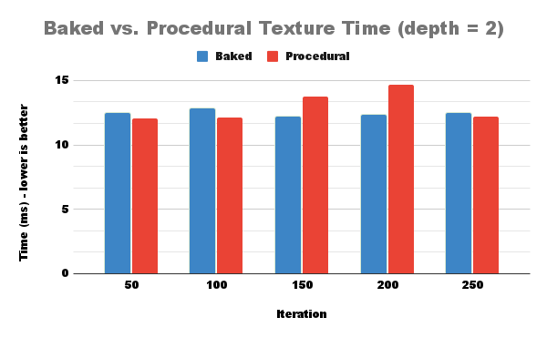

There's no significant different between the baked and procedural texture for the checkerboard pattern.
This suggests that using baked texture is most practically faster as the access speed is fixed regardless of texture pattern, 
whereas procedural texture is heavily dependent on the efficiency of the algorithm.

## References
https://www.khronos.org/files/gltf20-reference-guide.pdf