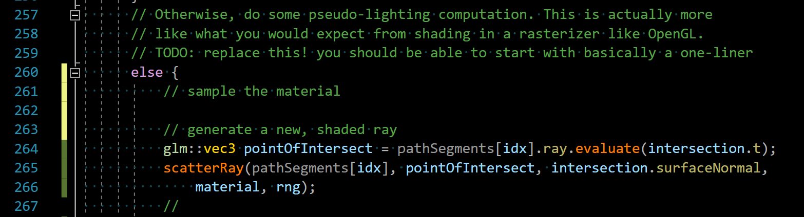

CUDA Path Tracer
================


## Progress

Stuck at 


**University of Pennsylvania, CIS 565: GPU Programming and Architecture, Project 3**

* (TODO) YOUR NAME HERE
* Tested on: (TODO) Windows 22, i7-2222 @ 2.22GHz 22GB, GTX 222 222MB (Moore 2222 Lab)

### (TODO: Your README)

*DO NOT* leave the README to the last minute! It is a crucial part of the
project, and we will not be able to grade you without a good README.


|                                                              | NVIDIA GeForce RTX 3060 Laptop GPU Limits |
| ------------------------------------------------------------ | ----------------------------------------- |
| Thread block slots (```maxBlocksPerMultiProcessor```)        | 16                                        |
| Thread slots (```maxThreadsPerMultiProcessor```)             | 1536                                      |
| Registers (```regsPerMultiprocessor```): 32-bit registers available per multiprocessor | 65536                                     |
| Shared memory (```sharedMemPerMultiprocessor```): Shared memory available per multiprocessor in bytes | 102400 bytes                              |

1000 iteration took 55.934 seconds with sort by material

1000 iteration took 21 seconds without sort by material


5000 iteration  took 285.831 seconds with sort by material

5000 iteration took 110.662 seconds. seconds without sort by material


For cornell box, sorting by material didn't help that much. 

Bug

1. read access violation when using thrust::remove_if. Fix: use thrust::device as the first parameter to indicate the correct execution policy because dev_paths is in device memory
