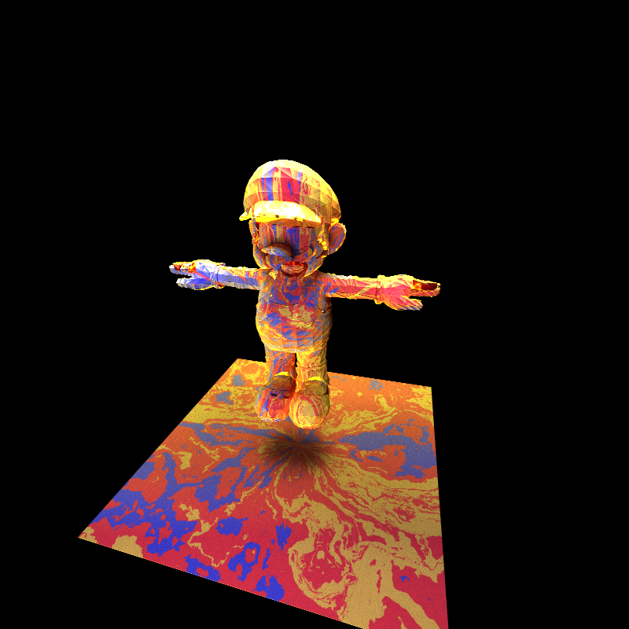

CUDA Path Tracer
================

**University of Pennsylvania, CIS 565: GPU Programming and Architecture, Project 3**

* Shubham Sharma
  * [LinkedIn](www.linkedin.com/in/codeshubham), [personal website](https://shubhvr.com/).
* Tested on: Windows 10, i7-9750H @ 2.26GHz, 16GB, GTX 1660ti 6GB (Personal Computer).
*GPU Compute Capability: 7.5

# Performance Analysis

## Optimisations

### Stream Compaction 

Stream compaction generally progress the execution by terminating the rays in case they are futile. Less threads  will be made and the execution quickened. The first-bounce cache moreover moves forward 13% execution by caching the primary crossing point of the beam. In expansion, the work puts the active rays closer together in memory, which ought to make getting to faster global memory access rates since they gets to will be continguous, rather than random. Underneath Values of remaining rays in Open and Closed Cornell Box.

Open Box
-	Remaining Rays
	-	640000
522846
363661
285058
233617
195501
165195
140456
0

Closed Box
-	Remaining Rays
	-640000
628992
618683
608142
597827
587715
577778
567933
0

 

### Material Sorting
In my case the material sorting slows down the execution time of program. I believe this can be attributed to less number of materials in my scene to begin with. The method in theory would sort the rays with similar material object intersections closer as they will have about the same lifetime. Since the scene doesn't have many materials the probablity of rays with same material behaviour being contiguous in memory is already high and sorting them only adds an overhead in this case. If the scene has a large number of materials then i believe the execution times will increase with Material Sorting.    

### Caching First Bounce
Since the first bounce intersections stays the same if the camera doesn't change, A cache can be implemented to save the intersection of the first bounce in the first iteration and the results can be directly used in later iterations. Since for antialiasing each iteration first bounce is different caching cant be done.
I have recorded an average of the exection time of my program for 3000 iterations below, with and without caching the first bounce. From the data we can depict an improvement of of 90ms in execution times.   

Without Cache 
-	2min 4.03s
 

With Cache 
-	2min 3.08s

