CUDA Path Tracer
================
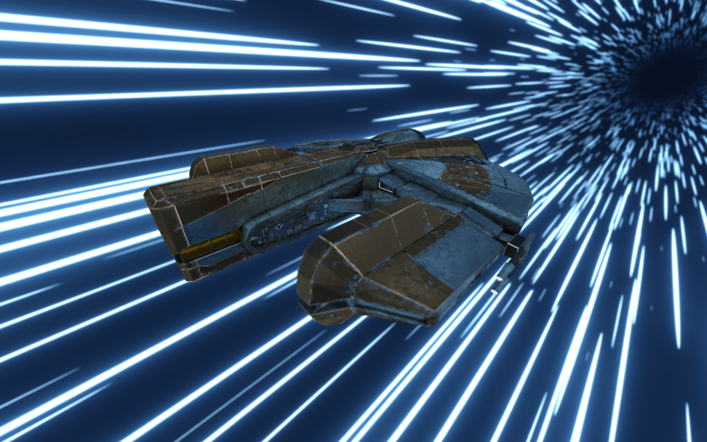

**University of Pennsylvania, CIS 565: GPU Programming and Architecture, Project 3**

* Richard Chen
* Tested on: Windows 11, i7-10875H @ 2.3GHz 16GB, RTX 2060 MAX-Q 6GB (PC)

## Overview

Path tracing is a rendering technique where light rays are shot out from the "camera" 
into the scene. Whenever it meets a surface, we track how the ray gets attenuated and scattered.
This allows for more accurate rendering at the cost of requiring vast amounts of computation.
Fortunately, since photons do not (ignoring relativity) interact with each other,
this is very parallelizable, a perfect fit for running on a GPU. 

Cornell Box Inspired | Very Fast Shiny Cow
---------------------|------------------
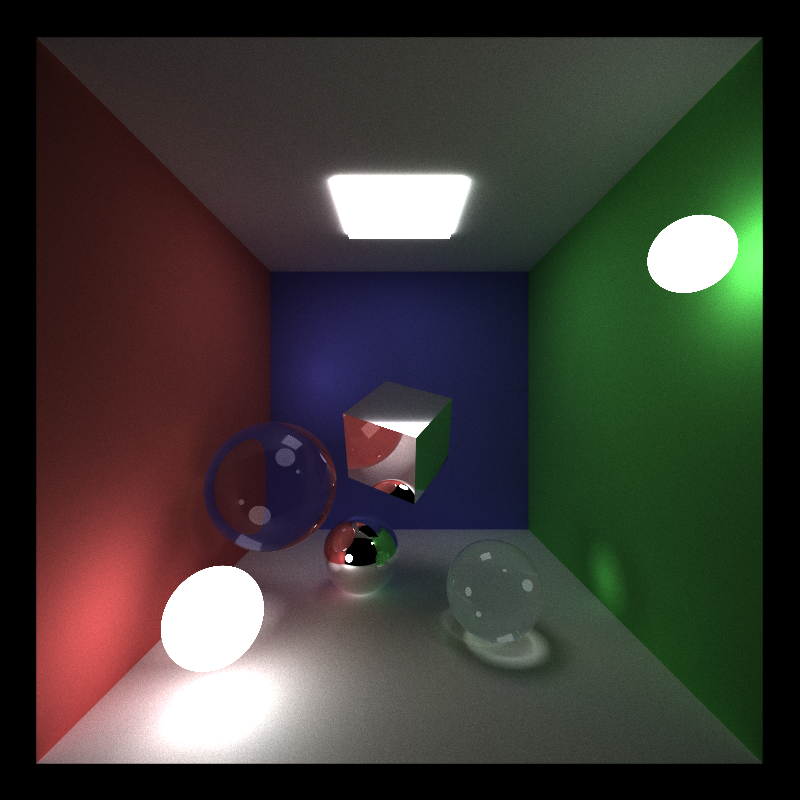 | 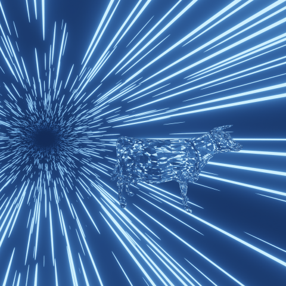
 
<!-- 
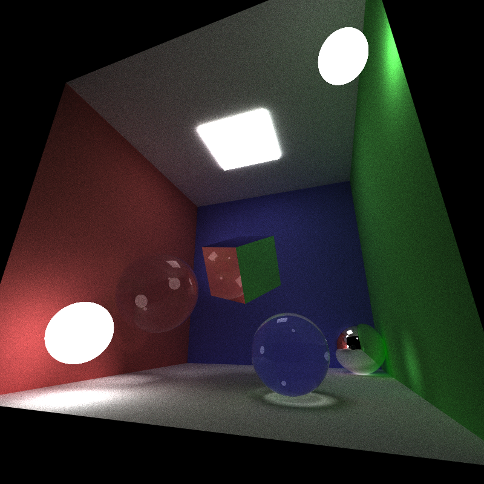 -->

## Features
   

* Diffuse surfaces  
 
Since most surfaces are not microscopically smooth, incoming light can leave in any direction.
 

 

* Specular reflection  
 
Smooth surfaces reflect light neatly about the surface normal, like a mirror does. 
 
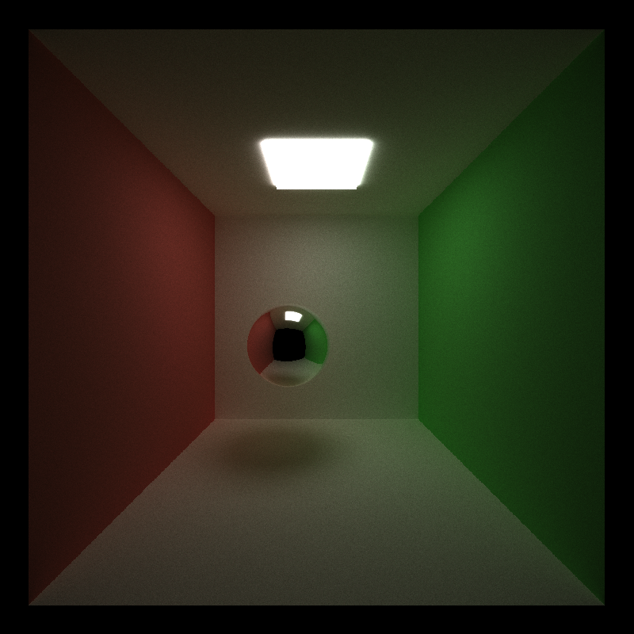
 

* Dielectrics with Schlick's Approximation and Snell's Law  
 
Light moves at different speeds through different mediums and this can cause light 
to refract and/or reflect. In these examples, glass and air are used with indices of refractions
of 1.5 and 1, respectively. The further the incoming light is from the surface normal, the more likely
it is to reflect. 
 
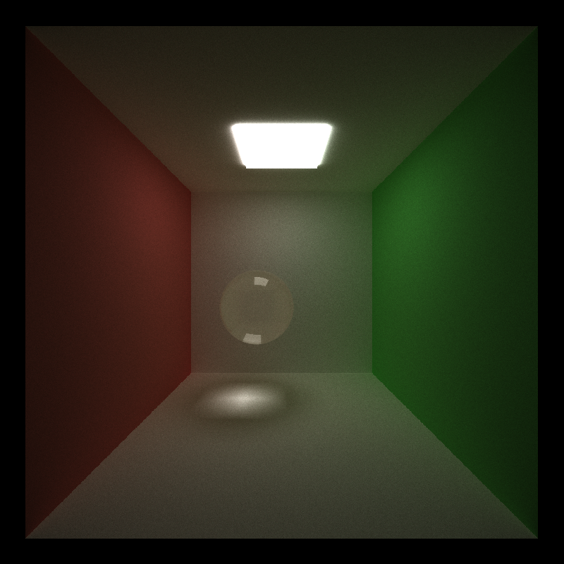
 

* Anti Aliasing via Stochastic Sampling  
 
As opposed to classical antialiasing which involves super-sampling an image and is thus very computationally
expensive, stochastic sampling wiggles the outgoing ray directions slightly. This reduces the jagged artifacts
from aliasing at the cost of more noise, but does not involve shooting extra photons per pixel. 
Notice how the left edge of the sphere is not nearly as jagged in the anti-aliased version
 
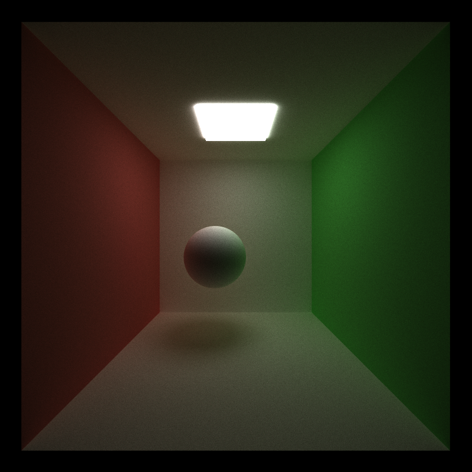
 

* Depth of Field/Defocus Blur  
 
Despite modelling the rays as shooting out from an infinitesimal point, real life cameras have a lens 
through which the light passes. Further, the laws of physics also prevent light from being infinitely focused.
With cameras, this means that objects further away from the focal length will be blurrier. In ray tracing, the origin points of the light rays are wiggled in a manner consistent with approximating a lens. 
 
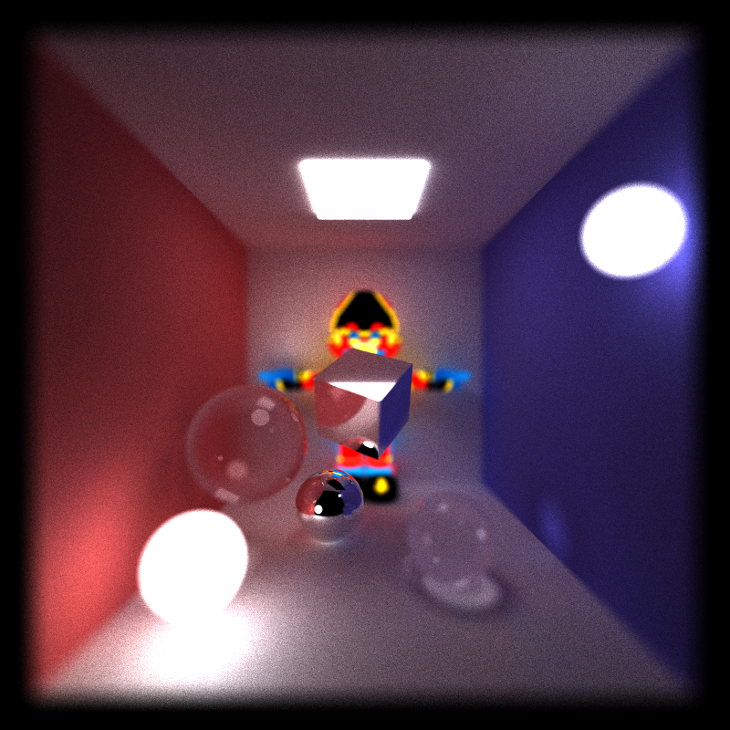
 

* Obj Mesh Loading  
 
While cubes and spheres are a great point to start off, one of the great joys in life is 
to render Mario T-Posing. Many 3d models are available from the internet, with most of them
being meshes composed of triangles. I used [tinyObj](https://github.com/tinyobjloader/tinyobjloader) to load models that were of the Wavefront OBJ file format. 
 
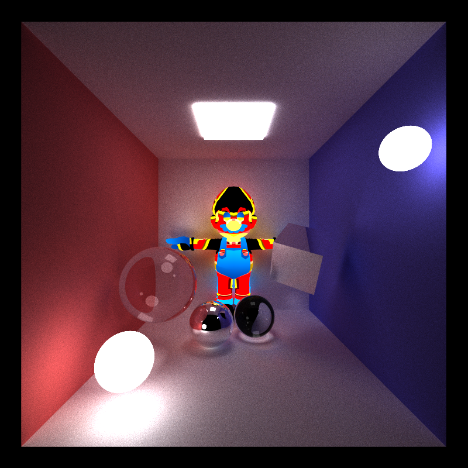
 

* Textures from files  
 
While it is theoretically possible to specify material properties for each shape in a scene, 
this can be untenable when working with thousands of shapes, let alone millions. 
Instead, it is common to use textures, images where the color encodes useful data. Then,
rather than giving every vertex all of its data, it can associate them with texture coordinates 
and look up the corresponding data only when relevant. I focused on textures that encoded
base color, tangent space normal mapping, ambient occlusion/roughness/metallicity, and emissivity.
I also set the background in a few renders to a texture rather than just having it fade to black, lest they be way too dark 
 
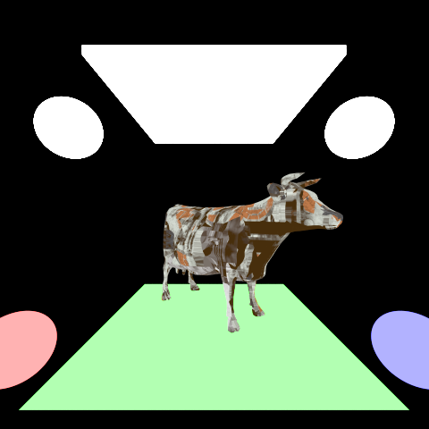
 

* Normal Mapping Texture Adaptation  
 
The normal vector at a location allows for computing reflections, refractions, and more since
knowing it allows one to calculate the angle of incidence. Technically, it is a co-vector but
a consensus has been reached for how the order of vertices in a triangle directs its planar normal.
At its most basic, each triangle contains enough information to calculate its normal. 
However, meshes composed of polygons are often used to model smooth objects, so it is common
to associate each vertex with a normal vector. Then, for a point inside a triangle, one can 
interpolate between the vertex normals to get a normal for a particular location.
Imagine a brick wall. The mortar crevices could be modelled by adding who knows how many new triangles. 
Alternatively, by turning the surface normals into a texture, they can be sampled as needed without weighing
down the system with extra computations. Bump maps and height maps accomplish something very similar, but 
normal maps themselves come in two varieties: Object space and Tangent space. Object space maps let one directly
sample the rgb components and associate them with the normal's xyz values. Tangent space normal maps involve 
a perspective shift so that the interpolated norm is pointing straight up. This requires some extra computation but is generally preferred due to its flexibility. The change of basis matrix TBN requires the namesake tangent, bitangent, and normal of which the normal is just the triangles planar norm. The other two can be relatively easily computed from the uv/texture coordinates of the vertices. To save on computation, I precompute them when loading in a mesh rather than need to recompute them every time they need to check the normal map. 
 
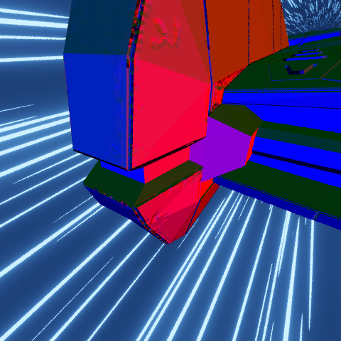
 

* Physically Based Rendering Texture Adaptation  

Just the base color      |  With more effects            
-------------------------|-------------------------
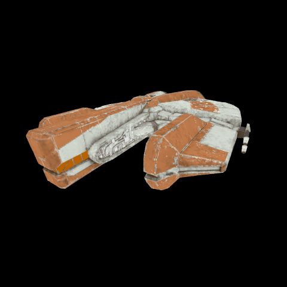 | 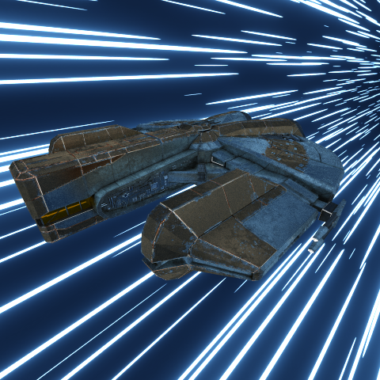

 
Nowadays, many people use metallic/roughness and Albedo instead of diffuse/specular.
I found a mesh (and its accompanying textures) that used this information so I had to 
figure out how to adapt to this. Due to vastly different behaviors between dielectrics
and conductors, metallicity the concept is treated almost as a boolean value, with gradations
encoding how to attenuate the metallic behavior. Physically based rendering tries to use 
more physics to enable more realistic rendering. Light is split into refractive and reflective
components and metals will absorb the refractive component whilst dielectrics will scatter both, 
with the resultant having both a specular and a diffuse portion. 
The roughness also has a varying effect predicated upon metallicity. And lastly there is an 
ambient occlusion map that describes how an area might be darker than expected. 
This seems to be more tailored towards rasterization as the nature of path tracing means
areas which would be occluded more just will not bounce the light rays back towards light sources. 
The theory goes much deeper, having had whole textbooks written about them but just scratching the 
surface let me translate the textures and make the model look cool. 
   

* Background Texture  

Raw Texture | Single Pass | Two Passes 
------------|-------------|--------------
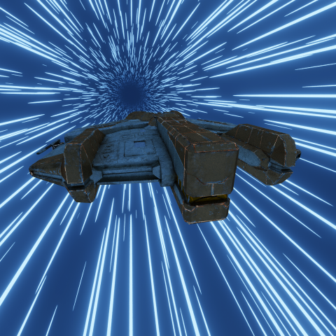 |  | 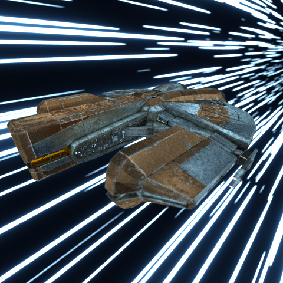  

 
As a Star Wars fan, my thoughts naturally drifted towards making the ship look like it was 
in hyperspace. This is also motivated by the fact that with path tracing, I could not think of how 
to simulate ambient lighting, and was afraid I would need to sprinkle many small luminescent orbs
around the scene just to be able to see anything. Once, I found a cool background, I was next concerned
with how to map the rectangular texture onto the viewable sphere. By exploiting the symmetry of the hyperspace effect looking like a tunnel, this was made easy but for more complex backgrounds, this 
would require more investigation. As it currently stands, for the unit sphere, x^2+y^2+z^2 = 1. 
Z is constrained by the x and y values enabling us to map the view direction vector to UV coordinates.
When z = 1, x = 0, y = 0 which maps to uvs of (0.5, 0.5). By extension, this should scoop a unit circle
out of the texture that points would actually map to, with (x, y, z) and (x, y, -z) mapping to the same
uv coordinates ensuring a smooth transition. Then, I rotated the mesh to align with the tunnel direction
and voila, it looks like it is cruising through hyperspace. 
  
The next issue is that the sky was too bright and too blue, since I was using the bright color for global illumination as well. So I interpolated the texture color between
black and itself based on its brightness, as I wanted the bright streaks to remain but the space between 
them to be darker. Then I did it again since it worked well the first time. 
 

## Performance Analysis

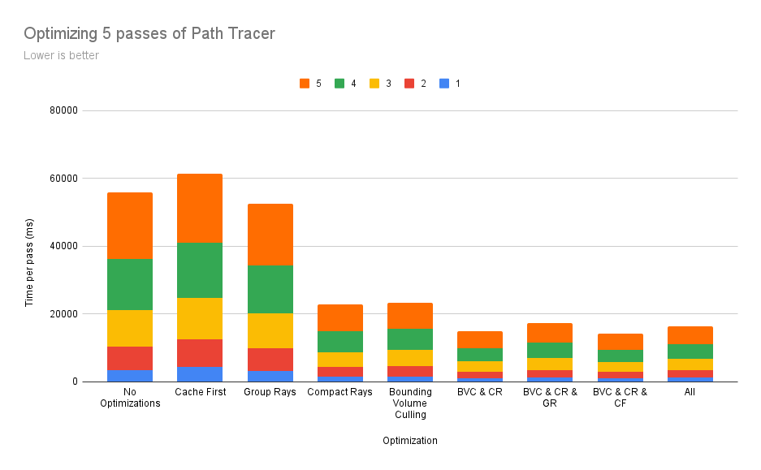  

* The scene used was a Cornell box with different colored walls, many spheres and cubes that were shiny or glass, and Mario T-Posing menacingly in the back with an emissive texture
* Caching the First Intersection
    * The rays start out at a known location and shoot into a screen pixel and then into the scene so it 
    makes sense to precompute the data on the first intersection for future computations
    * Since antialiasing and depth of field are cool effects that add randomness and break this optimization, this optimization is worthless  
* Sorting Rays by Material
    * When there are multiple materials, checking the rays in order introduces branch divergence since materials will interact with the rays differently. Instead sort the rays by material so that there will be less divergence
    * Meshes, which are expensive to check, count as a singular material so this optimization is situationally helpful if the scene in question has many different kinds of materials
* Compact Dead Threads
    * If a ray terminates early, remove it from the pool so that there are fewer rays to check
    * Especially when the geometry of the scene is very open, this optimization is very beneficial
* Mesh Intersection Test via AABB
    * Rather than check collisions against every triangle, associate each mesh with its min and max bounds
    for an axis aligned bounding box (AABB) and only check intersection with triangles if it intersects the bounds
    * Especially if a mesh fits tightly inside a box, this optimization is very helpful. But if the mesh is irregularly shaped enough that the AABB encompasses the whole scene anyway, it would be less useful.
    * The Ebon Hawk model has more than 69,000 triangles and fits relatively neatly into its AABB so this 
    is extremely useful

## Debug Views

Texture | Normal | Depth
--------|--------|-------
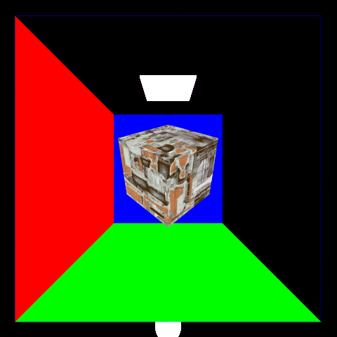 |  | 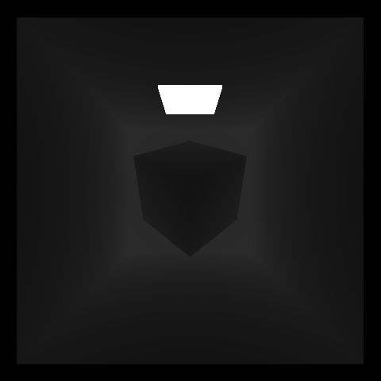  

## Headache Inducing Bugs

Buggy | Fixed | Cause
------|-------|-------
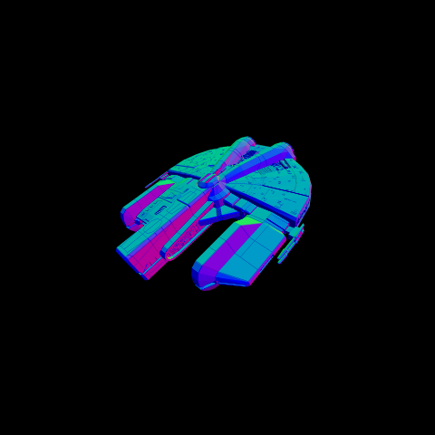 | 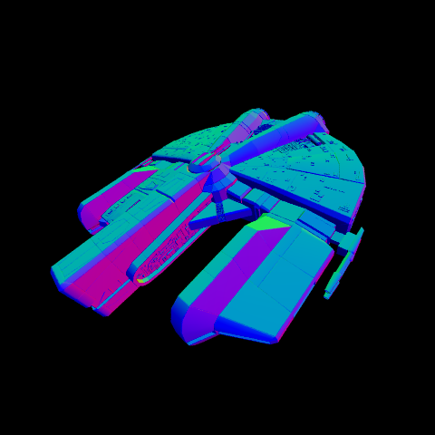 | Bad Normal Interpolation
 | 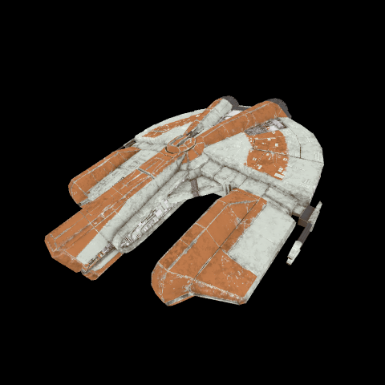 | Tiling uv coordinates can be negative
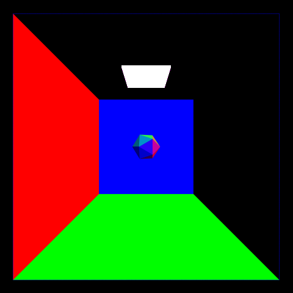 | 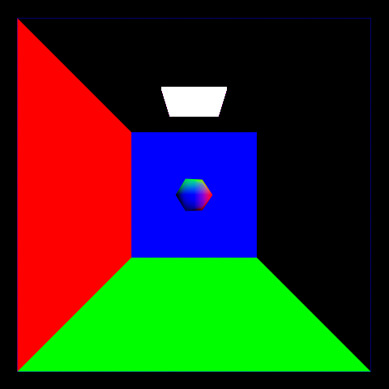 | The obj did not have normals that were meant to be interpolated
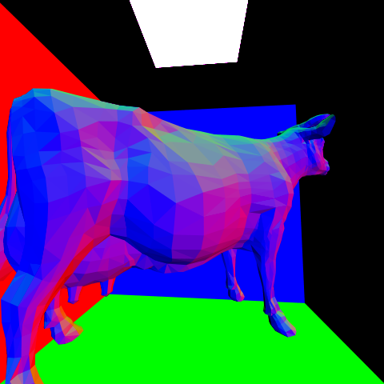 |  | I thought the cow would have interpolated normals but it did not so it was not actually a bug. 

Bug | Cause 
----|--------
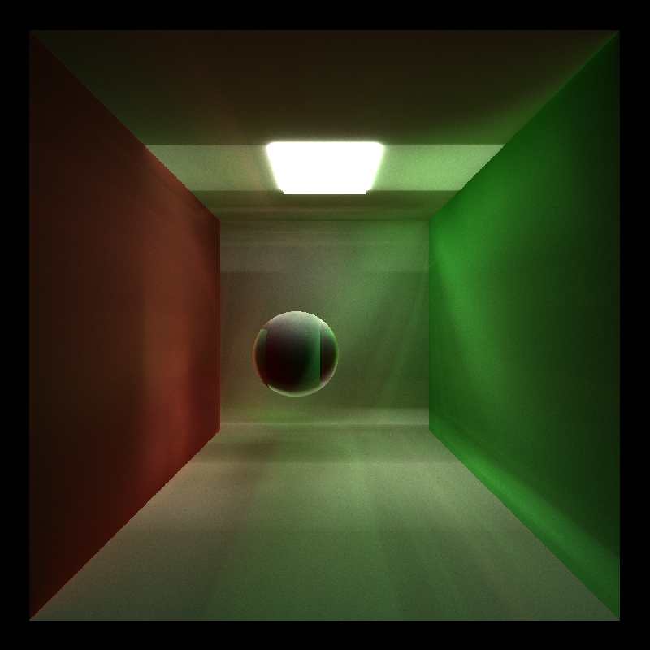 | Bad RNG Seeding 
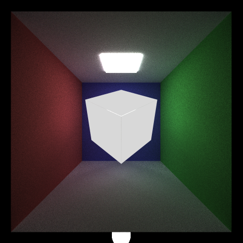 | Checking the explicit error condition t == -1 but forgetting to also eliminate the general t < 0 bad case
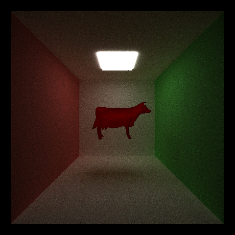 | Triangle Intersection was wrong
  
  
## Further Work
* Heavily optimize the performance with a special focus on reducing branch divergence  
* Refactoring the code to be more structured and less haphazard
* Changing the option toggles from `#define` macros to booleans so changing does not require 
lengthy recompilation  
* Dive deeper into PBR to make everything look cooler like making the coppery parts shinier in a realistic way that is not just sidestepping the material behaviors 
* Learn about the disney BSDF and the GGX equation
* How to interpolate normals from a tangent space normal map  
* Support for multiple mesh importing

## Other
* Special thanks to lemonaden for creating a free, high quality mesh of the Ebon Hawk https://sketchfab.com/3d-models/ebon-hawk-7f7cd2b43ed64a4ba628b1bb5398d838  
* Ray Tracing in One Weekend  
* IQ's list of intersector examples and the Scenes & Ray Intersection slides from UCSD's CSE168 course by Steve Rotenberg that helped me understand how Möller–Trumbore worked
* UT Austin's CS384 slides on normal mapping tangent that explained the theory on how to convert from tangent space normals to object space and https://stackoverflow.com/questions/5255806/how-to-calculate-tangent-and-binormal for explaining the calculations in a way that did not seem like abuse of matrix notation  
* https://wallpaperaccess.com/star-wars-hyperspace for the cool hyperspace wallpaper  
* Adobe's articles on the PBR Metallic/Roughness workflow that explained the theory behind it  

<!-- 4 mesh loading 
6 hierarchical spatial data structure 
2 refract 
2 depth of field 
2 antialiasing
5/6 texture/bump mapping
2 direct lighting -->

<!-- 
illegal array idxs in gpu kernel -->
