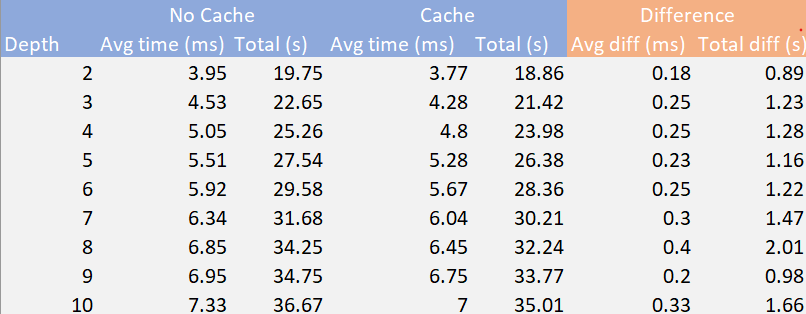

CUDA Path Tracer
================

Implementation of a CUDA-based path tracer capable of rendering globally-illuminated images.

**University of Pennsylvania, CIS 565: GPU Programming and Architecture, Project 3 - Path Tracer**

- Anthony Mansur
  - https://www.linkedin.com/in/anthony-mansur-ab3719125/
- Tested on: Windows 10, AMD Ryzen 5 3600, Geforce RTX 2060 Super (personal)

## Introduction

### What is a Path Tracer?

A Path Tracer is a rendering technique used to generate graphical images based on physically simulating how light works. As opposed to rasterization, it starts by shooting rays from a camera to the pixels in our screen, and following those rays at several points of intersection until it hits a light source. At every bounce, we multiply our current color with the color of the material hit. 

This technique has been widely used, mostly in the CPU, in many industries, most notably in animation, to generate photo-realistic images that mimic what we see in the real-world.

### What's different?

In this project, we attempt to create a path tracer utilizing the GPU, giving us much faster rendering speeds. As we start with a very basic implementation, there are many avenues of improvement in our path tracer, and this readme will go over some of those strategies used to make such improvements. We will first start of with the core features before diving deeper in how we made this path tracer unique! 

## Features

### Baseline

The following features were given to us before starting this assignment:

- Loading and reading the scene description format.
- Sphere and box intersection functions.
- Support for saving images.
- Working CUDA-GL interop for previewing your render while running.
- A skeleton render with:
  - Naive ray-scene intersection
  - A "fake" shading kernel that colors rays based on the material and intereseciton properties but does NOT compute a new ray based on the BSDF.

### Core Features

- Basic path-tracer with an improved shading kernel with BSDF evaluation for Ideal Diffuse Surfaces and Perfectly specular-reflective surfaces
  - As opposed to terminating after the first bounce, each ray generated will bounce to a new direction depending on the type of material hit
    - If a diffuse object is hit, the new direction bounced will be a cosine-weighted random direction in a hemisphere
    - If a reflective surface is hit, we combine the visual effects of a diffuse material and a perfectly specular surface that bounces the ray at a perfect reflection
      - 50% of the time, we bounce the ray using one method, but divide the overall color by it's probabiltiy 0.5.
  - A ray is terminated if it hits a light source, does not intersect an object, or runs out of bounces
  - Starting from RGB(1,1,1) , at each intersection, the ray's color is multiplied with the material color of it's intersection
- Utilizing thrust's library, at every bounce our rays take, in a parallel fashion, we remove all the rays that have "terminated," i.e., those rays thatno longer bounce, to minimize the amount of threads launched that did no work.
- Sort the rays based on the materials the intersected with
  - Issue: at every iteration, rays intersect different materials, and the BSDF evaluation may be different. So, if the rays (threads) at a warp have different BSDF evaluations, there will be branch divergence, which is not optimal as every thread needs to wait until the last one for all of them to be released.
  - Solution: We have three buffers of interest, our rays, intersections, and materials. The intersections are indexed the same way as our rays, and each interesection has an value to the index of the material of the object hit. We utilize thrust's sort_by_key operation, and sort the intersections and rays based on the material index. 
  - Performance: This sorting is costly, as it adds more computations and memory reallocation at every iteration. If your scene does not have that many different materials, you will most likely see a significant performance hit. However, if you have a lot of materials, this additional step may increase your performance (see the Issue section above).
- A toggleable option to cache the first bounce intersection for re-use across all subsequent iterations
  - Caching provided some performance improvements. See Performance analysis for more details.

## Visual Improvements

### Antialiasing

It is commonly stated that, unlike rasterization, ray tracing gives us antialiasing for free. The way it does so is during the iteration process. We shoot multiple rays per pixel, and we average the color for all iterations. By picking a random point in each pixel, as opposed to the center point every time, we get an anti-aliased render.

 

### Refraction

The objects you import in a ray tracer may vary in material. An object's material is, in essence, determines how a ray bounces off of or into the object. One cool phenomenon is the way that light refracts when it interacts with water, glass, and other dielectrics. The tricky part to getting this to look right is to formulate how the light will reflect or refract based on the varying angles of the camera and the index of refraction of the material. Once accomplished, you get interesting looking results as shown below.

Notice the caustic that is created by the lighting interacting with the glass sphere!

## Mesh Improvements

So that we can render more than just boxes and spheres, I utilized the tinyOBJ open-source library to import OBJ files, from which we extract all the individual triangles that make up an object. Once we have the position and shape of all the triangles, rendering the object is as easy as doing a ray-triangle intersection for triangles. 

Note that the time for our ray to traverse our scene grows linearly with the number of primitives it has. When an object is loaded with a lot of triangles, this quickly becomes a problem. That is why we implement this mesh loading with an hierarchical data structure (see below).

## Performance Improvements

### Hierarchical Data Structure

Acceleration structures are one of the components at the heart of any ray tracer. It allows us to reject groups of primitives and order the search process so that nearby intersections are likely to be found first and farther away ones are potentially ignored. With a hierarchical data structure, the time it takes to trace a single ray through the scene grows logarithmically with the number of primitives, as opposed to linearly.

For this project, I decided to implement a method called Bounding Volume Hierarchy (BVH), an acceleration based on primitive subdivision, where the primitivizes are partitioned into a hierarchy of disjoints sets. See image above (source: Wikipedia)

Each primitive is contained in a leaf node, defined with a bounding box that contains the whole primitive. These leaf nodes are then group up with other leaf nodes, and those respective nodes are then grouped up together by proximity, until we are left with a root node. Each node also has a bounding box that contains their children nodes.

For the image above, a ray first checks if it hits A (via a ray-box intersection test). If it does, it then checks if it hits B and C. And so forth, until it reaches the end and it is left with a set of primitives to check (via a ray-triangle intersection test for this implementation). This simple breadth-first search is implemented on the device (GPU) using a stack of fixed size to keep track of the nodes that need to be traversed. This stack is of size 20, which, on average, should support 2^20 or about 1 million triangles. It can be easily modified to store more.

To test the performance our data structure, we load a [Stanford Bunny](http://graphics.stanford.edu/data/3Dscanrep/) of 4968 and 69451 triangles, and a Stanford Dragon of 871,414 triangles, into a cornell box to see the time it takes to render. 

**TODO: Make into a graph**

## Additional Performance Analysis

### Caching first bounce intersections

Using std::chrono, the number of seconds it took to render 5000 iterations of the cornell-box with varying max ray depths were calculated. Generally speaking, caching gave some minor improvements

## Submission

### CMake

I have updated the CMakeLists.txt to include a new cpp (src/bvhtree.cpp) and added a directory with the tinyobj import (add_subdirectory + adding tinyobj in the target link libraries).

