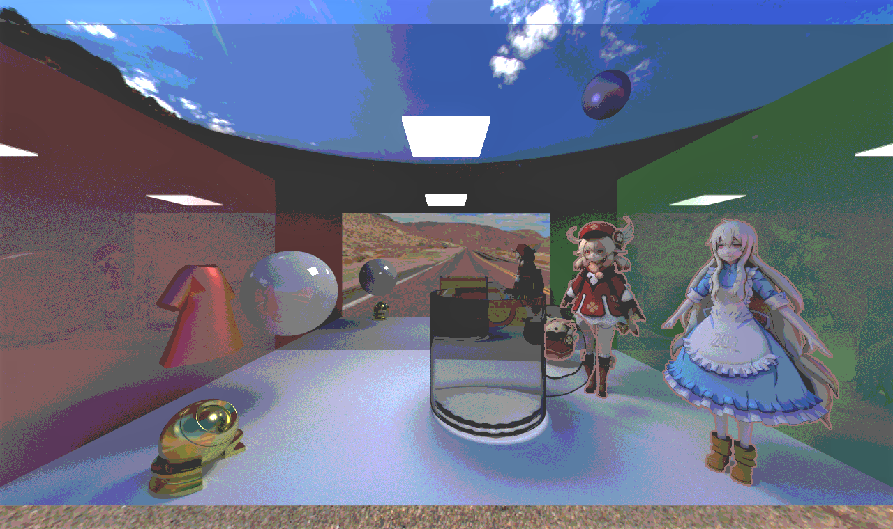
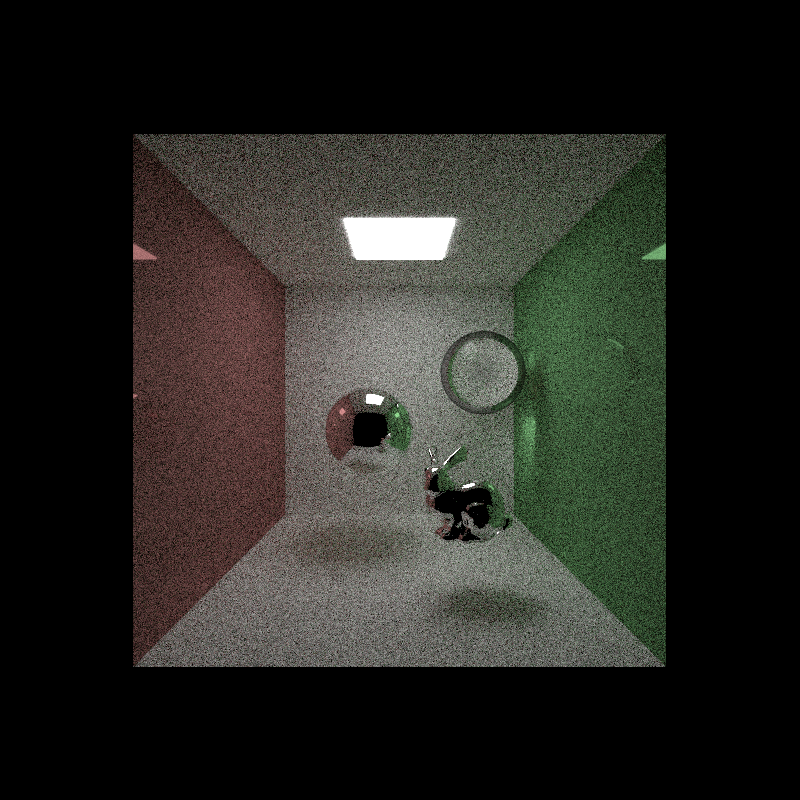
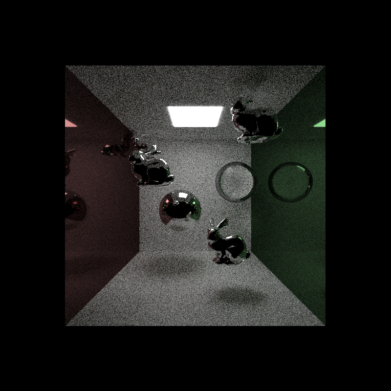
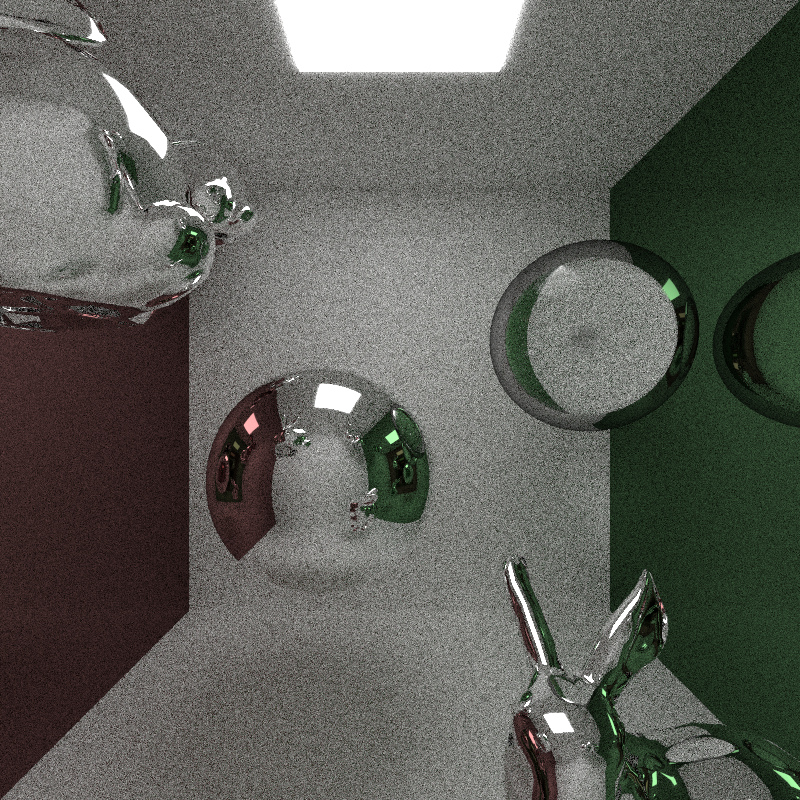
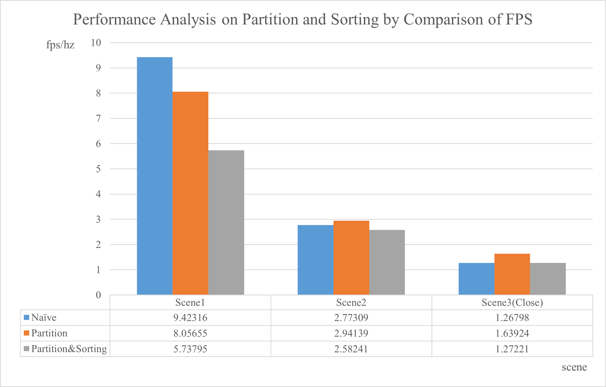
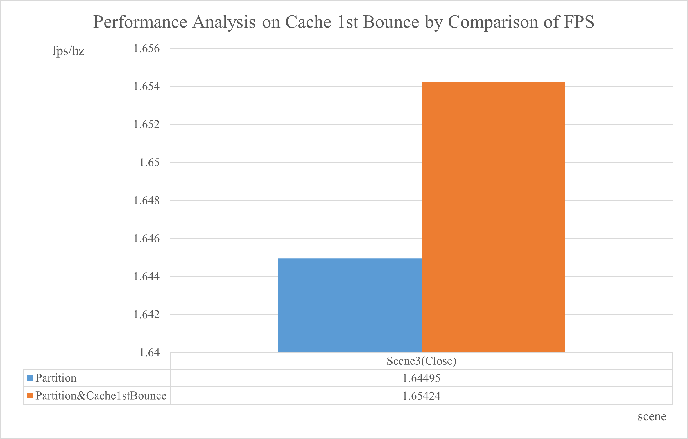
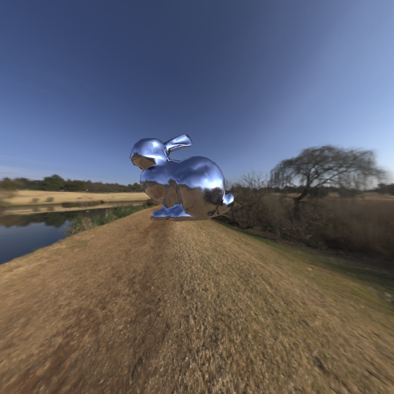
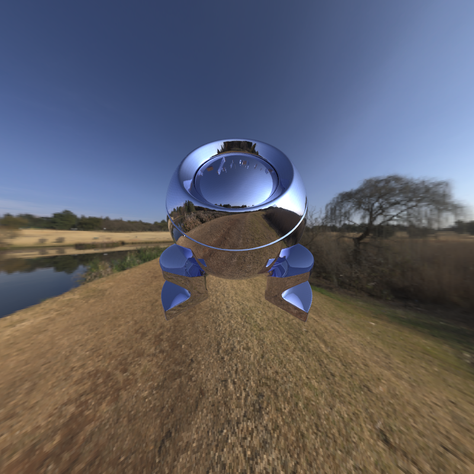
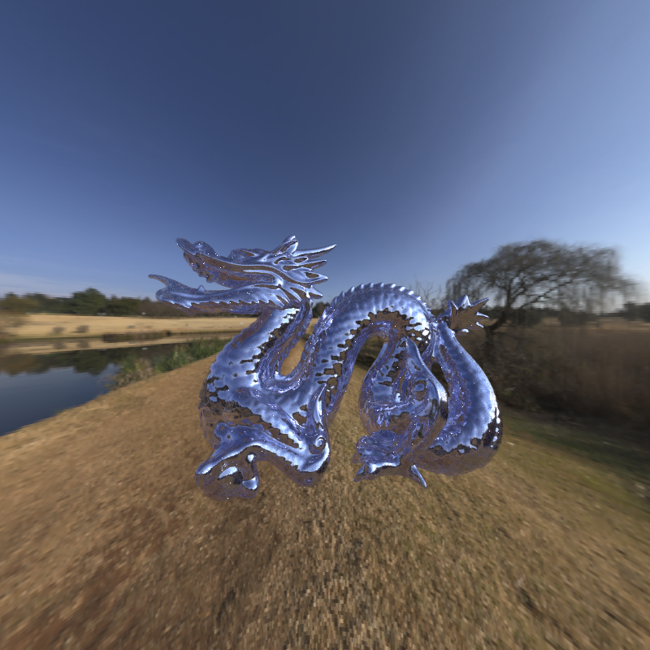
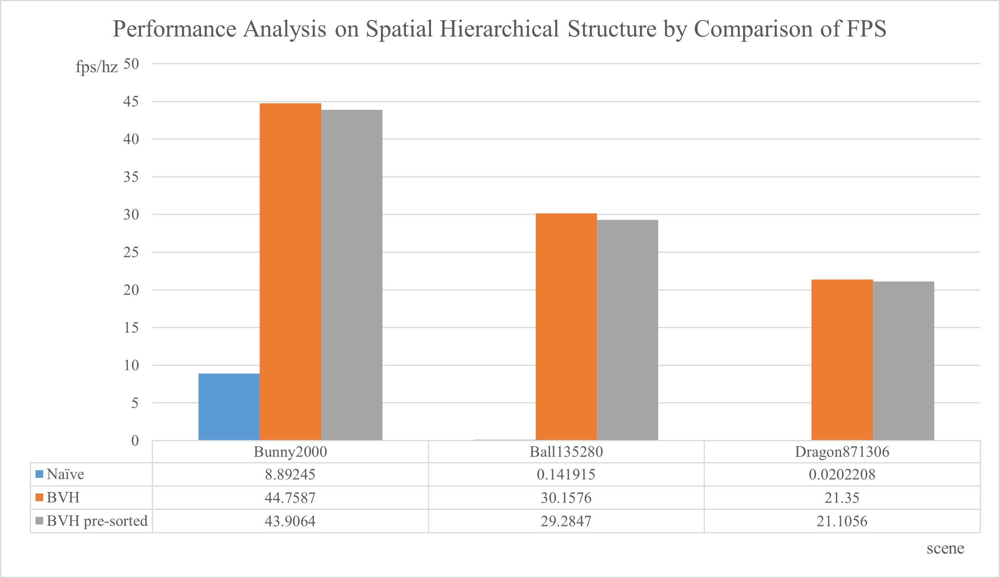

CUDA Path Tracer
================

**University of Pennsylvania, CIS 565: GPU Programming and Architecture, Project 3**

* Xuntong Liang
  * [LinkedIn](https://www.linkedin.com/in/xuntong-liang-406429181/), [GitHub](https://github.com/PacosLelouch), [twitter](https://twitter.com/XTL90234545).
* Tested on: Windows 10, i7-10750H @ 2.60GHz 16GB, RTX 2070 Super with Max-Q 8192MB

## Features

### Overall

- Implemented BSDF for ideal diffuse and specular-reflective surfaces.
- Used stream compaction `thrust::partition` after shading to reduce the number of rays for further bounce.
- Used sorting by material type before shading.
- Implemented a toggleable option to cache the first bounce for re-using.

- Implemented refraction, and non-perfect specular surfaces with Phong material and microfacet material with GGX normal distribution. :two:
- Implemented importance sampling of scattered ray with different materials. :three:
- Implemented `OBJ` mesh loading with [tinyObj](https://github.com/syoyo/tinyobjloader). :four:
- Implemented stochastic anti-aliasing. :two:
- Implemented post processing such as outlining by stencil, and a simple version of ramp shading with a ramp texture. :three:
- Implemented texture import and mapping with triangle meshes, and HDR image sky sphere. :five:
- Implemented bounding volume hierarchy as a hierarchical spatial data structure for triangle meshes. :six:

Some features are shown in the overall picture, and some details and analysis will be shown below. 

### Partition and Sorting

Partition and sorting are some methods to optimize the path tracing. Partition is to reduce the number of paths after some bounces, while sorting is to make threads in every warp do similar amount of computation with sampling and BSDF evaluation. 

The benefit of partition depends on the rate of the surface area of the background and emitted objects in the viewport, as well as the colors of the objects. If the colors are bright, or the surface area of the background and emitted objects is small, there are few paths that can be omitted, thus to make the performance even worse, counting the cost of the partition.

Here are some analysis for three scenes, with maximum depth 16. The first scene is relatively simple. The second scene contains a few triangle meshes and more specular. The third scene is closed so that the rays have no chance to reach the background. I generated the images with 128 samples per pixel, and record the fps of iteration.

|                            Scene1                            |                            Scene2                            |                        Scene3(Close)                         |
| :----------------------------------------------------------: | :----------------------------------------------------------: | :----------------------------------------------------------: |
|  |  |  |

Scene 1 contains 1 emissive box, 5 boxes, 2 spheres, and 1 triangle mesh with 2000 triangles. Scene 2 contains more 3 triangle mesh with 2000 triangles each. Scene 3 is closed with another box, with camera zoom-in to prevent rays from hitting the background. 

The result tells us that the partition and sorting cannot make the performance better if the scene is too simple. However, when the scene is complex, or there are even more glossy objects, there are more rays that may hit the background or emissive objects earlier, so the partition performs a good improvement. Because I haven't implemented any complex material effects, such as subsurface scattering, sorting seems to make the performance worse in my project. 

Based on the result, I would enable partition but disable sorting in further analysis. 

### First Bounce Cache

Because stochastic anti-aliasing varies the first intersection for every iteration, the cache is not usable if the random range is large. However, the effect of anti-aliasing is not significant if the random range is too small. I turned off the stochastic anti-aliasing when performed the first bounce cache.

Here are some analysis for the third scene above.

There is a slight performance improvement with first bounce cache. Maybe there are some better results when applying this method to a scene with tons of triangles. 

### Stochastic Anti-Aliasing

Anti-aliasing is actually a task to make our sampling of color in the screen satisfying Nyquist–Shannon sampling theorem as much as possible. For example, if we create all the rays with the same origin and direction in a pixel, it means that the spatial sampling rate of color in the screen is one sample per pixel. This will cause signal overlapping at the area that the signal varies rapidly in both x and y directions, for example, at any diagonal edges. Even though we cannot eliminate the signal overlapping thoroughly, we can still increase the spatial sampling rate to make the signal smoother. 

In a Monte-Carlo based path tracer, we must have many rays created for each pixel in the first bounce. A simple way to increase the spatial sampling rate is to make the origin of the rays different but still close to each other, and a simple way to implement this thought is, randomly assigning an offset, as the figure below shows. 

The next two pictures show that, the diagonal in the second picture, which is processed by anti-aliasing, is smoother than the sawtooth-like diagonal in the first picture. 

|                      w/o Anti-Aliasing                       |                      with Anti-Aliasing                      |
| :----------------------------------------------------------: | :----------------------------------------------------------: |
|  |  |

### Materials and Importance Sampling

I implemented several simple materials, including:

- Phong material, which contains diffuse term and specular term.
- Perfect dielectric material, which can appear as perfect reflection material or perfect refraction material.
- Microfacet material with GGX normal distribution, which is a kind of physically-based material.

These materials have different bidirectional scattering distribution function (BSDF), and can have different sampling functions to make the convergence of the estimate to the actual value faster. The core idea is to sample from the CDF of the BSDF rather than from the uniform distribution. For example, the lambert material gives a PDF of reflection angle as cosine weighted. Further discussion can be found in [Importannce Sampling of the Phong Reflectance Model](https://www.cs.princeton.edu/courses/archive/fall16/cos526/papers/importance.pdf) for Phong material.

In some BSDF of material, there are more than one terms and contains different light directions. With BSDF=BRDF+BTDF, for example, I randomly determine whether the ray is reflected or transmitted, by a weight such as diffuse color and specular color, or Fresnel term. And then we sample a specific ray on this single term. We should consider that randomly picking a term is a kind of multiplying a probability to this term, and we should do some calculations to make the result match the original BSDF. 

### Post Processing

The post processing methods apply on the final image, which means that the post processing has no influence on the path tracing process. What we have to consider is how to get the other input source.

In a rasterization-based renderer, we can store some extra data, such as base color, normal, stencil, material ID, and object ID, into a G-buffer. In path tracer, we can also get these data in the first bounce, and store these data into our G-buffer as well. When we apply post processing, the G-buffer can be one of the inputs.

I implemented some simple post processing, such as drawing outlines by stencil values, and simple ramp shading by final colors and a ramp texture. In fact, I also apply the gamma correction in the post processing pipeline but it should not be a kind of post processing in my opinion.

Here are some effects of post processing. It seems weird of the ramp shading result, maybe because the ramp texture is not so suitable for this scene.

| Outlines                                                     | Ramp Shading                                                 | Ramp Shading with Outlines                                   |
| ------------------------------------------------------------ | ------------------------------------------------------------ | ------------------------------------------------------------ |
|  |  |  |

### Mesh Loading and Texture Loading

On the CPU side, mesh loading can be easily done by `tinyObj` and texture loading can be easily done by `stbImage`. However, it should be considered that how to pass, and when to pass these data into GPU. We should pass these data into GPU after CUDA initialization, otherwise there would be a CUDA error.

In this situation, we should keep the relationship between geometries and model files, and the relationship between materials and texture files. After CUDA initialization, we can load these files, parse them, and move them into GPU. 

I also implemented HDR image loading for sky sphere, which means that I have to implement spherical mapping. The core idea is converting the ray direction in world space to spherical coordinate system, and mapping angles into texture coordinates.

I apply bilinear interpolation when reading a pixel from a texture by texture coordinate. 

### Bounding Volume Hierarchy

Bounding volume hierarchy (BVH) is a hierarchical spatial structure based on bounding volume, which the most common representation is bounding box. Compared to other structures such as the octree and the KD-tree, the BVH is more suitable for static triangle meshes in my opinion, because the BVH partitions by objects instead of spatial area, and makes no difficulties for us to deal with many spatial-area-based corner cases, such as objects overlapping at some axes, and determining whether a triangle is in a spatial area. 

The structure of the BVH can be shown by the figure below. each node contains a bounding box, and the subtree is divided based on two smaller bounding boxes. In leaf nodes, there should be some target objects. Using the BVH decreases the average time complexity of ray-triangle intersection from O(N) to O(logN). 

| 0    | 1    | 2    | 3    | 4    | 5    | 6    | 7    |
| ---- | ---- | ---- | ---- | ---- | ---- | ---- | ---- |
| N1   | N2   | N3   | N4   | N5   | N6   | N7   | O1   |

| 8    | 9    | 10   | 11   | 12   | 13   | 14   |
| ---- | ---- | ---- | ---- | ---- | ---- | ---- |
| O2   | O3   | O4   | O5   | O6   | O7   | O8   |

I build the BVH on CPU and simply pass it to GPU. Because I store the triangle (or geometry) index in leaves, and store node index for left and right children, there is no gap between CPU and GPU, compared to the pointer representation. Since we can set the maximum depth of the BVH or it is obvious that the depth cannot exceeds 32 if we build a half-divided BVH, we can allocate a stack with fixed capacity for depth-first traversal, instead of recursive traversal. In addition, the binary tree can be represented in an array, as the table above shown. In this case, the children of i-th node is the (i\*2+1)-th and (i\*2+2)-th. 

I haven't use any heuristic method, such as surface area heuristic, in this project, because it is more difficult and needs to store more data to build an imbalanced binary tree for GPU, and the improvement of half-divided BVH is good enough. 

Here are some analysis for three scenes, with maximum depth 8. Each scene has a triangle mesh object with glossy microfacet GGX material and an HDR image sky sphere, and the three objects have 2000, 135280, 871306 triangles respectively. 

|                          Bunny2000                           |                          Ball135280                          |                         Dragon871306                         |
| :----------------------------------------------------------: | :----------------------------------------------------------: | :----------------------------------------------------------: |
|  |  |  |

I also tested how passing a sorted triangle array to GPU enabling the triangle index in the BVH leaves consecutive would affect the performance. However it doesn't seem to give an improvement, maybe because the BVH access in each thread is already out of order. 

It turns out that the fps is extremely low without BVH if the number of triangle is greater and greater. However, with BVH, it still holds a good fps. 

## Changes

### CMakeList Changes

I add a new project `log_profile` for logging the profile. 

### Scene File Format

To support more features, I modified the original scene file format. 

Materials are defined in the following fashion:

* MATERIAL (material ID) //material header
* MATERIAL_TYPE (MaterialType) //material type, including PHONG, DIELECTRIC, MICROFACET_GGX, default is PHONG
* RGB (float r) (float g) (float b) //diffuse color
* DIFFUSE_TEXTURE (file) //diffuse texture instead of single color
* SPECX (float specx) //specular exponent
* SPECRGB (float r) (float g) (float b) //specular color
* SPECULAR_TEXTURE (file) //specular texture instead of single color
* REFL (float refl) //reflectivity flag, 0 for no, 1 for yes, or as a float of 1 - roughness
* REFR (bool refr) //refractivity flag, 0 for no, 1 for yes
* REFRIOR (float ior) //index of refraction for Fresnel effects
* EMITTANCE (float emittance) //the emittance strength of the material. Material is a light source iff emittance > 0.

Cameras are defined in the following fashion:

* CAMERA //camera header
* RES (float x) (float y) //resolution
* FOVY (float fovy) //vertical field of view half-angle. the horizonal angle is calculated from this and the reslution
* ITERATIONS (float interations) //how many iterations to refine the image
* DEPTH (int depth) //maximum depth (number of times the path will bounce)
* FILE (string filename) //file to output render to upon completion
* EYE (float x) (float y) (float z) //camera's position in worldspace
* LOOKAT (float x) (float y) (float z) //point in space that the camera orbits around and points at
* UP (float x) (float y) (float z) //camera's up vector
* POSTPROCESS (integer n) //number of post process, default is 0
* (OUTLINE_BY_STENCIL stencil r g b width OR COLOR_RAMP texturefile) //post process method and their arguments

Backgrounds are defined in the following fashion:

- BACKGROUND //background header
- RGB (float r) (float g) (float b) //background color, default is 0,0,0
- SPHERE_MAP (file) //sky sphere texture instead of single color

Objects are defined in the following fashion:

* OBJECT (object ID) //object header
* (cube OR sphere OR trimesh) //type of object, can be either "cube", "sphere", or "trimesh". Note that cubes and spheres are unit sized and centered at the origin.
* material (material ID) //material to assign this object
* MODEL (file) //model file needed if the type of object is "trimesh"
* STENCIL (integer stencil) //stencil value of object, default is 0
* TRANS (float transx) (float transy) (float transz) //translation
* ROTAT (float rotationx) (float rotationy) (float rotationz) //rotation
* SCALE (float scalex) (float scaley) (float scalez) //scale

## Resource and Reference

1. [Simulating Depth of Field Blurring](http://paulbourke.net/miscellaneous/raytracing/)
2. [Importance Sampling of the Phong Reflectance Model](https://www.cs.princeton.edu/courses/archive/fall16/cos526/papers/importance.pdf)
3. [Microfacet Models for Refraction through Rough Surfaces](http://www.graphics.cornell.edu/~bjw/microfacetbsdf.pdf)
4. [Bounding Volume Hierarchy](https://developer.nvidia.com/blog/thinking-parallel-part-ii-tree-traversal-gpu/)
5. [tinyObj](https://github.com/syoyo/tinyobjloader)
6. [sIBL Archive](http://www.hdrlabs.com/sibl/archive.html)

