Project 3 CUSA Path Tracer
======================

**University of Pennsylvania, CIS 565: GPU Programming and Architecture, Project 3*

* Raymond Yang
	* [LinkedIn](https://www.linkedin.com/in/raymond-yang-b85b19168)
	* Tested on: 
		* 10/09/2021
		* Windows 10
		* NVIDIA GeForce GTX 1080 Ti. 
	* Submitted on: 10/09/2021
	* Used 3 Late Days

  

## Introduction 
The objective of this project was to implement a naive core path tracer that took a simplistic approach to rendering scenes. 

  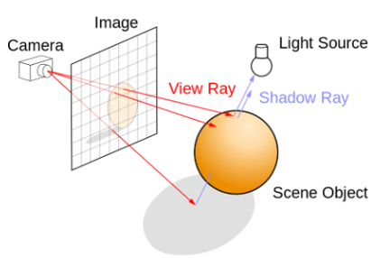

From a camera, a viewing plane (or image plane) can projected. We simulate the physical characters of light by shooting a ray (photon) from each pixel within our viewing plane towards the scene. The rays would iteratively be bounced from an origin point and a surface. In each iteration, the ray can either miss the scene entirely (entering a void) or can be obstructed by an entity within the scene. The ray can be obstructed either by a light source or non-light source. 

  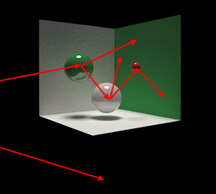

For each iteration, if the ray is not obstructed or is obstructed by a light source, the ray is terminated. If the ray is obstructed by a non-light source, it will reflect, refract, and/or diffuse against the obstructing surface. 

  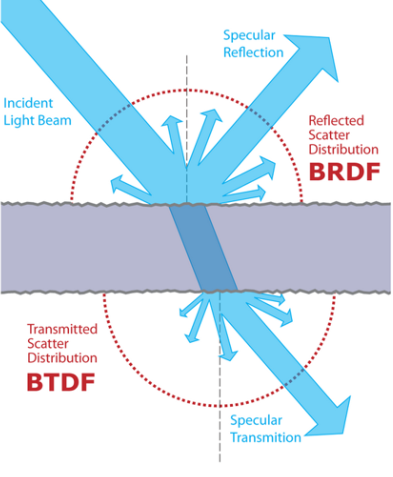

For each successful obstruction, the color of the obstructing surface is factored into the final color the ray's original corresponding pixel. 

## Core Features 
The [core features](https://github.com/CIS565-Fall-2021/Project3-CUDA-Path-Tracer/blob/main/INSTRUCTION.md#part-1---core-features) include:
* Naive BSDF Path Tracer (Feature Implementation)
* First Iteration Caching (Performance Improvement)
* Ray Stream Compaction (Performance Improvement) 
* Material Sorting (Performance Improvement) 
All features and performance improvements may be toggled by `#define`s found in `src/sceneStructs.h`

  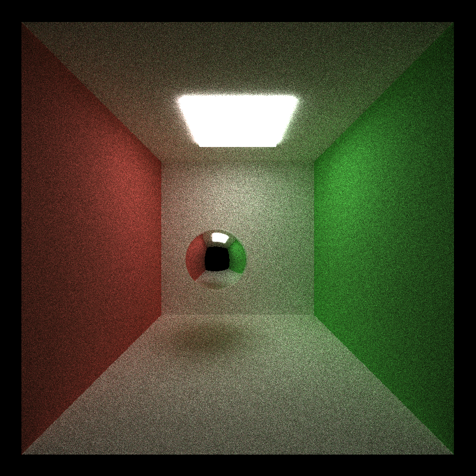

### Naive BSDF Path Tracer
Bidirectional scattering distribution function (BSDF) is a combination of bidirectional reflectance distribution function (BRDF) and bidirectional transmittance distribution function (BTDF). Given any material, as defined as a component of reflectance and refractance, rays should demonstrate a combination of reflecting, refracting, and diffusing behavior. In `scenes/`, materials are defined such that: 

  REFL + REFR <= 1

As a result, the range `[0,1]` can be broken into two components such that:

  REFL + REFR + DIFFUSION == 1

* Cornell with reflective sphere:

  

* Cornell with refractive sphere:

  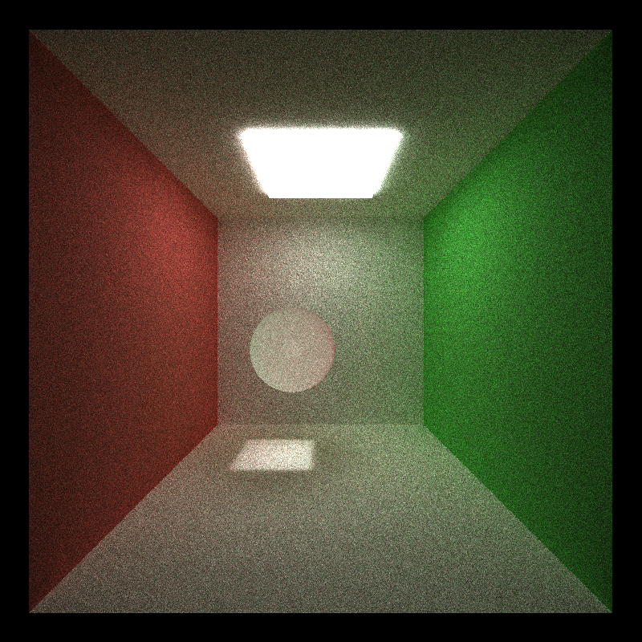

* Cornell with diffusive sphere:

  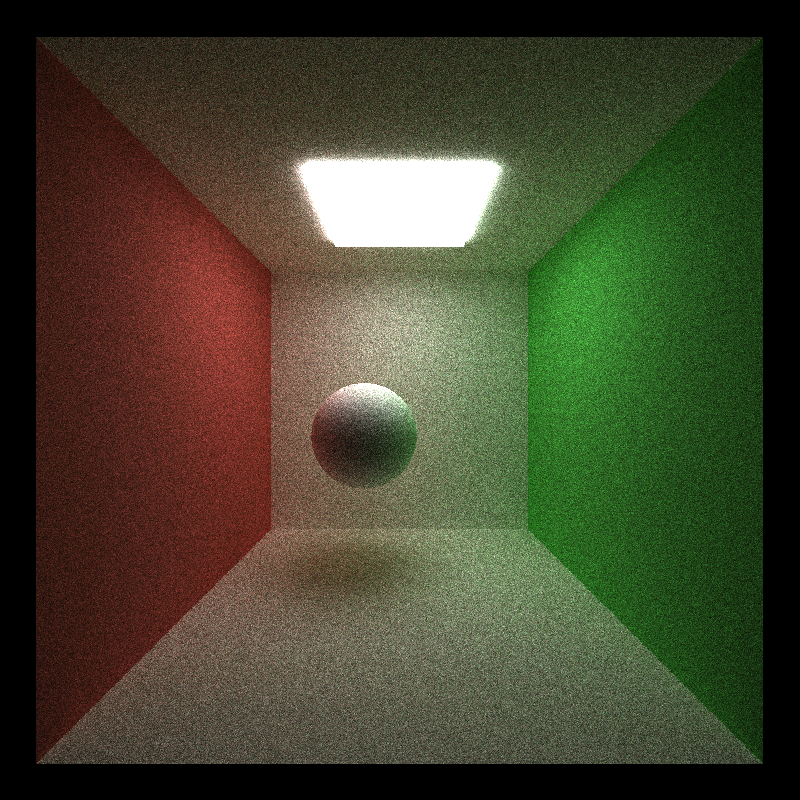

* Cornell with all three properties: 

  

### First Iteration Caching
Iterations allow a more precise, represetative image of the scene by repeatedly shooting rays into the scene. Without antialiasing, every first bounce (ray from image plane to scene) between all iterations should be identical. As a result, we should be able to cache the results of the first bounce of the first iteration and use this data in subsequent iterations without re-calculating the first bounce. 

### Ray Stream Compaction 
Each ray is terminated when it either hits a light source or is not obstructed. Between each depth, where depth is defined as each batch of single bounces, in each iteration, we can cull a number of rays that have should be terminated by performing stream compaction. Consequently, fewer rays (and threads) must be launched in subsequent depths to optimize on memory and computation. 

### Material Sorting
Like stream compaction, each ray stores the type of material it was obstructed by. Between each depth, we sort rays by their material type. The intention is to minimize branch divergence in subsequent depths. Rays where are obstructed by similar surface materials are more likely to demonstrate similar behavior and require relatively comparable computations times. This allows the GPU to terminate entire warps who are processing rays against similar surfaces more quickly and with fewer stalls. 

## Additional Features
The [unique features](https://github.com/CIS565-Fall-2021/Project3-CUDA-Path-Tracer/blob/main/INSTRUCTION.md#part-2---make-your-pathtracer-unique) include: 
* Mesh Loading using tinyOBJ (Feature Implementation)
	* Bounding Box (Performance Improvement)
* [Anti-Aliasing](https://raytracing.github.io/books/RayTracingInOneWeekend.html#antialiasing) (Feature Implementation)
* [Refraction using Schlick's Approximation](https://raytracing.github.io/books/RayTracingInOneWeekend.html#dielectrics) (Feature Implementation)

### Mesh Loading using tinyOBJ
This feature allows you to import unique .OBJ mesh into the path tracer. Much of the code was refactored from CIS560's' rasterizer. As an object is loaded, we generate an buffer of tuples of vertex position and normal. OBJ files follow a format such that each three groups of data represent a face of a triangle on the mesh. Once this data is loaded into the GPU, the GPU checks for intersections of rays against these triangle meshes. 

  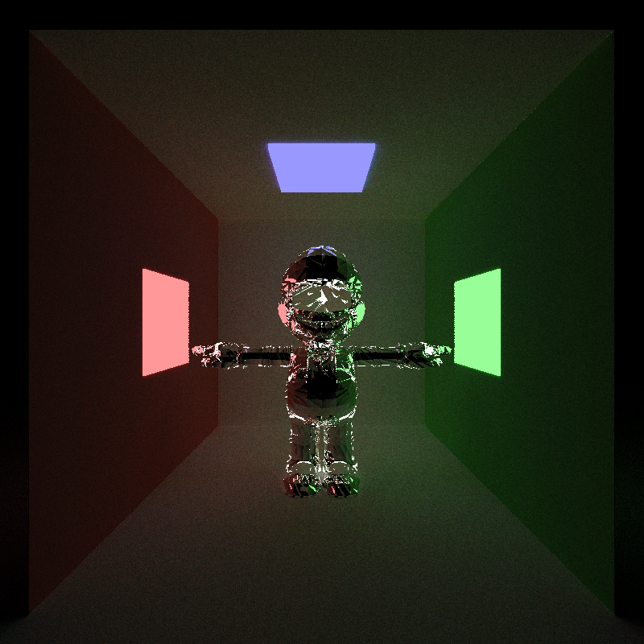

#### Bounding Box
Each mesh is a complex arrangement of numerous triangular faces with unique vertices and normals. The naive implementation would check every ray projected into the scene against every triangular surface of every mesh. This is clearly computationally expensive and time consuming. The first step to optimize this would be to restrict the volume of each mesh into a bounding box. That is, a mesh will only be checked against a ray for intersection if the ray will enter the bounding box of the mesh. The current implementation is minimally effective in that it is a single volume bounding box around the entire mesh. 

### Anti-Aliasing 
Anti-aliasing is a common feature that slightly distorts how a scene is rendered. This prevents far objects from being rendered with sharp edges that would typically result in texture jittering and collisions. The current implementation deviates the origin ray direction that is first projected from the camera into the scene on a random distribution. More precisely, the first ray of each iteration is shot out from a random position within the same pixel. That way, we obtain a better average of the color of the pixel. 

  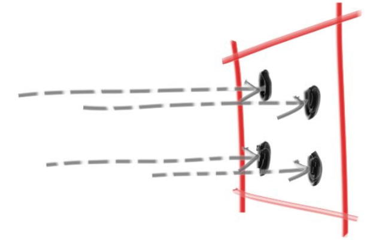

#### Anti-Aliasing full images
With anti-aliasing: 

  

Without anti-aliasing: 

  

#### Anti-Aliasing zoomed images
With anti-aliasing: 

  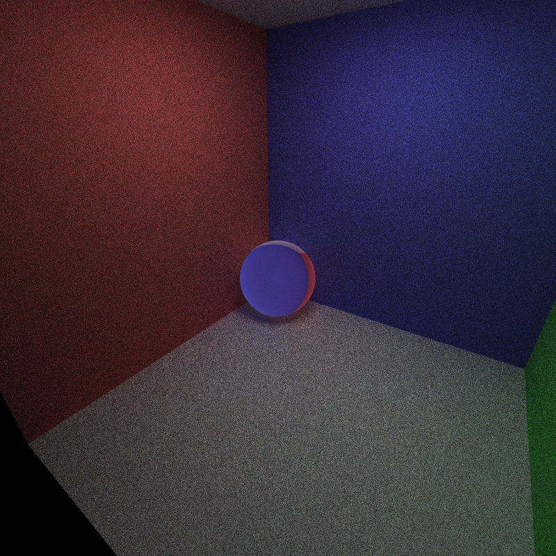

Without anti-aliasing: 

  

### Refraction using Schlick's Approximation 
If we looked at a refractive material surface such as a plane of glass or clear plastic from a steep angle, the material ceases to demonstrate refractive properties and would show reflective properties instead. The current implementation mimics this behavior using Schlick's approximation in cases where the incident angle between the surface and the ray is sufficiently shallow, and snell's law in cases where the incident angle between the surface and the ray is sufficiently large. 

With Schlick's Approximation: 

  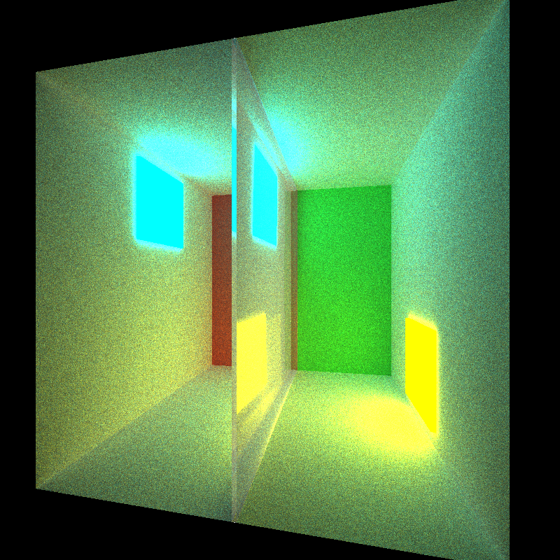

Without Schlick's Approximation: 

  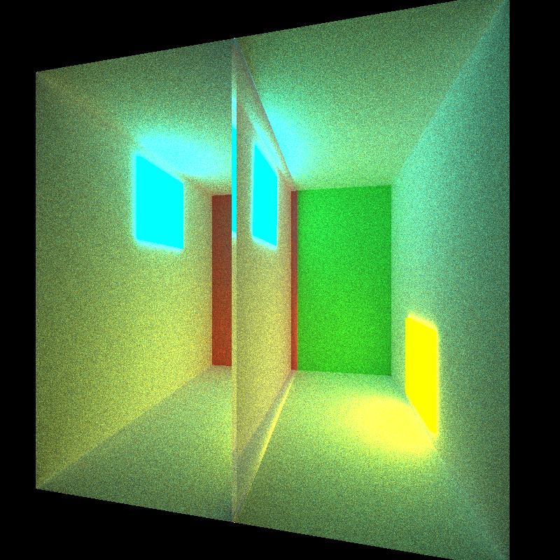

## Performance Analysis
There are four features intended to optimize the path tracer:
* First Iteration Caching
* Ray Stream Compaction
* Material Sorting
* Bounding Box

### Ray Stream Compaction 
Benchmark: `scene/cornell.txt`
This section intends to measure the isolated rate of culling rays via stream compaction. More threads culled is correlated with improved performance. All renders begin with 640,000 rays. The values in the charts and number of rays remaining after each iteration. 

Lower is better: 

  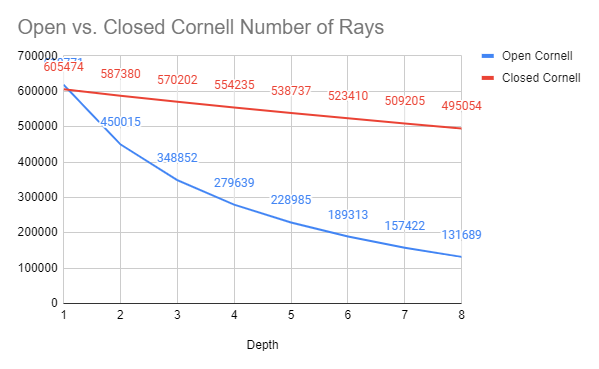

#### Open Scene
| Iteration | 1        | 2        | 3        | 4        | 5        | 6        | 7        | 8        |
|-----------|----------|----------|----------|----------|----------|----------|----------|----------|
| Depth 1   | 618771   |          |          |          |          |          |          |          |
| Depth 2   | 618771   | 450015   |          |          |          |          |          |          |
| Depth 3   | 618771   | 450015   | 348852   |          |          |          |          |          |
| Depth 4   | 618771   | 450015   | 348852   | 279639   |          |          |          |          |
| Depth 5   | 618771   | 450015   | 348852   | 279639   | 228985   |          |          |          |
| Depth 6   | 618771   | 450015   | 348852   | 279639   | 228985   | 189313   |          |          |
| Depth 7   | 618771   | 450015   | 348852   | 279639   | 228985   | 189313   | 157422   |          |
| Depth 8   | 618771   | 450015   | 348852   | 279639   | 228985   | 189313   | 157422   | 131689   |

#### Closed Scene
| Iteration | 1        | 2        | 3        | 4        | 5        | 6        | 7        | 8        |
|-----------|----------|----------|----------|----------|----------|----------|----------|----------|
| Depth 1   | 605474   |          |          |          |          |          |          |          |
| Depth 2   | 605474   | 587380   |          |          |          |          |          |          |
| Depth 3   | 605474   | 587380   | 570202   |          |          |          |          |          |
| Depth 4   | 605474   | 587380   | 570202   | 554235   |          |          |          |          |
| Depth 5   | 605474   | 587380   | 570202   | 554235   | 538737   |          |          |          |
| Depth 6   | 605474   | 587380   | 570202   | 554235   | 538737   | 523410   |          |          |
| Depth 7   | 605474   | 587380   | 570202   | 554235   | 538737   | 523410   | 509205   |          |
| Depth 8   | 605474   | 587380   | 570202   | 554235   | 538737   | 523410   | 509205   | 495054   |

### Comparisons 
Benchmark: `scene/cornellOBJ.txt`
This section intends to measure the efficacy of each optimization in isolation and finally all together. Effectiveness is measured in runtime. Lower runtime is better. Runtime is determined by the total clocktime for the path tracer to complete 100 iterations under the following condition: 
* No optimization
* With first iteration caching
* With ray stream compaction
* With material sorting
* With bounding box
* With first iteration caching, ray stream compaction, material sorting, and bounding box

|				   | Time (s) |
|------------------|----------|
| No Optimization  | 778      |
| 1st Iter Cache   | 624      |
| Ray Compaction   | 228      |
| Material Sorting | 770      |
| Bounding Box	   | 704      |
| All Optimization | 209      | 

  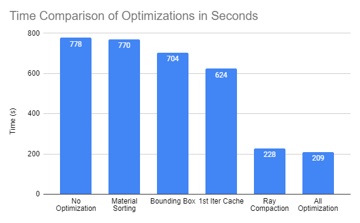

