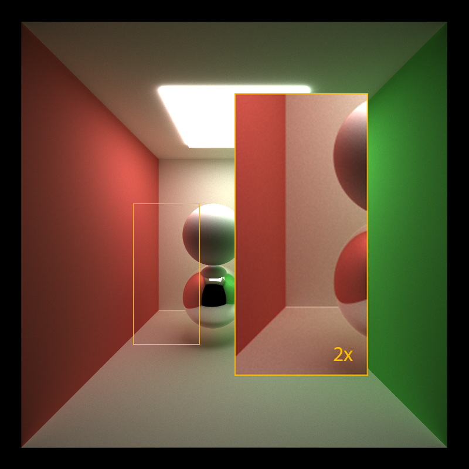

CUDA Path Tracer
================

**University of Pennsylvania, CIS 565: GPU Programming and Architecture, Project 3**

* Zirui Zang
  * [LinkedIn](https://www.linkedin.com/in/zirui-zang/)
* Tested on: Windows 10, AMD Ryzen 7 3700X @ 3.60GHz 32GB, RTX2070 SUPER 8GB (Personal)

## Photorealistic Rendering by Tracing Rays

In real life, rays come from light source, bounce between object surfaces before entering our eyes. Each bounce off an object surface carries information of that surface. In ray-tracing rendering, we can start from the eye (image plane), trace backwards through each pixel to the world and eventually to the light source. Such ray-tracing is repeated thousands of times and color information is averaged to give photorealistic effects.

### Surface Scattering 

Below list the 3 separate scattering surfaces implemented in this renderer. To make refracgive surface seen more realistic, schlicks approximation is used to make the surface the effect of Frenel reflections. Objects in the seen can use a combination of these 3 properties based on the bidirectional scattering distribution function (BSDF) of the surface. 

| Lambertian | Reflective | Refractive |
| ------------- | ----------- |----------- |
|   |  |  |

Here shows different surfaces with colors.

## Features

### Depth of Field
Depth of Field is created by sampling with a non-zero aperture size.

### Anti-Aliasing
Anti-Aliasing is implement with sub-pixel sampling.

| with Anti-Aliasing | without Anti-Aliasing |
| ------------- | ----------- |
|   |  |

### Other Features
1. .obj Mesh Import
2. Toggleable option to cache the first bounce intersections for re-use across all subsequent iterations, when not using anti-aliasing. Is is not used because AA is a must.
3. Elimiating terminated rays with Stream Compaction. This method definitely reduces empty thread launches and improves performance.
4. Efficient attempt to sort the ray by the material type before shading. No efficient improvement is seen with this method.
