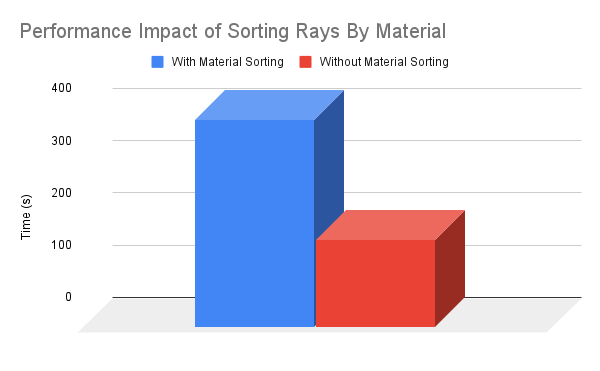

CUDA Path Tracer
================

**University of Pennsylvania, CIS 565: GPU Programming and Architecture, Project 3**

* Ashley Alexander-Lee
  * [LinkedIn](linkedin.com/in/asalexanderlee), [Personal Website](https://asalexanderlee.myportfolio.com/)
* Tested on: Windows 10, i7-6700 @ 3.40GHz 16GB, Quadro P1000 (Moore 100A Lab)

*Mirrored hall effect, iterations: 5,000, depth: 8, resolution: 1200x1200*

Usage
=====

#### Installation
1. Use a Cuda-enabled Windows machine
2. Clone this repository
3. `mkdir build` in the folder
4. Run CMake, and select "Visual Studio 2019" and "x64"
5. Configure and generate binaries
6. Open the .sln file in VS2019
7. In "Properties" -> "Debugging" -> "Command Arguments", type `../scenes/name_of_scene.txt`
8. Be sure to run in Release Mode

#### In-Code Toggles
There are a few macros I defined to turn certain features on or off. Most are located in pathtrace.cu:
- `SORT_MATERIALS` (bool) - sort rays by material after each bounce
- `CACHE_FIRST_BOUNCE` (bool) - cache the shaded rays after the first bounce on the first iteration so that the remaining iterations don't have to recompute the first bounce -- as long as it's deterministic (i.e. DOF and anti-aliasing aren't enabled)
- `DOF` (bool) - apply depth of field
- `FOCAL_LEN` (float) - focal length for DOF
- `ANTIALIASING` (bool) - apply anti-aliasing

In scene.cpp and intersections.h, we have:
- `USE_BB` (bool) - use bounding box

Description
=============
In this project, I implemented a pathtracer on the GPU by evaluating "batches" of rays during each iteration. At each iteration, I performed the following steps:

**1. Generate camera rays**
- Save these `PathSegment`s to an array on the GPU
- If `ANTI_ALIASING` is enabled, the reference point is jittered
- If `DOF` is enabled, a point is sampled from a disk to represent the camera position, and a focal length determines the slice of the viewing frustuum we're casting to

**2. Compute intersections with scene**
- Save these `ShadeableIntersection`s to an array on the GPU

**3. Shade each ray according to the material**
- Multiply the `PathSegment` color by the color of the intersection
- If `SORT_BY_MATERIAL` is enabled, rays are sorted based on material after this step

**4. Generate new ray directions based on the material**
- There are three materials supported: 1) Diffuse, 2) Specular, and 3) Dialectric
- Diffuse rays are scattered based on semi-random sampling of a hemisphere
- Specular rays are scattered in exactly one direction (reflected across the normal)
- Dialectric rays are either reflected or refracted based on a Fresnel coefficient
- Alter the origin and direction of the `Ray` in each `PathSegment`

**5. Cull rays if 1) they hit nothing, or 2) they hit the light**
- Rays are flagged to terminate if they match the termination conditions listed
- I maintain a list of pointers to active rays, and use stream compaction to remove all pointers to rays that are terminated.

**6. Perform steps 2 - 5 until we've reached max depth or all rays are culled**

**7. Add the resulting colors to the pixels**

Features
========
### Dielectrics
I added support for transmissive materials, where the reflective and refractive components are based on a fresnel coefficient. The coefficient determines the likelihood of scattering a reflective or a refractive ray. 

| | |
|-|-|
| | |

### Depth of Field

| Focal Length: 10 | Focal Length: 15 |
| ---------------- | ---------------- |
|  ||

The camera origin is jittered by sampling from a disk, and the focal length determines the slice of the view frustuum we're casting a ray to. 

### Mesh Loading
I added support for obj loading and mesh display. I used [tinyobjloader](https://github.com/tinyobjloader/tinyobjloader) to read an obj path and triangulate the mesh. I then created a Triangle struct and a vector containing vectors of triangles that is owned by the scene. I populated each triangle and pushed it to the vector, then got the pointer to said vector and saved it to the geometry. Finally, I copied the triangle data over to the GPU before running the integrator.

I also added a computeIntersection function for the mesh, which iterates through all of the mesh's triangles, and computes the intersection of the given ray with each triangle, finding the minimum distance along the ray to the nearest triangle. 

### Anti-Aliasing
I jittered the pixel point by some fractional value to achieve anti-aliasing, as seen below. I rendered this scene at a low resolution (200x200) so that the improvements are obvious.

As you can see below, enabling anti-aliasing doesn't seem to have a major effect on runtime. There is an additional cost associated with jittering the rays, but this is minimal. 

*Run on Cornell Box, iterations: 5000, depth: 8, 800x800*

Optimizations
============

### Stream Compaction

I created an array of pointers on the GPU, all pointing to existing rays. I used Thrust's `partition` function to sort all of the "truthy", i.e. non-terminatable, to the front of the array, and maintained a pointer to the back of the "truthy" values. This array of pointers to rays is used for future intersection and shading calculations, as it represents the collection of rays that are active. You can see below the number of rays that are culled at every depth. 

I ran the following on a simple cornell box with a diffuse sphere in the middle, and removed the side and back walls for the "Open" configuration. I only ran 1 iteration, with max depth 100 and resolution 800x800 (this is why you will notice the number of rays start at 640,000). I only show up to depth 50, since the flatline trend continues on to 100. 

You can see almost a logarithmic decrease in the rays for the open cornell box configuration, and a more gradual decrease for the closed cornell box. This makes sense, since the termination conditions are: 1) if the ray hits nothing, and 2) if the ray hits a light. The likelihood of hitting nothing is very high in the open cornell box, since about a third of the screen is empty space, whereas it is very low for the closed cornell box. This results in a high number of rays being terminated each depth for the open cornell box, leading the iteration to finish early at depth 20, instead of 100. 

### Sorting by Material

I have a toggleable option `SORT_BY_MATERIAL` that will sort the rays by material after each depth. This means that rays with similar bounce futures will be grouped together, increasing the likelihood that warps will finish together, and fewer rays will be left idle.

As it stands, sorting by material seems to have a negative impact on runtime performance. I rendered the following scene that contains 6 spheres with interleaved materials with and without sorting by material. I imagine that there are so few materials in the scene that the cost of sorting at each depth is not offset by the savings gained by grouping rays with similar materials together. If you were to drastically increase the number of materials and objects in the scene, I would guess you would see more of an improvement. 

### Caching the First Bounce

I also have a toggleable option `CACHE_FIRST_BOUNCE` which, if enabled, saves the first bounce data in a GPU array. Future iterations can then skip a depth, harvesting the first bounce data from the appropriate GPU array. This shaves off about `1 / depth` amount of pathtrace computation. Note that this option cannot be enabled if `DOF` or `ANTIALIASING` are enabled, since the first bounce will be non-deterministic. 

You can see significant time savings as the resolution is increased, as you save on that much more computation.

### Mesh Bounding Box

Another option I provide is `USE_BB`, which will create a bounding box for the mesh. The savings for this depends on how much of the space the mesh takes up -- if the mesh encompasses most of the viewing space, the bounding box offers little help efficiency-wise. However, if it takes up a fraction of the viewing space, you are saving a large amount of time that would be spent iterating over and testing for intersection with triangles.

Bloopers
=======

#### Skeleton Lamp

#### Let the Rain Come Down

#### My Refractive Rays Got Lost

