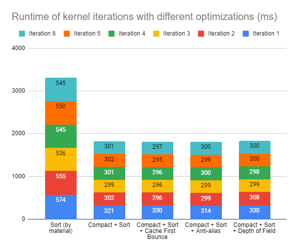

CUDA Path Tracer
================

**University of Pennsylvania, CIS 565: GPU Programming and Architecture, Project 3**

* Kaan Erdogmus
  * [LinkedIn](https://linkedin.com/in/kaanberk), [personal website](https://kaan9.github.io)
* Tested on: Windows 10, i7-8850H @ 2.592GHz 24GB, Quadro P1000

## Project Overview
A path tracer is a program that renders 3-dimensional scenes by mimicking, in reverse, the scattering of light from a
light source into a camera. In short, the path tracer generates rays from each camera pixel onto the scene, determines 
what they collide with and bounces them off repeatedly until they hit a light source or a maximum number of bounces is
reached. If the bounced ray eventually hits a light source, the properties of the surfaces hit (their colors,
for example) are combined to determine the color of the pixel sampled.

Path tracing allows for additional properties of surfaces to be observed. For example, a matte surface can bounce rays off in arbitrary directions whereas a specular (mirror) surface can always reflect with the same angle. More complex
surfaces can be rendered by combining such effects probabilistically. Additional effects such as refraction through surfaces are also possible, as implemented in this project.

This project implements a path tracer on the GPU using CUDA, parallelizing on the (non-terminated) rays in a bounce for each iteration.

## Features Implemented
* A basic path tracer using a Bidirectional Scattering Distribution Function
	* Ideal diffuse surfaces
	* Perfectly specular surfaces
	* For surfaces that are a mix of diffuse and specular, probabilistically chooses between the effects
* Removal of terminated rays using stream compaction
* Sorting of path segments and rays by material type on the GPU prior to shading
* Caching first bounces (since these are always the same when not using methods like antialiasing)
* Refraction with Fresnel effects using Schlick's approximation
* Stochastic Sampled Antialiasing
* Physically-based depth of field (partial implementation, work-in-progress)
* Arbitrary OBJ mesh loading (complete) and rendering (incomplete) with bounding boxes, using triangle intersections

## Visuals

### Ideal Diffuse surfaces
Simulates light bouncing from a surface in an arbitrary direction for non-reflective surfaces.
The incident ray is bounced of in a random direction using cosine-weighted hemisphere (which increases the expected
angle from the surface).

### Perfectly specular reflection
Simulates a perfect mirror, bouncing light off at the same angle as the incident ray.

### Refraction
Refractive surfaces with Fresnel effects using Schlick's approximation.
The rendered image uses indices of refraction of 1.2, 1.5, and 2.0 (back-to-front) respectively for the spheres. 

Multiple effects, such as refraction and reflection can be combined by probabilistically deciding which type of effect
to create depending on the incident ray.

The blue sphere is both refracting and reflecting.

### Stochasting Sampled Antialiasing
This is a method of antialiasing, where for each pixel in every iteration of the path-tracer, a small random offset less than the pixel's dimensions is added, effectively inserting noise to each created ray which smooths
(and slightly blurs) the image.

Without anti-aliasing:

With anti-aliasing:

The difference is especially noticeable on the top edge of the ideal diffused surface,
where the antialiased version is much smoother. It is also visible in the edges of the cornell box.

### Depth of field (work-in-progress)
Real cameras have a non-infinitesimal lens size and as a consequence have a focal length where the objects appear the
clearest and objects become blurier the further away they are. This implementation attempts to simulate this effect by
mapping each pixel to a point on a disk that acts as a lens and casting rays.

TODO: bugfixes

See bloopers for visual.

### OBJ Mesh loading and Bounding boxes (work-in-progress)
Arbitrary meshes in the form of OBJ files can be loaded into the scene. The meshes are broken down into and represented as triangles. Specifically, a contiguous array of triangles is kept in memory (and later transferred to device memory for rendering). The meshes are loaded by iterating over the faces and breaking up and generating triangles for the faces,
then appending these triangles to the contiguous array. Each mesh stores the index in the triangle array of where its
triangles begin and the number of triangles it contains.

For efficiency, the mesh also stores the minimum and maximum coordinates in 3-dimensions. Specifically, when iterating
over the vertices of the faces, the smallest and largest encountered x, y, and z coordinates are stored which describe
the box that bounds the mesh entirely. Then, ray collisions with the mesh are performed first by checking for
intersections with the bounding box, and then by performing a triangle intersection test which every triangle in the
mesh.

Loading of OBJ files and triangle intersect is complete. TODO: bugfix in rendering

## Performance Improvements

The above chart is the performance measurements of the Cornell box with three spheres (a perfect diffuse, a perfect
refract, and a blue mixed reflect-refract) whose image is shown under *Refraction*.

The above chart shows the runtimes for the same cornell box but with a "front" wall added, the blue sphere removed (to
maintain the same number of objects), and the camera moved forward into the now-closed box.

### Material sorting
Why is sorting more efficient? Reduces divergence as more kernels of the same warp in the same block are calling the same intersect/shading functions since they're the same material.

### Caching first bounces
The above charts effectively show the change in performance for different max ray depths when the first bounce is
cached. That is, by observing the change in runtime of the subsequent kernel calls and comparing across an open versus a closed cornell box, we can analyze the performance benefit of the caching.

## Bloopers

#### Buggy implementation of depth-of-field lens

#### Incorrect refract implementations
      

#### Incorrect reflection implementation

## Acknowledgments and External libraries
* Added [tiny object loader](https://github.com/tinyobjloader/tinyobjloader/).
* Physically Based Rendering 3rd edition
* Ray Tracing in One Weekend

