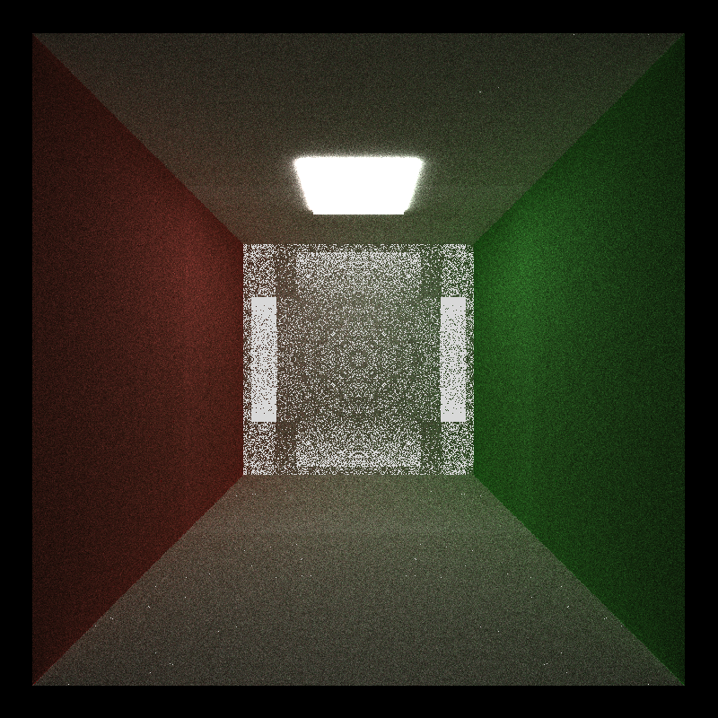

CUDA Path Tracer
================

**University of Pennsylvania, CIS 565: GPU Programming and Architecture, Project 3**

* Yuxuan Zhu
  * [LinkedIn](https://www.linkedin.com/in/andrewyxzhu/)
* Tested on: Windows 10, i7-7700HQ @ 2.80GHz 16GB, GTX 1050 4096MB (Personal Laptop)

## Demo

The gltf file is obtained from https://github.com/KhronosGroup/glTF-Sample-Models/tree/master/2.0/Duck

## Introduction

This is a GPU based image renderer with path tracing capability. Path tracing is the process of shooting rays from camera and updating the color of the rays as they bounce around the scene. Path tracing simulates how light travels in real life and enables realitic image rendering. Since each ray shot from the camera is independent from each other. Path tracing is embarassingly parallel and can be done with CUDA.   

Feature highlight:
1. Diffusion
2. Reflection
3. Refraction
4. Anti-aliasing
5. Depth of field effect
6. Arbitrary mesh loading
7. First bounce caching
8. Sorting by material

**Control Options**
1. Toggle 1 to enable/disable material sorting
2. Toggle 2 to enable/disable first bounce caching
3. Toggle 3 to enable/disable stochastic sampled anti-aliasing
4. Toggle 4 to enable/disable depth of field effect
5. Toggle 5 to enable/disable bounding volume intersection culling

## Features
**Diffusion/Reflection**

Diffusion allows the illumination of rough objects like walls. Reflection simulates the effects of mirrors and shiny objects.

**Refraction**

Refraction simulates the effects of translucent materials such as glass. Light will bend when it enters and exits these materials. When light enters from a medium with high index of refraction to a medium of low index of refraction, beyond a certain angle light will have total internal reflection instead of refraction. I implemented refraction with support for total internal reflection. Adding this feature will slow down the kernel because of the additional calculations for refraction angle, reflectance coefficient etc. This feature can take advantage of the parallel processing of GPU since the rays are independent. 

The top image is before refraction is applied. The bottom one is after.

**Anti-aliasing**

Aliasing is the problem of artefacts on images as a result of discretization of pixels. This can be mitigated by taking more than one sample per pixel from regions around the center of the pixel. By performing stochastic sampled anti-aliasing, we are use a higher number of iterations to produce a sharper image. Stochastic sampled anti-aliasing definitely benefits from being implemented on the GPU because the rays generated for each pixel are always independent. This might be further optimized by launching more threads to per pixel. The exact effect cannot be known unless it is tried out. This depends on whether launching extra threads will help mask memory latency by doing more computations. Below is the comparison for 2000 iterations. 

The top image is before anti-aliasing is applied. The bottom one is after.

**Depth of Field**

Depth of field creates the thin lens effect of a real life camera as opposed to a pinhole camera. Objects in focus will be sharp while objects out of focus will be blurry. Depth of field significantly increases the number of iterations required to render an image since we need to shoot rays from not just a pinhole but rather the whole area of the circular lens. Depth of field definitely benefits from being implemented on the GPU because the rays generated are always independent. This might be further optimized by launching more threads to handle rays generated from different camera origins. The exact effect cannot be known unless it is tried out. This depends on whether launching extra threads will help mask memory latency by doing more computations. 

The top image is before depth of field is applied. The bottom one is after.

**Meshloading**

Meshloading enables the loading of any scenes recorded in the gltf format. Gltf is a compact format designed for scene tranmission. I used the tinygltf library to help load the scene. However, significant effort is still required to parse the scene struct for use with my path tracer. I also referenced https://github.com/syoyo/tinygltf/issues/71 for examples on parsing the format. Meshloading will signifcantly slow down the path tracer becaues the mesh involves a high number of triangles and the data structure is not optimized for a high number of geometries. This functionality can only be implemented on the CPU since it involves IO. This can be further optimized by using a hierarchical spatial data structure such as octree. I ran out of time so I did not implement this optimization. I implemented bounding volume intersection culling. For bounding volume intersection culling, I used a sphere to bound the object rather than a cube, since it is easier and faster.
The tradeoff is the volume contained by the cube is larger. I did a performance analysis to show the benefit of culling.

**First Bounce Caching**

If the rays are generated deterministically, then the first itersection of the rays with the objects in the scene will always be the same. Instead of recalculating this first intersection at every iteration, we can cache this first intersection to speed up the path tracing process. However, there will be diminishing return as the number of bounces for each iteration increases. First bounce caching is also not needed if there is any randomness in the ray generation process. The graph below is the performance analysis.

**Sorting Rays by Material**

Warp divergence can seriously impact the performance of GPUs. So it is paramount to ensure the rays in each warp are doing similar calculations. Since different materials will result in differnt bouncing and shading behavior, we need to sort the rays and intersections by material to make rays hitting the same materials to be contigous in memory. There are different ways of sorting. Custom sorting in thrust is done with merge sort, which is slower than radix sort. In order to accelerate, I changed the data
structure to allow radix sort. I seperated out material ID from the material struct. I changed the material ID of terminating rays to a positive number as well since I am not sure whether thrust radix sort supports negative numbers. 

I compared three different implementations of material sorting
1. key value sort with custom comparator (fast)
2. key value sort by zip iterator with one material ID buffer (slow)
3. key value sort with duplicate material ID buffer (fastest)

This shows that extra operations can sometimes speed up GPU programs. The tradeoff is that I am using one extra buffer which take up a bit more space. 

Even though sorting by material should theoretically speed up the path tracer, the effect is not very obvious and most of the time the sorting makes the render slower. This is because there is some randomness with choosing reflection and refraction which made sorting less useful since there could be divergence for the same material.

## Bloopers

This circular pattern was accidently created because of floating point errors.

