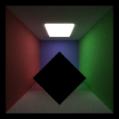

CUDA Path Tracer
================

**University of Pennsylvania, CIS 565: GPU Programming and Architecture, Project 3**

* Ashley Alexander-Lee
  * [LinkedIn](linkedin.com/in/asalexanderlee), [Personal Website](https://asalexanderlee.myportfolio.com/)
* Tested on: Windows 10, i7-6700 @ 3.40GHz 16GB, Quadro P1000 (Moore 100A Lab)

Usage
=====

#### Installation
1. Use a Cuda-enabled Windows machine
2. Clone this repository
3. `mkdir build` in the folder
4. Run CMake, and select "Visual Studio 2019" and "x64"
5. Configure and generate binaries
6. Open the .sln file in VS2019
7. In "Properties" -> "Debugging" -> "Command Arguments", type `../scenes/name_of_scene.txt`
8. Be sure to run in Release Mode

#### In-Code Toggles
There are a few macros I defined to turn certain features on or off. Most are located in pathtrace.cu:
- `SORT_MATERIALS` (bool) - sort rays by material after each bounce
- `CACHE_FIRST_BOUNCE` (bool) - cache the shaded rays after the first bounce on the first iteration so that the remaining iterations don't have to recompute the first bounce -- as long as it's deterministic (i.e. DOF and anti-aliasing aren't enabled)
- `DOF` (bool) - apply depth of field
- `FOCAL_LEN` (float) - focal length for DOF
- `ANTIALIASING` (bool) - apply anti-aliasing

In scene.cpp and intersections.h, we have:
- `USE_BB` (bool) - use bounding box

Description
=============
In this project, I implemented a pathtracer on the GPU by evaluating "batches" of rays during each iteration. At each iteration, I performed the following steps:

**1. Generate camera rays**
- Save these `PathSegment`s to an array on the GPU
- If `ANTI_ALIASING` is enabled, the reference point is jittered
- If `DOF` is enabled, a point is sampled from a disk to represent the camera position, and a focal length determines the slice of the viewing frustuum we're casting to

**2. Compute intersections with scene**
- Save these `ShadeableIntersection`s to an array on the GPU

**3. Shade each ray according to the material**
- Multiply the `PathSegment` color by the color of the intersection
- If `SORT_BY_MATERIAL` is enabled, rays are sorted based on material after this step

**4. Generate new ray directions based on the material**
- There are three materials supported: 1) Diffuse, 2) Specular, and 3) Dialectric
- Diffuse rays are scattered based on semi-random sampling of a hemisphere
- Specular rays are scattered in exactly one direction (reflected across the normal)
- Dialectric rays are either reflected or refracted based on a Fresnel coefficient
- Alter the origin and direction of the `Ray` in each `PathSegment`

**5. Cull rays if 1) they hit nothing, or 2) they hit the light**
- Rays are flagged to terminate if they match the termination conditions listed
- I maintain a list of pointers to active rays, and use stream compaction to remove all pointers to rays that are terminated.

**6. Perform steps 2 - 5 until we've reached max depth or all rays are culled**

**7. Add the resulting colors to the pixels**

Features
========
### Dialectric Materials
I added support for refractive materials, where the reflective and refractive components are based on a fresnel coefficient. The coefficient determines the likelihood of scattering a reflective or a refractive ray. 

### Depth of Field

| Focal Length: 10 | Focal Length: 15 |
| ---------------- | ---------------- |
|  ||

The camera origin is jittered by sampling from a disk, and the focal length determines the slice of the view frustuum we're casting a ray to. 

### Mesh Loading
I added support for obj loading and mesh display. I used [tinyobjloader](https://github.com/tinyobjloader/tinyobjloader) to read an obj path and triangulate the mesh. I then created a Triangle struct and a vector containing vectors of triangles that is owned by the scene. I populated each triangle and pushed it to the vector, then got the pointer to said vector and saved it to the geometry. Finally, I copied the triangle data over to the GPU before running the integrator.

I also added a computeIntersection function for the mesh, which iterates through all of the mesh's triangles, and computes the intersection of the given ray with each triangle, finding the minimum distance along the ray to the nearest triangle. 

### Anti-Aliasing
I jittered the pixel point by some fractional value to achieve anti-aliasing, as seen below. I rendered this scene at a low resolution (200x200) so that the improvements are obvious.

| Without Anti-Aliasing | With Anti-Aliasing |
| --------------------- | ------------------ |
|  |  |

Optimizations
============

### Stream Compaction

