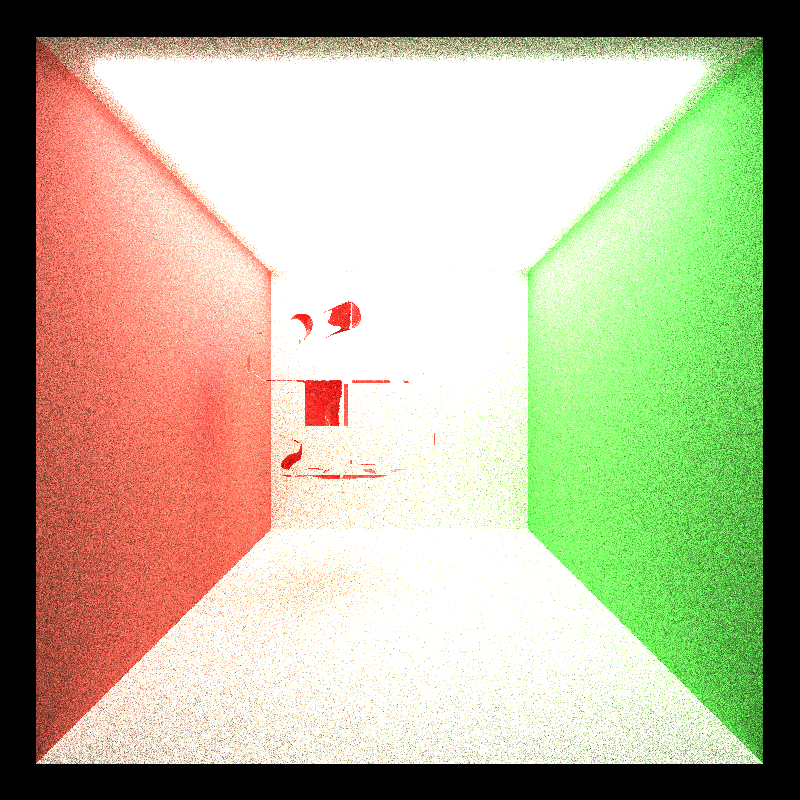

CUDA Path Tracer
================

**University of Pennsylvania, CIS 565: GPU Programming and Architecture, Project 3**

* Stephen Lee
  * [LinkedIn](https://www.linkedin.com/in/stephen-lee-bb5a40163/)
* Tested on: Windows 10, i7-9750H @2.60GHz, RTX 2060 6GB (personal laptop)

#  Project Overview

The goal of this project was to implement a path tracer on the GPU to render images. While computationally expensive, the algorithm's embarassingly parallel nature lends itself well to a GPU implementation, and allows us to create a far more realistic render of a scene than rasterization can by more accuractely simulating light physics.

# Special Features Implemented
Below is a brief list of the features I implemented as part of my path tracer project.
* Refraction with Fresnel effects using Schlick's approximation
* Physically-based depth-of-field effects by jittering rays within an aperture
* Stochastic Sampled Antialiasing
* Arbitrary mesh loading and rendering
* Hierarchical spatial data strutures for better ray/scene intersection testing (octree)

### Refraction with Fresnel Effects
In addition to perfectly specular-reflective and ideal diffuse surfaces, I implemented refractive surfaces with Fresnel effects. Refraction is a change in direction for incoming light rays when they hit the surface of another material. This physical effect was implemented using [Schilck's approximation](https://en.wikipedia.org/wiki/Schlick's_approximation) to probabilistically determine whether the incident light ray should be reflected or refracted by the material. This can be observed by the reflective light spots on the glass sphere, and the redirection of light rays focused on the light spot on the floor.

### Physically-Based Depth-of-Field Effects
Depth of field is a technique used in photography to focus the image on a certain object and have the rest of the image out of focus. This is generally accomplished with using a wider aperture to create an exposure. This was simulated in this project by defining a lens radius and focal distance for the camera and sending out rays by sampling points around the lens. Below we can see that the reflective red ball is in focus in the foreground, while the diffuse red ball in the background is out of focus.

### Anti-Aliasing
Anti-aliasing is a pixel operation that smooths edges in a geometry. This was accomplished by adding a randomized offset to the ray direction to average out the color with the pixels around it. We have anti-aliasing on the top and no anti-aliasing on the bottom. There's very slight smoothing of edges around the sphere for the anti-aliasing render as well as smoothing of the background wall colors.

### Mesh Loading from OBJ Files
3D mesh models were rendered in some scenes using tiny_obj_loader to help process OBJ files. Only one mesh can be loaded into the scene at any given time, where the path to the OBJ file containing the mesh data is hardcoded into main.cpp. Once this mesh data is loaded into the scene, we now have to check for each triangle in the mesh whether it intersects our rays. This method leads to many pointless intersection tests, since some rays may not hit any of the triangles at all. To help improve performance, a bounding box was created around the mesh and first testing to see if the ray intersected the bounding box at all before checking all of the triangles.

### Hierarchical Spatial Data Structures (Octrees)g
This is a further performance improvement that builds off of the bounding box idea from the mesh loading section. We essentially define the bounding box of the entire mesh to be the root of an [octree](https://en.wikipedia.org/wiki/Octree) and subdivide it into octants that comprise its children up to a certain tunable depth. Once we hit the leaves of the octree, we have essentially subdivided the entire bounding box into unique mini bounding boxes where we can track which triangles are bounded by this leaf. I kept track of this by creating a buffer of Triangles and maintaining start and end pointers within the Octree nodes for the ranges of Triangles that fell within the bounds of the box. We can then traverse the tree when shooting rays to check a much smaller subset of Triangles to get some performance improvements.

I wasn't able to complete this feature in its entirety, but I've implemented tree construction on the CPU to determine which triangles belong to which nodes, and an iterative check for each leaf's bounding box. I'm not entirely sure why some parts of the mesh are rendered while other aren't, but the general outline of the bunny is still there. I'd imagine there are some edge cases I'm missing that's causing me to ignore some triangles and not consider them in my ray calculations.

# Performance Optimizations
Performance optimizations such as bounding boxes, caching the first bounce for rays, stream compacting dead rays, and sorting rays by materials

### Bounding Boxes
As described in the Mesh Loading section, bounding boxes were added around the meshes to add a pre-check that determined whether the triangles of the mesh had to be tested for ray intersections at all. We can say some pretty large performance gains by adding this simple feature seeing 25% increase in performance for the cloud render and a 50% increase in performance for the bunny render. We see better performance gains for the bunny than the cloud because the bunny is comprised of many more triangles meaning a lot more computation was skipped when rays were culled by the bounding box check.

### Caching the First Bounce
When the anti-aliasing feature is disabled, the first bounce for each pizel from the camera is deterministic and the same for every iteration. Thus an optimization can be made to compute the first bounce just a single time and cache this computation for use in later iterations rather than computing it all over again. We can see these effects summarized in the graph below where the performance gains for iteration times were tested with varying max bounce depths. We can see some slight performance increases across the board, although it's pretty inconsistent and small. These small improvements do add up over the entire render time of scene since we are doing 1000s of iterations.

### Sorting by Materials
Sorting intersections by materials makes it more likely that the same materials will be grouped together before the BSDF evaluates and run in the same warp. This means that threads in a warp will be able to complete computation at the same time rather than having threads running less computationally intensive materials wait for threads running more computationally intensive materials and conseuqently more efficient use of compute resources. In my experience, the cost of sorting outweighed these benefits for cornell.txt which was the scene that I tested. Perhaps this is because there aren't many material types and most of the materials are diffuse anyways so the BSDFs were already taking roughly the same amount of time.

### Stream Compacting Terminated Rays
As the rays bounce around the scene, some will terminate before others. This means that they will not contribute any more detail to the image and can thus be removed from consideration. This process is known as stream compaction and will decrease the number of rays we have to consider within each iteration. In the graph below we can see that as the simulation goes on, many paths are culled from consideration, thus decreasing the amount of computation we need to do.

