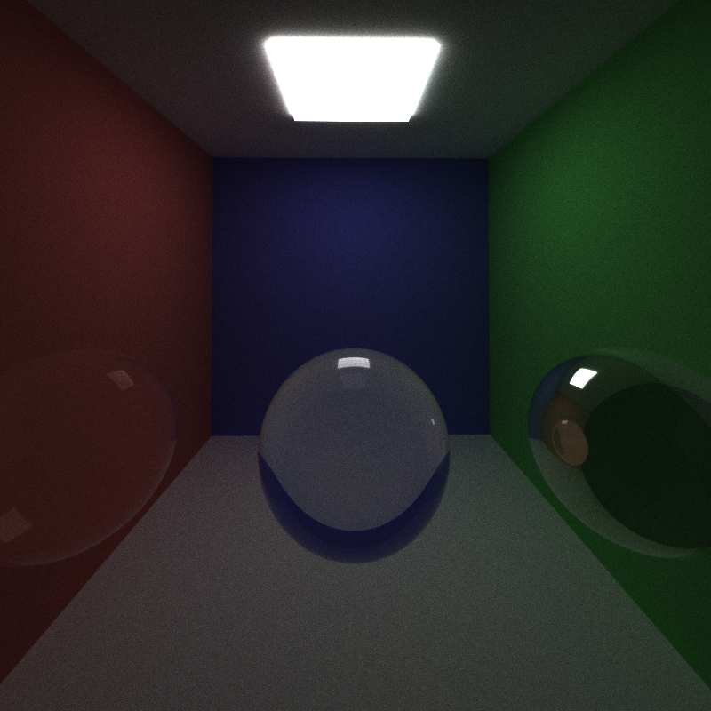
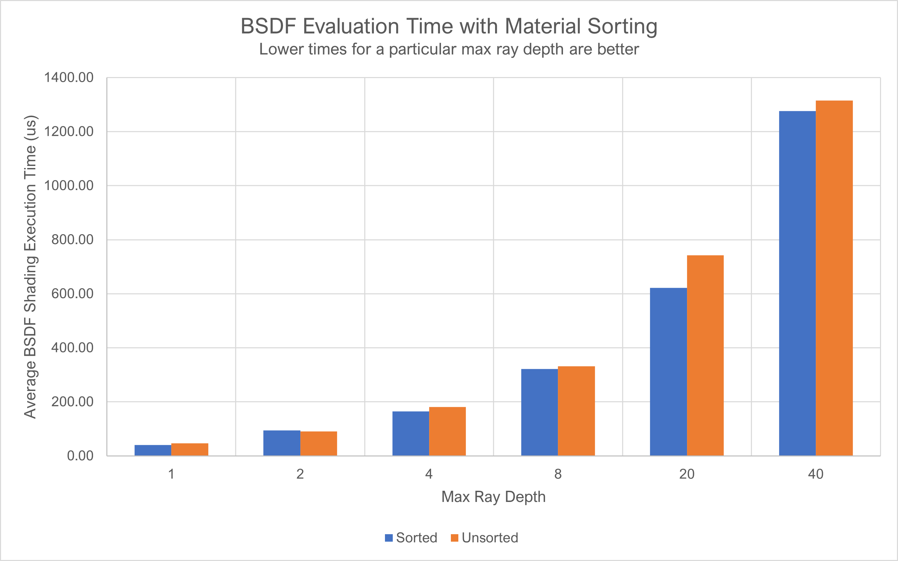

CUDA Path Tracer
================

**University of Pennsylvania, CIS 565: GPU Programming and Architecture, Project 3**

* Aditya Hota
  * [LinkedIn](https://www.linkedin.com/in/aditya-hota)
* Tested on: Windows 11, i7-8750H @ 2.20 GHz 20 GB, GTX 1070 eGPU 6 GB (personal laptop)

# Overview

This project involved implementing a path tracer, accelerated on an NVIDIA GPU by parallelizing computations through the CUDA API. Path tracing allows us to develop an accurate rendering of the lighting and material effects of objects in a scene, which rasterization cannot do.

## Features
* Loading of arbitrary object models (in the Wavefront OBJ format)
* Simulation of refraction with Frensel effects
* Physically-based depth of field and object focusing
* Anti-aliasing to smoothen rendered scenes
* Shading of objects using BSDF evaluation

## Performance features
* Mesh intersection culling using bounding boxes to reduce mesh render times
* Termination of unnecessary paths using stream compaction
* Material sorting to allow for more contiguous memory accesses
* Caching the first bounce

# Feature Showcase
## Load arbitrary objects

  
   

3D meshes in the Wavefront Object format (.OBJ files) can be loaded in through the scene file by specifying the type of element as a `MESH` and then including the path to the scene file. Meshes can use the same materials as defined earlier in the scene file and transformations can be applied too. Meshes essentially get converted into triangle Geom objects, so loading in complex .OBJ files causes the rendering time to increase. However, there is a trick that can improve rendering times, discussed [here](#mesh-intersection-culling).

## Refraction with Fesnel effects

  
  
   

The above images show glass balls with increasing indices of refraction (1.2, 1.8, and 5.0). There is a slight reflection of the light on the top of the balls as well, due to the Frensel effect--the larger the angle between the camera's look vector and the surface normal, the more reflection we see. Refraction is accomplished by probabilistically adding a reflective or refractive effect to the incoming ray.

## Depth of field

  
  

These images show the depth of field effect, where a focal radius and length can be simulated. This allows the camera to "focus" on an object, just like in real life, and is accomplished by jittering the rays within an aperature. Objects out of focus are blurred by moving the ray starting point to somewhere on a circular disk with the camera origin at the center. The picture above on the left shows a virtual camera with lens radius 0.5mm and focal distance 6m; the one on the right has lens radius 0.5mm and focal distance 3m; as we can see, increasing the focal length allows us to focus on objects farther away.

## Anti-aliasing

  
  

On the left is with anti-aliasing on, and on the right is with anti-aliasing off. Anti-aliasing introduces some randomness into the direction of the ray emitted from the camera. This means that for a given pixel, the color seen will be a very localized but uniform average of the pixels around it. In the image to the right, the reflection of the edge between the red and white wall appears jagged, but the edge is a lot smoother with anti-aliasing. Anti-aliasing essentially applies a low-pass smoothing filter to reduce the effect of sudden changes in geometry.

## BSDF evaluation

  

The picture above shows a purely specular object reflecting the objects and light around it. Depending on the material properties (reflectivity, refractivity), light rays can be bounced off an object as they would be in real life. In a typical object, light from all angles can bounce off an object before reaching the viewer; BSDF reverses this by randomly choosing a direction to bounce a ray in hopes that it will eventually hit a light source. Furthermore, in objects that can refract light, some rays can be transmitted inside. 

# Performance improvements
## Mesh intersection culling

  

The image above shows a bounding box established around a mesh. The naive method for testing intersections involves having each ray check whether it intersects every geometry in the scene. However, meshes contain lots of triangles and this can slow down the testing process. Not all rays will intersect with a triangle in a mesh, so these intersections do not need to be tested; threads that would previously test for all these intersections can be reused to perform other computations and speed up rendering. Intersection culling is achieved by establishing an axis-aligned bounding box (AABB) around the mesh and seeing if a ray intersects with the box (using the provided box intersection formula with a scaled and transformed cube geometry to fit the BB shape). If the ray does not intersect with the box, none of the mesh's triangles are checked for intersection; however, if the ray does intersect the box, the triangles are checked. This saves a lot of unnecessary computation.
 

  

The graph above shows the impact of mesh intersection culling. There is a clear disparity in between loading times when culling is used; as the geometry becomes more complex, the difference in execution time increases. This shows that mesh culling will be particularly useful when rendering large mesh files because the number of geometries to test for intersections is much smaller. In the future, when used with hierarchical structures, the intersection can be further localized so that only particular regions of the mesh have to be tested.

## Terminate rays using stream compaction

  

When a ray has bounced enough times without reaching a light or has turned black, any subsequent bounces will not result in any color being added to the render. Therefore, these rays can be terminated from the pool. This prevents kernels from being started for rays that will have no effect on the final image. Stream compaction has a significant impact on the rendering performance, as the number of rays that need to be checked decreases with each bounce. At the end of the iteration, we can see see that there are fewer rays compared to if we don't remove any. Furthermore, as we increase the maximum ray bounce depth, we see more rays being terminated because they reach termination conditions. In the open scene, it is easier for a ray to bounce out of the scene and turn black, so we see an even smaller number of remaining rays. Fewer rays means fewer threads and more useful computation on the GPU.

## Sorting materials

  

Sorting materials allows geometries with the same material properties to be grouped together before BSDF computation executes. When materials are grouped together, it is more likely that BSDF computations with the same material properties will run in the same warp. This will allow for threads in a warp to finish computation at the same time, rather than having threads of one material wait for threads of another. Because we are not doing explicit alignment of materials between thread blocks, we do not see a large speedup. However, there is a noticeable effect on the BSDF kernel run times, especially for larger max ray depths.

## First bounce caching

  

When anti-aliasing is disabled, the first bounce for each pixel from the camera into the scene will be the same across iterations. Therefore, we can compute the first bounces just once, and use this cached data in subsequent iterations. We see the effects of this in the graph above: when our max ray depth is 1 (meaning we have at most one bounce), we spend virtually no time running the intersection logic, since we just reuse the cached data from the first iteration. Here, the first intersection kernels takes 168350 us to compute, but any subsequent intersection computation kernels only take on average 255 us. The time saved with the first bounce also helps reduce the average total kernel execution time when we have higher max ray depths. Because anti-aliasing makes the first ray direction non-deterministic, we cannot use first-bounce caching with anti-aliasing, or else we end up with a blurry image.

# Miscelaneous notes
* Meshes must be placed after any objects in the scene file and their numbering must continue from the numbering scheme used for any objects.
* Despite decrementing the number of remaining bounces for rays on each bounce, the check for whether a ray has 0 remaining bounces did not seem to work with `thrust::remove_if`. Therefore, I am checking whether the color is 0 (meaning any future bounces would just color pixels black).

# References
* Loading in .OBJ files using TinyOBJLoader
  * https://github.com/tinyobjloader/tinyobjloader#example-code-new-object-oriented-api
