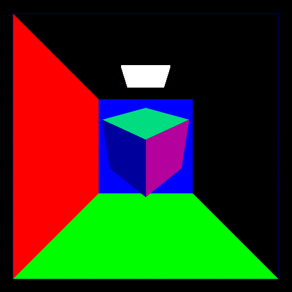

CUDA Path Tracer
================

**University of Pennsylvania, CIS 565: GPU Programming and Architecture, Project 3**

* Richard Chen
* Tested on: Windows 11, i7-10875H @ 2.3GHz 16GB, RTX 2060 MAX-Q 6GB (PC)

## Overview

Path tracing is a rendering technique where light rays are shot out from the "camera" 
into the scene. Whenever it meets a surface, we track how the ray gets attenuated and scattered.
This allows for more accurate rendering at the cost of requiring vast amounts of computation.
Fortunately, since photons do not (ignoring relativity) interact with each other,
this is very parallelizable, a perfect fit for running on a GPU. 

<!-- 
 -->

## Features

* Diffuse surfaces

 
Since most surfaces are not microscopically smooth, incoming light can leave in any direction.
 

* Specular reflection

 
Smooth surfaces reflect light neatly about the surface normal, like a mirror does. 
 

* Dielectrics with Schlick's Approximation and Snell's Law

 
Light moves at different speeds through different mediums and this can cause light 
to refract and/or reflect. In these examples, glass and air are used with indices of refractions
of 1.5 and 1, respectively. The further the incoming light is from the surface normal, the more likely
it is to reflect. 
 

* Anti Aliasing via Stochastic Sampling

 
As opposed to classical antialiasing which involves super-sampling an image and is thus very computationally
expensive, stochastic sampling wiggles the outgoing ray directions slightly. This reduces the jagged artifacts
from aliasing at the cost of more noise, but does not involve shooting extra photons per pixel. 
Notice how the left edge of the sphere is not nearly as jagged in the anti-aliased version
 

* Depth of Field/Defocus Blur

 
Despite modelling the rays as shooting out from an infinitesimal point, real life cameras have a lens 
through which the light passes. Further, the laws of physics also prevent light from being infinitely focused.
With cameras, this means that objects further away from the focal length will be blurrier. In ray tracing, the origin points of the light rays are wiggled in a manner consistent with approximating a lens. 
 

* Obj Mesh Loading

 
While cubes and spheres are a great point to start off, one of the great joys in life is 
to render Mario T-Posing. Many 3d models are available from the internet, with most of them
being meshes composed of triangles. I used [tinyObj](https://github.com/tinyobjloader/tinyobjloader) to load models that were of the Wavefront OBJ file format. 
 

* Textures from files  

 
While it is theoretically possible to specify material properties for each shape in a scene, 
this can be untenable when working with thousands of shapes, let alone millions. 
Instead, it is common to use textures, images where the color encodes useful data. Then,
rather than giving every vertex all of its data, it can associate them with texture coordinates 
and look up the corresponding data only when relevant. I focused on textures that encoded
base color, tangent space normal mapping, ambient occlusion/roughness/metallicity, and emissivity.
I also set the background in a few renders to a texture rather than just having it fade to black, 
lest they be way too dark. 
 

* Normal Mapping Texture Adaptation  

 
The normal vector at a location allows for computing reflections, refractions, and more since
knowing it allows one to calculate the angle of incidence. Technically, it is a co-vector but
a consensus has been reached for how the order of vertices in a triangle directs its planar normal.
At its most basic, each triangle contains enough information to calculate its normal. 
However, meshes composed of polygons are often used to model smooth objects, so it is common
to associate each vertex with a normal vector. Then, for a point inside a triangle, one can 
interpolate between the vertex normals to get a normal for a particular location.
Imagine a brick wall. The mortar crevices could be modelled by adding who knows how many new triangles. 
Alternatively, by turning the surface normals into a texture, they can be sampled as needed without weighing
down the system with extra computations. Bump maps and height maps accomplish something very similar, but 
normal maps themselves come in two varieties: Object space and Tangent space. Object space maps let one directly
sample the rgb components and associate them with the normal's xyz values. Tangent space normal maps involve 
a perspective shift so that the planar norm of a triangle is is pointing straight up. This requires some extra
computation but is generally preferred due to its flexibility. The change of basis matrix TBN requires the namesake tangent, bitangent, and normal of which the normal is just the triangles planar norm. The other two can be relatively easily computed from the uv/texture coordinates of the vertices. To save on computation, I precompute them when loading in a mesh rather than need to recompute them every time they need to check the normal map. 
 

* Physically Cringe Rendering Texture Adaptation  
 
Nowadays, many people use metallic/roughness and Albedo instead of diffuse/specular.
I found a mesh (and its accompanying textures) that used this information so I had to 
figure out how to adapt to this. Due to vastly different behaviors between dielectrics
and conductors, metallicity the concept is treated almost as a boolean value, with gradations
encoding how to attenuate the metallic behavior. Physically based rendering tries to use 
more physics to enable more realistic rendering. Light is split into refractive and reflective
components and metals will absorb the refractive component whilst dielectrics will scatter both, 
with the resultant having both a specular and a diffuse portion. 
The roughness also has a varying effect predicated upon metallicity. And lastly there is an 
ambient occlusion map that describes how an area might be darker than expected. 
This seems to be more tailored towards rasterization as the nature of path tracing means
areas which would be occluded more just will not bounce the light rays back towards light sources. 
The theory goes much deeper, but 
 

## Performance Analysis
* AABB
* First cache
* mat sort
* cull threads

## Debug Views
 should have displayed the texture

 It was caused by negative uv coords because of tiling

 made me think I had bad normal blending so
 also agreed
 showed that each triangle just had the same normal

## Bloopers
* Initial mesh loading had triangle collision errors

Bug fixes:
seed the rng with the depth otherwise bad banding
offset new origin by surface normal not new direction

https://sketchfab.com/3d-models/ebon-hawk-7f7cd2b43ed64a4ba628b1bb5398d838
Ebon Hawk - sketchfab lemonaden

tinygltf insns by https://piazza.com/class/kqefit06npb37y?cid=134

diffuse vs specular
ray compaction
material sorting
cache bounce

gltf (also have debug views avalible for each)
    texture
    normal
    bump
refraction/fresnel/schlick
skylight???

4 mesh loading 
6 hierarchical spatial data structure 
2 refract 
2 depth of field 
2 antialiasing
5/6 texture/bump mapping
2 direct lighting
4 subsurface scattering
6 Wavefront pathtracing

// https://www.iquilezles.org/www/articles/intersectors/intersectors.htm

https://www.cs.utexas.edu/~fussell/courses/cs384g-spring2016/lectures/normal_mapping_tangent.pdf
Scenes & Ray Intersection 
Steve Rotenberg CSE168: Rendering Algorithms 
UCSD, Winter 2017

COLORMAP ../scenes/ebon_hawk/textures/ebonhawk_V_EHawk01_baseColor.png
EMITMAP ../scenes/ebon_hawk/textures/ebonhawk_V_EHawk01_emissive.png
ROUGHMAP ../scenes/ebon_hawk/textures/ebonhawk_V_EHawk01_metallicRoughness.png
NORMALMAP ../scenes/ebon_hawk/textures/ebonhawk_V_EHawk01_normal.png

check t < 0

wrapping negative texture coords

https://wallpaperaccess.com/star-wars-hyperspace

pbrIsh
DOF
fix aabb

to set scene, change camera lookfrom rather than rotating the mesh

glm::vec2

based https://stackoverflow.com/questions/5255806/how-to-calculate-tangent-and-binormal

https://schuttejoe.github.io/post/disneybsdf/
https://stackoverflow.com/questions/5255806/how-to-calculate-tangent-and-binormal
file:///C:/Users/richa/AppData/Local/Temp/normal_mapping_tangent.pdf

illegal array idxs in gpu kernel

something something shinyness
