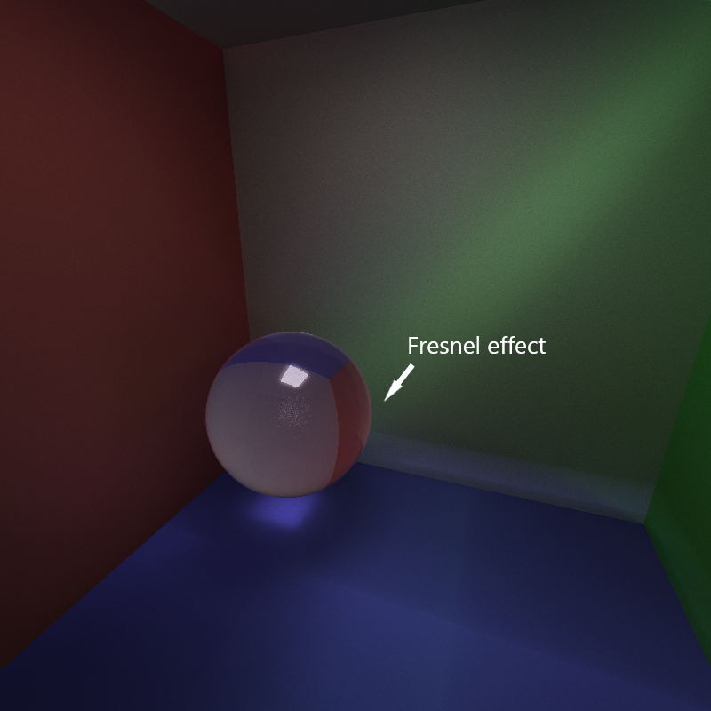
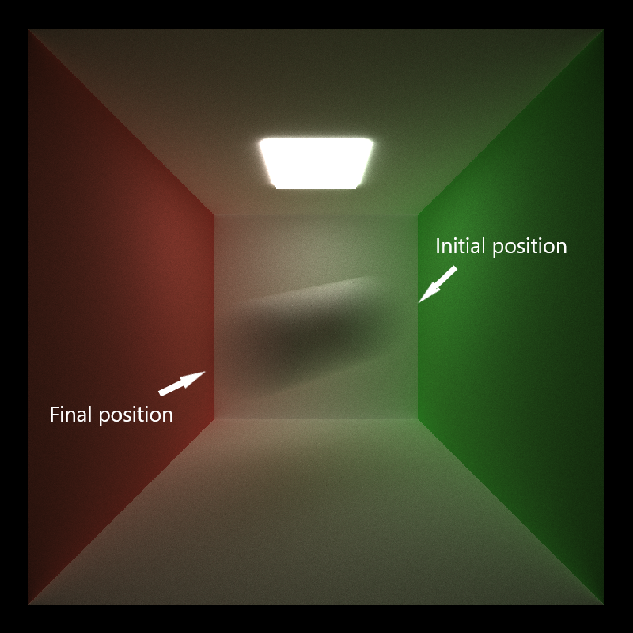

CUDA Path Tracer
================

**University of Pennsylvania, CIS 565: GPU Programming and Architecture, Project 3**

* Bowen Deng
  * [LinkedIn](www.linkedin.com/in/bowen-deng-7dbw13)
* Tested on: Windows 10, AMD Ryzen 9 5900HX with Radeon Graphics @ 3.30GHz 16GB, GeForce RTX 3070 Laptop GPU 8GB (Personal Computer)

## Abstract

A CUDA-based path tracer, which is capable of rendering globally-illuminated images very quickly.


> Scene: scenes/represent.txt

## Features

### Ideal Diffuse and Perfectly Specular-Reflective Materials Rendering

These two are the most fundamental materials in a path tracer.


> Scene: scenes/regular.txt

For an ideal diffuse object, like the ball on the right, the bounce ray scattered on its surface is in a random direction of a hemisphere.

For a perfectly specular-reflective object, like the ball on the left, the bounce ray reflected on its surface is in the reflective direction.

### Path continuation/termination using Stream Compaction

When a ray hits light, hits nothing, or reaches maximal tracing depth, we want to stop tracing it for better performance. A stream compaction algorithm is applied to terminate the rays which will not keep scattering. The built-in `thrust::stable_partition` function is applied to perform the compaction.

### Refraction with Fresnel Effects

For a refractive object, like the glass ball below, the scattering on its surface includes two ways, one in the reflective direction like mirror, and the other in the refractive direction defined by Snell's law. Schlick's approximation is used to determine the ratio of these two.


> Scene: scenes/refract.txt

The Fresnel effect can be observed in the edge of the form, since the angle of incidence is steeper here.

### Arbitrary Mesh Rendering

An arbitrary mesh, which consists of many triangles, can be stored in a `.obj` file. The third party `tinyObj` is applied to load `.obj` files.

```
// Mesh
OBJECT 6
mesh
../scenes/wahoo.obj
material 1
TRANS       0 4 -1
ROTAT       0 0 0
SCALE       1 1 1
```

To specify a mesh, an object should be labeled as `mesh`, and the next line tells the loader where the model file is.


> Scene: scenes/mesh.txt

Naively, the path tracer checks every triangle of the mesh to see whether an intersection exists. It can be optimized by using bounding volume intersection culling, which will be discussed in Performance Analysis part. The normal of the intersection is computed by barycentric interpolation on the three vertices of the triangle.

### Texture Mapping and Bump Mapping

A texture is stored as an image. It can be mapped to a mesh according to the uv coordinates, which are also from barycentric interpolation. `stb_image` is used to load such images.


> Scene: scenes/texture.txt

In a similar way, a normal map can be applied to replace the original surface normal, which provides an illusion that the surfaces are full of bumps.

| texture | normal map |
| ------------------------ | ----------------------- |
|  |  |
|  |  |
> Scene: scenes/normal.txt

The result with normal mapping on the right looks much more realistic. In addition, since normal mapping just changes the direction of surface normals without modifying the original mesh, it does not bring much additional cost. A comparison for rendering with or without it can be found in Performance Analysis part.

The texture and normal map of a mesh can specified by `texture` and `normal` in the following way.
```
// Mesh
OBJECT 1
mesh
../scenes/cube.obj
material 1
TRANS       0 5 0
ROTAT       -30 90 0
SCALE       1 10 10
texture ../scenes/154.JPG
normal ../scenes/154_norm.JPG
```

### Physically-Based Depth-of-Field

To simulate a real camera, a virtual aperture is set in front of the original pinhole. Every time the camera is generating a new ray, first sample a random point on the aperture, and then calculate the emitting direction defined by Snell's law.

```
// Camera
CAMERA
RES         800 800
FOVY        45
ITERATIONS  5000
DEPTH       5
FILE        cornell
EYE         0.0 5 10.5
LOOKAT      0 5 0
UP          0 1 0
LENRAD 0.5
FOCALLEN 6
```

Such aperture is defined by `LENRAD` and `FOCALLEN`, which are the radius of lens and the focal length respectively. As the focal length changes, the camera will focus on objects at different distances.

| small focal length | large focal length |
| ------------------------ | ----------------------- |
|  |  |
> Scene: scenes/dof.txt

### Stochastic Sampled Antialiasing

Antialiasing can help smooth the edges of the rendered image. A 4x antialiasing is performed by first rendering a 4x resolution image, with stochasticly sampled rays at each pixel. After tracing all the rays, the result image is downsampled to the origin size by averaging the colors of 4 adjacent pixels.

| no antialiasing | with 4x antialiasing |
| ------------------------ | ----------------------- |
|  |  |
> Scene: scenes/aa.txt

### Direct lighting

For a ray which is reaching the maximal tracing depth, direct lighting takes it directly to a random point on an emissive object, instead of just terminating it. It makes the path tracer converge more quickly since such kind of ray gives more contribution to the final result.

| no direct lighting at 50 spp | with direct lighting at 50 spp |
| ------------------------ | ----------------------- |
|  |  |
> Scene: scenes/regular.txt

From the result at a small number of sampling, only slight improvement is observed. Also, the scene seems a bit more bright as expected.

This feature can be enabled by toggling this macro defined in `src/pathtrace.cu`
```
// Direct lighting by taking a final ray directly to a random point on an emissive object
#define DIRECT_LIGHT 1
```

### Motion Blur

The motion of an object is defined by considering the translation vector as its initial position, and adding an `END` translation vector as its final position.

```
// Sphere
OBJECT 6
sphere
material 1
TRANS       2 5 -1
ROTAT       0 0 0
SCALE       3 3 3
END         -2 4 1
```


> Scene: scenes/motion.txt

The ball above moves from the initial position to the ending position during a time period. Each ray generated by camera now has a time stamp indicating the ratio of elapsed time. When computing intersections, the position of the moving object is obtained by linear interpolation.

## Performance Analysis

### Measurement Metric

To measure performance, CUDA events are applied to record the time cost for each iteration. The average FPS is defined as total iterations rendered divided by total time elapsed.
```
float milliseconds = 0;
cudaEventElapsedTime(&milliseconds, kernel_start, kernel_stop);
time_elapse += milliseconds / 1000;

// display average FPS
kernel_fps = iteration / time_elapse;
```

The result will be shown in the title of the application.


This feature can be enabled by toggling this macro defined in `src/main.h`
```
// Toggle for measuring performance
#define KERNEL_FPS 1
```

### Bounding Volume Intersection Culling

When rendering a mesh, it can reduce the number of rays that have to be checked against the entire mesh by first checking rays against a volume that completely bounds the mesh. A bounding box is defined by one corner with smallest coordinates and the other with largest coordinates.


> Scene: scenes/mesh.txt

The result above is measured on a simple scene with just one Mario mesh and shows trivial improvement. What about a more complex scene?


> Scene: scenes/bounding.txt

A significant performance gain is observed, since in this scene several meshes are set in different places, where bounding volume culling can reduce lots of unuseful intersection checking. It can be imagined that for a real scene to be rendered, which has more meshes and the they are more complex, bounding volume culling will play an important role.

This feature can be enabled by toggling this macro defined in `src/pathtrace.cu`
```
// Toggle for bounding volume intersection culling to reduce number of rays to be checked
#define BOUND_BOX 1
```

### Normal Mapping


> Scene: scenes/normal.txt

When applying normal mapping, the performance just drops slightly. In real applications like games, it is a good choice to use normal mapping, instead of complex meshes, for obtaining both realistic visual effects and a high FPS.

### Sorting Rays by Material Type

The path tracer performs BSDF evaluation using just one big shading kernel, and so evaluations for different materials within the kernel will take different amounts of time to complete. Such divergence is harmful to performance in CUDA programs since at some time in one warp, some threads could be idle while others are working. One solution is to sort the rays so that rays interacting with the same material are contiguous in memory before shading.


> Scene: scenes/cornell.txt

However, the result based on a standard cornell box shows that the performance is even worse after applying material sort. The reason is that the sorting operation itself takes time. For a simple scene without many kinds of different materials, this cost is much more than the benefits from preventing divergence.

This feature can be enabled by toggling this macro defined in `src/pathtrace.cu`
```
// Sort the rays so that rays interacting with the same material are contiguous in memory before shading
#define MATERIAL_SORT 1
```

### Cache for First Bounce Intersections

In the beginning of each sampling iteration, the camera scatters rays into the scene and they intersect with some objects or not without randomness. So why not store the information about these first bounce intersections at the first iteration and simply reuse them across all subsequent iterations? 


> Scene: scenes/cornell.txt

Experiments show that the first bounce cache helps improve performance, but as the max ray depth grows, such improvement becomes less obvious. This is because when a high max depth is set, the computation cost is mainly from subsequent bounce rays, caching for first bounce thus provides less effect on performance.

This feature can be enabled by toggling this macro defined in `src/pathtrace.cu`
```
// Cache the first bounce intersections for re-use across all subsequent iterations
#define CACHE_FIRST_BOUNCE 1
```

**NOTE: First bounce caching can NOT be used with antialiasing, depth-of-field or motion blur features at the same time, since it assumes non-randomness for rays generated by camera, which is not applicable for the latter two.**

## Bloopers

**"Thank You My Renderer"**


**"Life is Boring"**


**"Am I Drunk?"**


**"Wow An Animus Anomaly!"**


## Reference

* Physically Based Rendering, Second Edition: From Theory To Implementation. Pharr, Matt and Humphreys, Greg. 2010.
* Ray Tracing: The Next Week, Peter Shirley, https://raytracing.github.io/books/RayTracingTheNextWeek.html#imagetexturemapping/storingtextureimagedata.
* tinyObj, third party code, https://github.com/tinyobjloader/tinyobjloader.
* Robo_OBJ_pose4, Artem Shupa-Dubrova, free model from https://sketchfab.com/3d-models/robo-obj-pose4-uaeYu2fwakD1e1bWp5Cxu3XAqrt.
* Models and textures from homework of CIS460, https://www.cis.upenn.edu/~cis460/21fa/index.html.
* Special thanks to Ling Xie, who helped me a lot in this project, his website https://jack12xl.netlify.app.