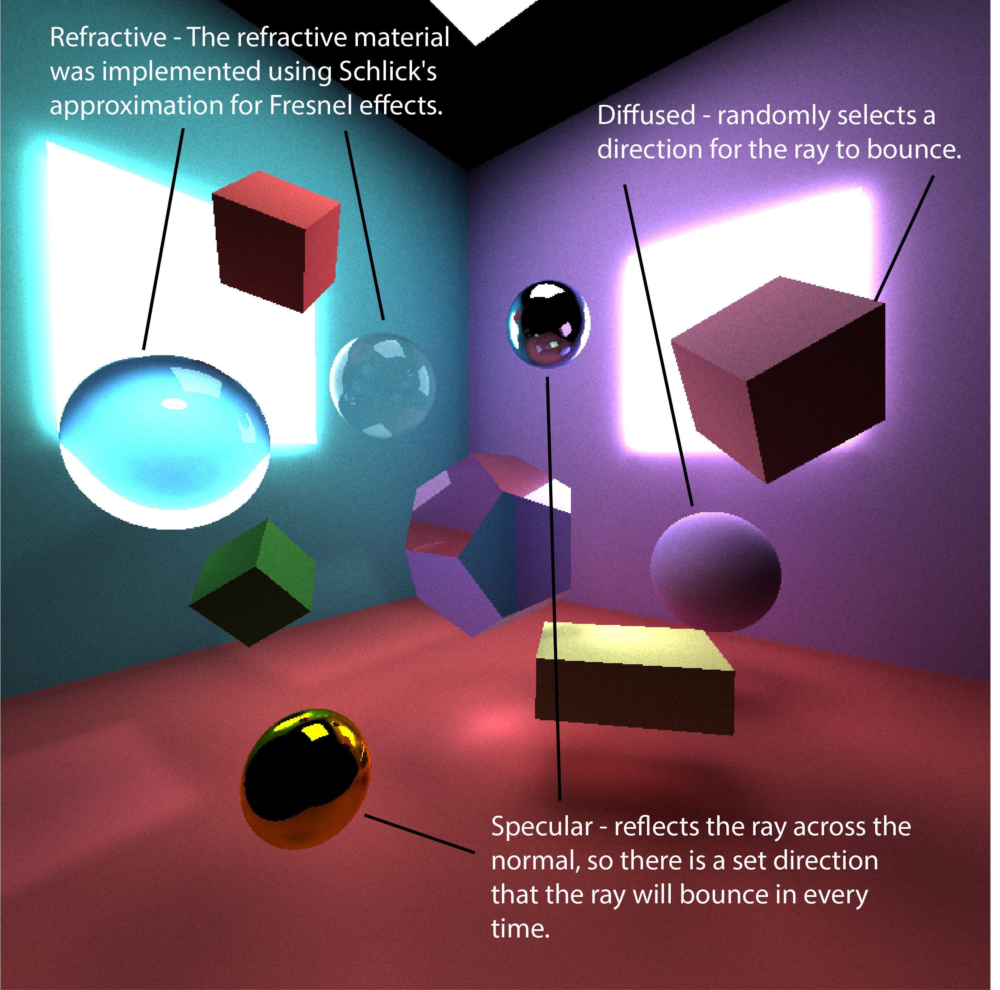
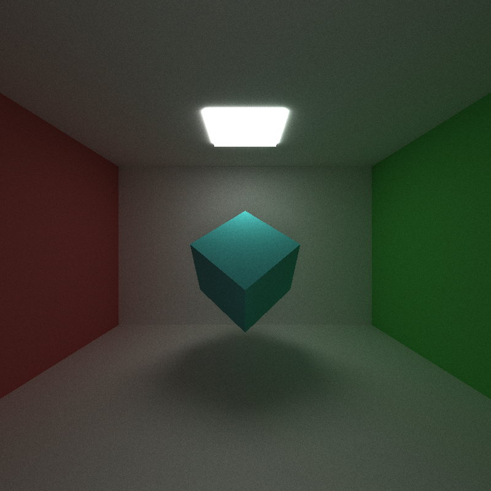

CUDA Path Tracer
================

**University of Pennsylvania, CIS 565: GPU Programming and Architecture, Project 3**

* Lindsay Smith
*  [LinkedIn](https://www.linkedin.com/in/lindsay-j-smith/), [personal website](https://lindsays-portfolio-d6aa5d.webflow.io/).
* Tested on: Windows 10, i7-11800H 144Hz 16GB RAM, GeForce RTX 3060 512GB SSD (Personal Laptop)

## Features
* Basic pathtracer
* Refractive, Reflective, and Diffused surfaces
* Anti-Aliasing
* OBJ Loading
* Depth of Field
* Direct Lighting

This pathtracer utilized [Physically Based Rendering](https://pbr-book.org/) for reference

### Materials
There are three different types of materials that I implemented. 

### Anti-Aliasing
In the left photo we can see the step-like edge of the sphere, but in the right one where anti-aliasing has been implemented it appears more smooth. This was implemented by slightly jittering the ray origin when calculating the direction. This provides the slight blur that we see around the edges of the sphere.

### OBJ Loading
The OBJ loader allows for .obj files to be uploaded to the pathtracer. It utilizes a Triangle geom type and reads the OBJ file to determine where the triangles and points on the triangles should exist. I used [tinyObj](https://github.com/tinyobjloader/tinyobjloader) to implement this.

### Depth of Field
For the depth of field we want to be able to shift the focus of our camera so that only certain parts of the image appear in focus. The first photo has no depth of field effect for reference. In the second photo we can see that the front sphere looks blurred due to the larger focal distance (13). With a lower value for the focal distance (8) the back sphere/background gets blurred.

### Direct Lighting
To get a direct lighting effect in our images we want to make the last bounce of each ray hit a light source. We do this by randomly selecting a point on a randomly selected light and setting the direction of the ray to that point. The first image is without direct lighting, and the second one we can see is overall brighter with the direct lighting enabled.

### Bloopers
A bit too much depth of field

Cube OBJs is just a triangle?

