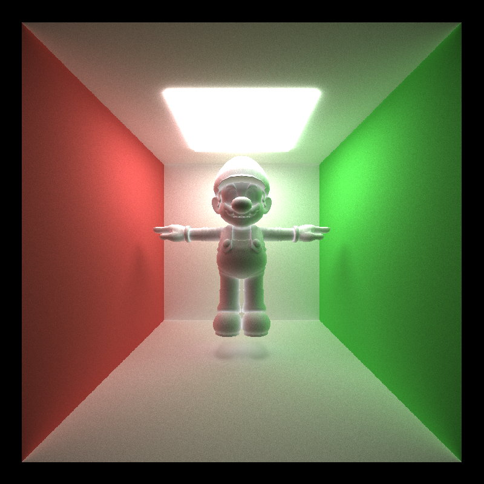
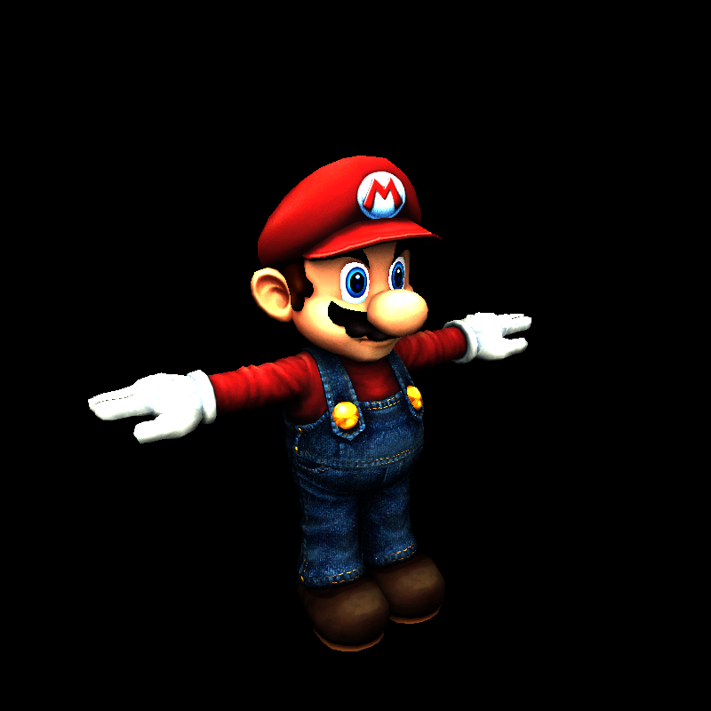
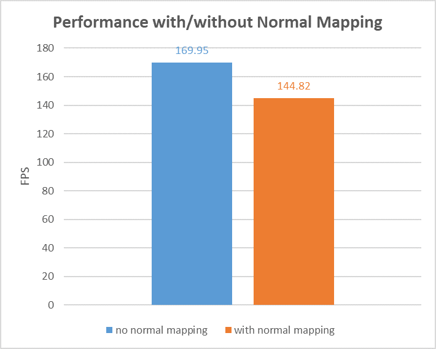
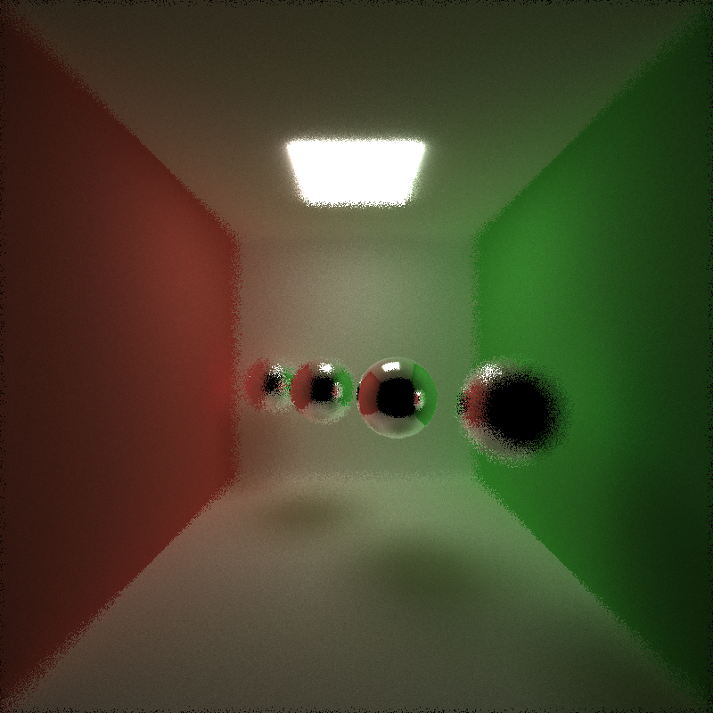
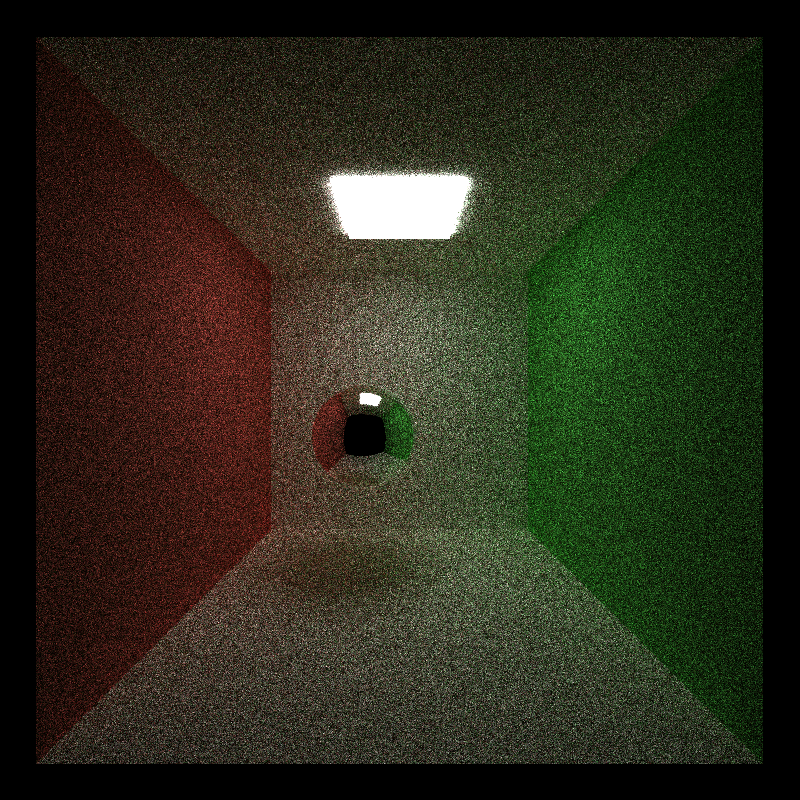

CUDA Path Tracer
================

**University of Pennsylvania, CIS 565: GPU Programming and Architecture, Project 3**

* Bowen Deng
  * [LinkedIn](www.linkedin.com/in/bowen-deng-7dbw13)
* Tested on: Windows 10, AMD Ryzen 9 5900HX with Radeon Graphics @ 3.30GHz 16GB, GeForce RTX 3070 Laptop GPU 8GB (Personal Computer)

## Abstract


> Scene: scenes/represent.txt

CUDA-based path tracer, which is capable of rendering globally-illuminated images very quickly.

## Features

### Ideal Diffuse and Perfectly Specular-Reflective Surfaces Rendering


> Scene: scenes/regular.txt

For an ideal diffuse surface, the diffuse color of its material is cumulated to the path segment, and a new bounce ray is scattered in a cosine-weighted random direction of a hemisphere.

For a perfectly specular-reflective surface, the specular color of its material is cumulated to the path segment, and a new bounce ray is scattered in the reflective direction.

### Path continuation/termination using Stream Compaction

A stream compaction algorithm is applied to terminate the rays which will not keep scattering (hitting light, hitting nothing, or reach maximal tracing depth). Here, I choose to use the built-in `thrust::stable_partition` function to perform compaction.

### Refraction with Frensel Effects


> Scene: scenes/refract.txt

The refraction includes two kinds of scattering, one in the reflective direction like mirror, and the other in the refractive direction defined by Snell's law. Schlick's approximation is used to determine the ratio between these two. As a result, the Frensel effects can be observed.

### Arbitrary Mesh Rendering


> Scene: scenes/mesh.txt

An arbitrary mesh stored in `.obj` files can be loaded using `tinyObj`.

Naively, the path tracer checks every triangle of the mesh to see whether an intersection exists. It can be optimized by using bounding volume intersection culling, which will be discussed in Performance Analysis part.

### Texture Mapping and Bump Mapping


> Scene: scenes/texture.txt

A texture is loaded as an image by `stb_image`. Once loaded, it can be mapped to an arbitrary mesh according to the uv coordinates.

Further more, a normal map can be applied in a similar way, with the following converting.
```
normal = color * 2 - 1;
```
When using the mapped normal instead of the original surface normal, there is an illusion that the surface is full of bumps, and so makes it more real.


> Scene: scenes/normal.txt

### Physically-Based Depth-of-Field


> Scene: scenes/dof.txt

To simulate the depth-of-field effect, a virtual aperture is set to jitter the rays from camera. Every time the camera is generating a new ray, first sample a random point on the aperture, and then calculate the emitting direction defined by Snell's law.

### Stochastic Sampled Antialiasing

**Without antialiasing**


**With antialiasing**


> Scene: scenes/regular.txt

A 4x antialiasing is performed by first rendering a 4x resolution image, with stochasticly sampled rays for each pixel. After finishing one tracing iteration, the result image is downsampled to the origin size by averaging colors of 4 adjacent pixels.

### Direct lighting

For a ray which is almost reaching the maximal tracing depth, direct lighting takes it directly to a random point on an emissive object, instead of just terminating it. This helps the path tracer converges more quickly.

**Without direct lighting at 10 spp**


**With direct lighting at 10 spp**


> Scene: scenes/regular.txt

### Motion Blur

The motion of an object is defined by its initial translation vector and an extra final translation vector.

```
// Sphere
OBJECT 6
sphere
material 1
TRANS       2 4 -1
ROTAT       0 0 0
SCALE       3 3 3
END         -2 4 -1
```

It moves from the initial position to the ending position during a time period. Each ray generated by camera now has a time stamp indicating the ratio of elapsed time. When computing intersections, the position of the object is obtained by linear interpolation.


> Scene: scenes/motion.txt

## Performance Analysis

### Measurement Metric

To measure performance, CUDA events are applied to record the time cost for each iteration. The average FPS is defined as total iterations rendered divided by total time elapsed.
```
float milliseconds = 0;
cudaEventElapsedTime(&milliseconds, kernel_start, kernel_stop);
time_elapse += milliseconds / 1000;

// display average FPS
kernel_fps = iteration / time_elapse;
```

The result will be shown in the title of the application.


This feature can be enabled by toggling this macro defined in `src/main.h`
```
// Toggle for measuring performance
#define KERNEL_FPS 1
```

### Bounding Volume Intersection Culling

When rendering a mesh, it can reduce the number of rays that have to be checked against the entire mesh by first checking rays against a volume that completely bounds the mesh. A bounding box is defined by one corner with smallest coordinates and the other with largest coordinates.


> Scene: scenes/mesh.txt

The result above is measured on a simple scene with just one Mario mesh and shows only slightly improvement. What about a more complex scene?


> Scene: scenes/bounding.txt

A significant performance gain is observed, since in this scene several meshes are set in different places, where bounding volume culling can reduce lots of unuseful intersection checking. It can be imagined that for a real scene to be rendered, which has more meshes and the they are more complex, bounding volume culling will play an important role.

This feature can be enabled by toggling this macro defined in `src/pathtrace.cu`
```
// Toggle for bounding volume intersection culling to reduce number of rays to be checked
#define BOUND_BOX 1
```

### Sorting Rays by Material Type

The path tracer performs BSDF evaluation using just one big shading kernel, and so evaluations for different materials within the kernel will take different amounts of time to complete. Such divergence is harmful to performance in CUDA programs since at some time in one warp, some threads could be idle while others are working. One solution is to sort the rays so that rays interacting with the same material are contiguous in memory before shading.


> Scene: scenes/cornell.txt

However, the result based on a standard cornell box shows that the performance is even worse after applying material sort. The reason is that the sorting operation itself takes time. For a simple scene without many kinds of different materials, this cost is much more than the benefits from preventing divergence.

This feature can be enabled by toggling this macro defined in `src/pathtrace.cu`
```
// Sort the rays so that rays interacting with the same material are contiguous in memory before shading
#define MATERIAL_SORT 1
```

### Cache for First Bounce Intersections

In the beginning of each sampling iteration, the camera scatters rays into the scene and they intersect with some objects or not without randomness. So why not store the information about these first bounce intersections at the first iteration and simply reuse them across all subsequent iterations? 


> Scene: scenes/cornell.txt

Experiments show that the first bounce cache helps improve performance, but as the max ray depth grows, such improvement becomes less obvious. This is because when a high max depth is set, the computation cost is mainly from subsequent bounce rays, caching for first bounce thus provides less effect on performance.

This feature can be enabled by toggling this macro defined in `src/pathtrace.cu`
```
// Cache the first bounce intersections for re-use across all subsequent iterations
#define CACHE_FIRST_BOUNCE 1
```

**NOTE: First bounce caching can NOT be used with antialiasing or motion blur features at the same time, since it assumes non-randomness for rays generated by camera, which is not applicable for the latter two.**

## Bloopers

**"Thank You My Renderer"**


**"Life is Boring"**


**"Am I Drunk?"**


**"Wow An Animus Anomaly!"**


