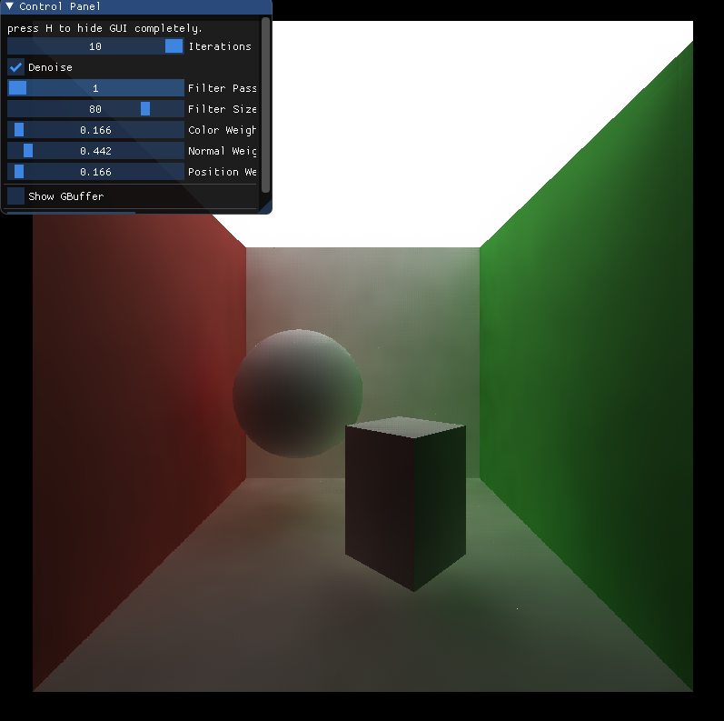

CUDA Denoiser for CUDA Path Tracer
==================================

**University of Pennsylvania, CIS 565: GPU Programming and Architecture, Project 4**

* Wayne Wu
  * [LinkedIn](https://www.linkedin.com/in/wayne-wu/), [Personal Website](https://www.wuwayne.com/)
* Tested on: Windows 10, AMD Ryzen 5 5600X @ 3.70GHz 32GB, RTX 3070 8GB (personal)

## Background

This project implements a **CUDA denoiser** based on the following paper: ["Edge-Avoiding A-Trous Wavelet Transform for fast Global Illumination Filtering,"](https://jo.dreggn.org/home/2010_atrous.pdf).

## Result

### Simple Blur
The A-Trous Wavelet filter is first implemented without any data weighting to achieve a simple blur effect. The result is compared to a Gaussian blur filter applied in GIMP.
There are some artifacts in this implementation most noticeable around the edges of the image. However, for the most part the blur effect is achieved properly and indicates that the wavelet kernel is working accordingly.

Original                   |  This Implementation        | GIMP
:-------------------------:|:-------------------------:|:-----------:
      |       |  

### G-buffer
For edge-avoiding weights, the normal and position data per-pixel are stored in the G-buffer. You can press the 1 or 2 key to conveniently switch between the normal, position visualization respectively.

Normal                     |  Position                    | Depth (Not Used)
:-------------------------:|:-------------------------:|:-----------:
          |        |     

### Blur with Edge-Avoiding (a.k.a Denoising)
Denoising is achieved by adding the effect of weights in the convolution.
The parameters are tuned to produce a desirably smooth output. 

Original            |  Simple Blur                     | Blur with Edge-Avoiding (Final Result)
:-------------------------:|:-------------------------:|:-----------:
   |        |  

### Custom Scenes
Scene         | Original             |  Denoised                 
:------------:|:------------------:|:-------------------------:
Suzanne       |   |       
Duck       |   |      

## Visual Analysis
### How visual results vary with filter size -- does the visual quality scale uniformly with filter size?

From the images below, we can see that the visual quality improves with increasing filter size.
However, they do not scale uniformly. There is a noticeable difference from 5x5 to 30x30. However, the difference is less significant from 30x30 to 60x60, and barely noticeable from 60x60 to 90x90.

5x5    |30x30                      |  60x60                     | 90x90
:-----:|:-------------------------:|:-------------------------:|:-----------:
|   |        |  

### How effective/ineffective is this method with different material types

The method is effective for diffuse materials and less effective for reflective materials.
As shown below, the denoised result for the diffuse scene is representable of the actual outcome.
However, in the specular scene, there is noticeable blurs in the reflected surface.

Material Type | Original             |  Denoised                 
:------------:|:------------------:|:-------------------------:
Diffuse       |   |       
Specular      |   |  

### How do results compare across different scenes? Does one scene produce better denoised results? Why or why not?

In general, the denoised result is dependent on how noisy the input image is. 
For the default Cornell scene with smaller light area, the path traced result at 10 iterations is still very noisy. As such, denoising does not really improve anything.
However, for the Cornell scene with ceiling light, the path tracer converges faster with larger light area and thus produce significantly less noisy image. Accordingly, the output of the denoiser is much better.

Scene | Original (10 Iterations)           |  Denoised                
:-----:|:------------------:|:-------------------------:
Cornell               |   |                           
Cornell Ceiling Light |   |       

## Performance Analysis

### How much time denoising adds to your renders
Since the denoising kernel is executed once during the last iteration of path tracing, the additional time from denoising is independent of the number of iterations that is run. The average time that denoising adds to the path tracer is about **8ms**.

  

### How denoising influences the number of iterations needed to get an "acceptably smooth" result
The purpose of denoising is to achieve the same smoothness/visual quality in image with less render iterations. Using a rendered image at 5000 iterations as the ground truth, we can see that the original input at 10 iterations is very noisy. Applying denoising at 10 iterations, we immediately remove most of the noise. There are noticeable differences around the edge and shadow areas of the scene, which is a known limitation outlined in the original paper. For the purpose of this project, we only look at smooth areas such as the walls and the floor for quality comparison. At 800 iterations of the path tracer, we roughly see the same amount of noise on the floor compared to the denoised version. As such, we consider 800 iterations as the acceptably smooth result, and thus the denoising reduces the required iterations for this specific example by **98.75%**!

Type    |Reference (5000 Iterations)     |  10 Iterations (Input)    |  Denoised (Output)   | 800 Iterations (Acceptably Smooth)          
:------:|:------------------:|:-------------------------:|:------------------:|:-------------------:
Image   |        |      |  | 
Diff    |        |   |  |      

### How denoising at different resolutions impacts runtime
The denoising time increases proportionally with increasing image resolution. 
From 800x800 to 1200x1200, there are 2.25x more pixels mapping to 2.18x increase in time.
Similarly, from 1200x1200 to 1600x1600, there are 1.78x more pixels mapping to 1.85x increase in time.

  

### How varying filter sizes affect performance
The denoising time increases with increasing filter size. With increasing filter size, more passes/iterations are required to expand the 5x5 B3-spline kernel to cover the filter/blur size.

  
