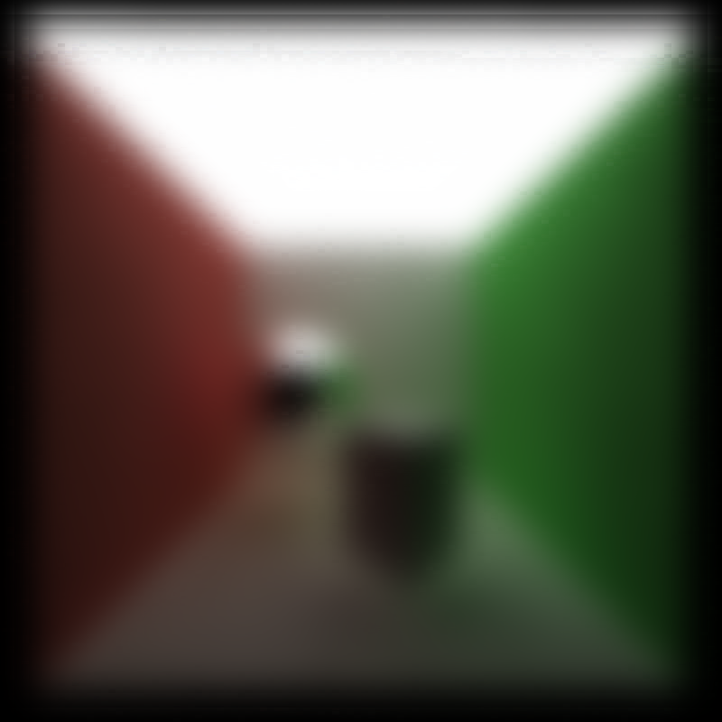
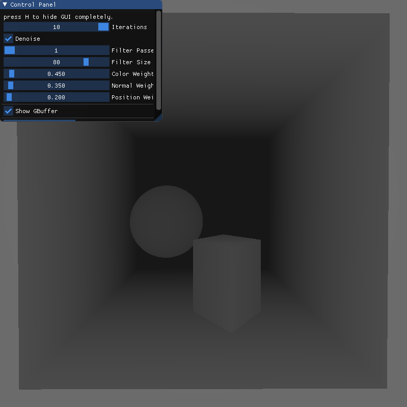

CUDA Path Tracer and Denoiser
================

**University of Pennsylvania, CIS 565: GPU Programming and Architecture, Project 3**

* Wayne Wu
  * [LinkedIn](https://www.linkedin.com/in/wayne-wu/), [Personal Website](https://www.wuwayne.com/)
* Tested on: Windows 10, AMD Ryzen 5 5600X @ 3.70GHz 32GB, RTX 3070 8GB (personal)

## Background

This is a GPU Path Tracer implemented in C++/CUDA with fundamental concepts from Physically-based Rendering (PBR) texts.
It allows loading GLTF files for meshes and their associated materials and textures.

## Screenshots
Duck            |  Damaged Helmet  | Flight Helmet  | Sponza
:-------------------------:|:-------------------------:|:--------------:|:-------:
   |   |   | 

## Basic Features

### Global Illumination
The first step was converting the naive shading method into a path tracer.
This allows for the global illumination effect to be achieved.

Before            |  After
:-------------------------:|:-------------------------:
   |  

### Basic Shading
Two basic shadings were implemented first: diffuse and perfect specular.
The diffuse component is shaded by generating new ray using cosine weighted random direction in a hemisphere.
The perfect specular uses `glm::reflect` to generate a perfectly reflected ray.

Diffuse            |  Perfect Specular
:-------------------------:|:-------------------------:
   |  

### Stream Compaction
The first optimization made is by removing the ray paths that have terminated using stream compaction.
In this case, we use the `thrust::stable_partition` kernel to partition paths based on completion.
This gives noticeable performance gain as less paths have to be processed by the kernel after each bounce.

Path Rays Remaining        |  Time
:-------------------------:|:-------------------------:
   |  

This optimization however is dependent on the scene being open, such that it is possible for a path to be terminated.
A closed scene will never allow the paths to terminate, therefore having no performance gain.

Path Rays Remaining        |  Time
:-------------------------:|:-------------------------:
   |  

### Paths Sorting
An attempt was made to optimize by sorting the intersection and ray paths based on materials for memory coalescing.
For this, the kernel `thrust::sort_by_key` is used to do key-value sorting.
However, this does not seem to impact the performance of the shading kernel as shown below. As such, the overall performance decreases due to the cost of sorting.
Additionally, all shading is done in one kernel, therefore there should be high chances of warp divergence for processing different materials.
No performance gain indicates that there may be little divergences and most materials are processed in similar execution fashion.
Perhaps introducing very distinctively different materials would make a bigger difference.

Test Scene       |  Shading Kernel Performance
:-------------------------:|:-------------------------:
   |  


### First Bounce Caching
Another optimization that's made is caching the intersection data for the first bounce (i.e. depth = 1). 
Since each ray starts at the same spot for each pixel, the first bounce result will always be the same for all iterations.
Although not significant, first bounce caching does make things slightly faster on average as shown in the chart below.

Test Scene       |  Time to each iteration
:-------------------------:|:-------------------------:
   |  

## GLTF Mesh Loading
In order to render more complex scenes, the system needs to support loading arbitrary mesh robustly.
As long as the system is sufficiently robust (e.g. able to handle multiple hierarchies), the complexity can be defined by the file format itself thus making the scene more visually interesting. **GLTF** was chosen as the scene description format as it is much more powerful than OBJ, and the fact that I have never worked with GLTF before and thought it would be a good opportunity to understand the specification.

To support GLTF mesh loading, I used [tinygltf](https://github.com/syoyo/tinygltf) to load in the GLTF file and parsed the data into custom `struct` data defined in `sceneStruct.cpp`. This step is necessary since the tinygltf classes are not GPU-compatible.
Additionally, in order to not have to deal with passing nested Struct Arrays to the GPU, each mesh vertex data is flattened into its own giant buffer containing the data for **all** meshes. 
The actual Mesh struct would only store the index offset for each data. This is similar to how GLTF/OpenGL defines VBOs, therefore there is opportunity to make the GLTF to GPU translation more direct.


## Metallic-Roughness Model
In order to support the material definition in GLTF 2.0, the default specular-gloss model needs to be converted to the metallic-roughness model.
In this implementation, a simplified implementation is used based on the idea of importance sampling.

### Metallic
The `metallicFactor` is interpreted as the probability for a surface to be specular. Below is the pseudo-code for the metallic logic:
```
isMetallic = uniformRandom(0,1) < metallicFactor
if isMetallic:
    specularShade
else
    diffuseShade
```

### Roughness
The `roughnessFactor` is interpreted as the variation amount in the reflected specular ray. This is based on PBR's microfacet model which introduces an imperfect specular ray instead of a perfect one.
The calculation and implementation for the imperfect specular ray is adopted from [GPU Gem 3, Chapter 20](https://developer.nvidia.com/gpugems/gpugems3/part-iii-rendering/chapter-20-gpu-based-importance-sampling).

GLTF provides a useful testing scene for different metallic and roughness values, as shown below with the implemented renderer.


## Texture
Most GLTF materials use textures instead of hardcoded albedo, metallic-roughness values. Naturally, it is important to implement the ability to load textures with GLTF.
Textures are loaded using `cudaTextureObj` and `cudaArray`, which allows multiple textures to be loaded at once and more optimized texture sampling.

### Texture Image
To read textures, we use the `Tex2D` built-in CUDA kernel.

No Texture (Red)        |  Textured
:-------------------------:|:-------------------------:
   |  

### Normal Mapping

Original       |  Normal Map              | Applied
:-------------------------:|:-------------------------:|:--------------------:
   |    |  

### Procedural Texture
Procedural texture can also be generated using a kernel. For example, a simple checkerboard pattern can be generated with the following algorithm:
```
(int(u) + int(v)) % 2 == 0 ? Color(1.f) : Color(0.f);
```

Baked       |  Procedural
:-------------------------:|:-------------------------:
   |  

On the right image, there's mildly noticeable aliasing indicating that it's the procedural generated one, whereas the baked texture is smoothly interpolated. Anti-aliasing can be fixed by optimizing the checkerboard algorithm, however it is not implemented here.

Performance Comparison


There's no significant different between the baked and procedural texture for the checkerboard pattern.
This suggests that using baked texture is most practically faster as the access speed is fixed regardless of texture pattern, 
whereas procedural texture is heavily dependent on the efficiency of the algorithm.

# Denoiser

### Simple Blur
The A-Trous Wavelet filter is first implemented without any data weighting to achieve a simple blur effect. The result is compared to a Gaussian blur filter applied in GIMP.
There are some artifacts in this implementation most noticeable around the edges of the image. However, for the most part the blur effect is achieved properly and indicates that the wavelet kernel is working accordingly.

Original                   |  This Implementation        | GIMP
:-------------------------:|:-------------------------:|:-----------:
      |       |  

### G-buffer
For edge-avoiding weights, the normal and position data per-pixel are stored in the G-buffer. You can press the 1 or 2 key to conveniently switch between the normal, position visualization respectively.

Normal                     |  Position                    | Depth (Not Used)
:-------------------------:|:-------------------------:|:-----------:
          |        |     


### Blur with Edge-Avoiding (a.k.a Denoising)
Denoising is achieved by adding the effect of weights in the convolution.
The parameters are tuned to produce a desirably smooth output. 

Original            |  Simple Blur                     | Blur with Edge-Avoiding (Final Result)
:-------------------------:|:-------------------------:|:-----------:
   |        |  


### Custom Scenes
Scene         | Original             |  Denoised                 
:------------:|:------------------:|:-------------------------:
Suzanne       |   |       
Duck       |   |      

## Visual Analysis
### How visual results vary with filter size -- does the visual quality scale uniformly with filter size?

From the images below, we can see that the visual quality improves with increasing filter size.
However, they do not scale uniformly. There is a noticeable difference from 5x5 to 30x30. However, the difference is less significant from 30x30 to 60x60, and barely noticeable from 60x60 to 90x90.

5x5    |30x30                      |  60x60                     | 90x90
:-----:|:-------------------------:|:-------------------------:|:-----------:
|   |        |  


### How effective/ineffective is this method with different material types

The method is effective for diffuse materials and less effective for reflective materials.
As shown below, the denoised result for the diffuse scene is representable of the actual outcome.
However, in the specular scene, there is noticeable blurs in the reflected surface.

Material Type | Original             |  Denoised                 
:------------:|:------------------:|:-------------------------:
Diffuse       |   |       
Specular      |   |  

### How do results compare across different scenes? Does one scene produce better denoised results? Why or why not?

In general, the denoised result is dependent on how noisy the input image is. 
For the default Cornell scene with smaller light area, the path traced result at 10 iterations is still very noisy. As such, denoising does not really improve anything.
However, for the Cornell scene with ceiling light, the path tracer converges faster with larger light area and thus produce significantly less noisy image. Accordingly, the output of the denoiser is much better.


Scene | Original (10 Iterations)           |  Denoised                
:-----:|:------------------:|:-------------------------:
Cornell               |   |                           
Cornell Ceiling Light |   |       


## Performance Analysis

### How much time denoising adds to your renders
Since the denoising kernel is executed once during the last iteration of path tracing, the additional time from denoising is independent of the number of iterations that is run. The average time that denoising adds to the path tracer is about **8ms**.

  

### How denoising influences the number of iterations needed to get an "acceptably smooth" result
The purpose of denoising is to achieve the same smoothness/visual quality in image with less render iterations. Using a rendered image at 5000 iterations as the ground truth, we can see that the original input at 10 iterations is very noisy. Applying denoising at 10 iterations, we immediately remove most of the noise. There are noticeable differences around the edge and shadow areas of the scene, which is a known limitation outlined in the original paper. For the purpose of this project, we only look at smooth areas such as the walls and the floor for quality comparison. At 800 iterations of the path tracer, we roughly see the same amount of noise on the floor compared to the denoised version. As such, we consider 800 iterations as the acceptably smooth result, and thus the denoising reduces the required iterations for this specific example by **98.75%**!

Type    |Reference (5000 Iterations)     |  10 Iterations (Input)    |  Denoised (Output)   | 800 Iterations (Acceptably Smooth)          
:------:|:------------------:|:-------------------------:|:------------------:|:-------------------:
Image   |        |      |  | 
Diff    |        |   |  |      

### How denoising at different resolutions impacts runtime
The denoising time increases proportionally with increasing image resolution. 
From 800x800 to 1200x1200, there are 2.25x more pixels mapping to 2.18x increase in time.
Similarly, from 1200x1200 to 1600x1600, there are 1.78x more pixels mapping to 1.85x increase in time.

  

### How varying filter sizes affect performance
The denoising time increases with increasing filter size. With increasing filter size, more passes/iterations are required to expand the 5x5 B3-spline kernel to cover the filter/blur size.

  

# References
* https://www.khronos.org/files/gltf20-reference-guide.pdf
* https://docs.nvidia.com/cuda/cuda-c-programming-guide/index.html#texture-object-api
* https://pbr-book.org/3ed-2018/Texture/Solid_and_Procedural_Texturing
* https://learnopengl.com/Advanced-Lighting/Normal-Mapping 
* https://developer.nvidia.com/gpugems/gpugems3/part-iii-rendering/chapter-20-gpu-based-importance-sampling 
* https://www.cs.upc.edu/~virtual/G/1.%20Teoria/06.%20Textures/Tangent%20Space%20Calculation.pdf