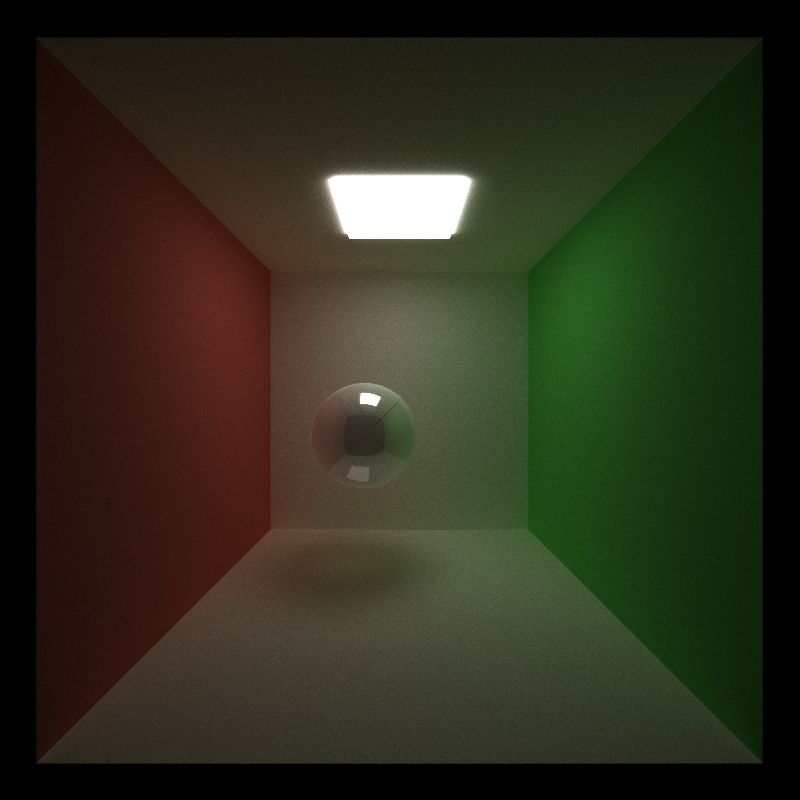
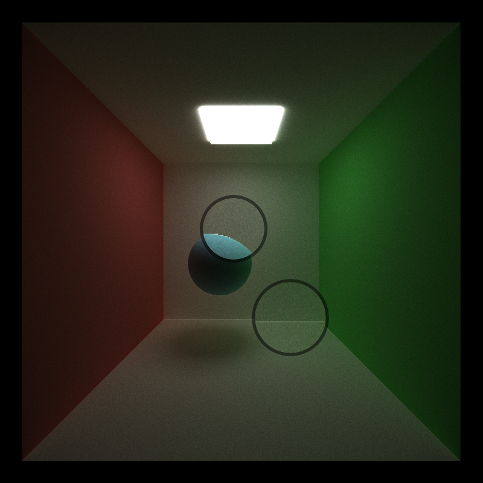
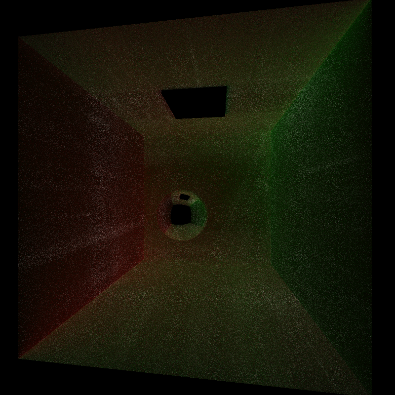
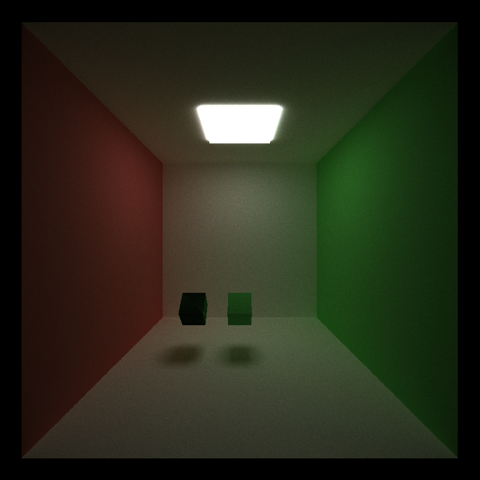

CUDA Path Tracer
================

**University of Pennsylvania, CIS 565: GPU Programming and Architecture, Project 3**

* Yichao Wang
  * [LinkedIn](https://www.linkedin.com/in/wangyic/) 
* Tested on: Windows 10 Home 64-bit (10.0, Build 18363)
  * Intel(R) Core(TM) i7-7700HQ CPU @ 2.80GHz (8 CPUs)
  * GeForce GTX 1060	6.1

## Demo

### Excalibur


Rendered using [fate.txt](scenes/fate.txt)

Excalibur model credit to [Terallis](https://sketchfab.com/3d-models/excalibur-fatestay-night-c7cb6fb3ada742e894f891ad18be1db4)

Rock model credit to [BenDelamore](https://sketchfab.com/3d-models/a-rock-c49139dbab5e4c498c225b56cca30466)

### Torii


Rendered using [torii.txt](scenes/torii.txt)

Torii model credit to [kazukisakamoto
](https://sketchfab.com/3d-models/torii-7c4d9c93946a41a2a73468b74436705b)

## Genshin Impact


Rendered using [genshin2.txt](scenes/genshin2.txt)

Environment stone credit to [SamanthaMB](https://sketchfab.com/3d-models/textured-game-environment-3a3c90194d35484f9b18b192c95341bf)

Wolf's Gravestone model credit to [Le Ryan](https://sketchfab.com/3d-models/genshin-impact-wolfs-gravestone-e71a938e02904b14abace9ce10078711)


Genshin Impact model credit to [José Castanheira](https://sketchfab.com/3d-models/genshin-impact-scene-fa345e2979544abe94fa05acf1d62f4b)
## Description

A CUDA-based path tracer.

Feature Implemented:

* Visual
    * Shading kernel with BSDF evaluation (diffuse, reflect & refract)
    * Stochastic Sampled Antialiasing
    * Stratified Cosine hemisphere sampling
    * Texture mapping and Bump mapping
* Mesh
    * GLTF mesh loading using tinygltf
* Performance
    * Path termination using streaming compaction
    * Material sorting
    * First bounce caching


## Feature Analysis


## Visual

### Shading Kernel with BSDF Evaluation (diffuse, reflect & refract)

|Diffuse | Reflect |
|-|-|
| | |

|Reflect + Refract | Diffuse + Reflect + Refract |
|-|-|
| | |

I implmented BSDF evaluation for different materials (diffuse, reflect & refract). For diffuse material, the ray is scattered using [cosine hemisphere sampling](#stratified-cosine-hemisphere-sampling)
. For reflect material, the ray is scattered using ```glm::reflect```. For refract material, the ray is scattered using Schlick's approximation. For multiple effect on one surface, I choose them based on probability defined in scene file. Before scattering rays, I [sorted material](#material-sorting) for better CUDA performance.

### Stochastic Sampled Antialiasing

|Without Antialiasing| With Antialiasing|
|--|--|
| | |

The path tracer runs multiple iterations (the images in [demo](#demo) uses 5000 iterations) to converge the final image. I implemented Stochastic sampled antialiasing by jittering the rays when generating them at first bounce of each iteration. Thus, the final pixels will average its surrounding color. From above comparision, we can see antialiasing has a better result. However, the antialiasing sacrifice the performance of [first bounce caching](#first-bounce-caching) because they should be different at each interation.

### Stratified Cosine Hemisphere Sampling

|Random|Stratified|
|----|----|
||

I implemented stratified cosine hemisphere sampling to make render result better than purely random sampling. A stratified sampling is a combination of uniform and random that is samples a random point in each grid. The stratified sampling is implmented using  [Peter Shirley's method](https://pdfslide.net/documents/a-low-distortion-map-between-disk-and-square.html).
The above results shows uses two cosine hemisphere sampling to generate next path's direction. We can see that random sampling has some unexpected white pixel while stratified sampling is fine.

### Texture mapping and Bump mapping

|Texture (296 ms/iter)|Texture + Bump (303 ms/iter) | Procedural Texture (300 ms/iter)|
|-|---|---|
| | |

The path tracer support for texture and bump mapping based on [GLTF mesh](#mesh). From above result, we can see there are more details for the mesh with bump mapping. I also implemented a simple procedural texture for performance comparision but it seems there is not much difference.

## Mesh

### GLTF Mesh Loading and Rendering with Bounding Volume Intersection Culling

The path tracer support simple GLTF mesh loading by using [tinygltf](https://github.com/syoyo/tinygltf/). I parsed each mesh into triangles and perform ```glm::intersectRayTriangle``` on each triangles. I also performed a simple bounding volume intersection culling so that triangles will be checked only if a ray intersect the mesh's bounding box. For furture improvement, we should use hierarchical spatial data structures such as Octree for the culling. 

GLTF format is very comprehensive and complicate. The current path tracer only support simple mesh loading with basic color texture and normal map texture. There are a lot more features to explore!

## Performance

The following performance analysis uses [cornell.txt](scenes/cornell.txt).

### cornell.txt render result:


### Path termination using streaming compaction

I implemented streaming compaction by using ```thrust::partition``` to separate the paths based on their living status so that the path tracer will continue with only the alive path. Thus, it will save us recourses by running fewer CUDA threads as the depth increase. In addition, we can also end the path tracer earlier if no thread is alive.

Plot1:


From Plot1, for open scene such as cornell.txt, we can see that the number of remaining thread become smaller as the ray bounces and finally become 0 once it reaches maximum depth. This is because the ray will terminate if it hit a light or it hit nothing. However, in a closed scene, the ray always has an intersection and it will only terminate when it hit light. Thus, the streaming paction is not useful for a closed scene because it only affects terminated rays. For reference, the average time cost for open scene is about 47 ms while it's about 96 ms for closed scene.

Plot2:


From Plot2, we can see that the performance increases as max depth increases when using streaming compaction. The time cost linearly increases when turning off streaming compaction. When max depth is 8, the cost for streaming compaction is more. This is because partition path also takes time.

### Material sorting

After computing the intersections, we want to sort them based on their materials before shading because we are using one big shading kernel. We can access the contigous memory with sorted intersections when perform shading. This improves performance because we decrease divergence in each warp. For reference, at max depth 8, the average time cost for material sorting is about 47 ms while it is about 60 ms without the sorting.

### First bounce caching

The path tracer runs multiple iterations to converge the final result. Without antialiasing, the first bounces at each iteration is the same. So I cached first bounce intersections at first iteration so that we do not need to generate them again at the first bounce for the other iteration. For reference, at max depth 8, the average time cost for first bounce caching is about 45 ms while it is about 47 ms without the caching.


## Blooper


failed path trace




failed refract material


failed bsdf sampling

