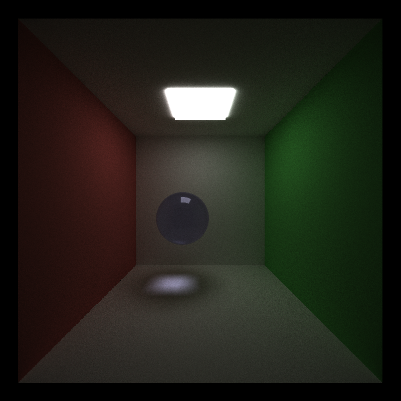
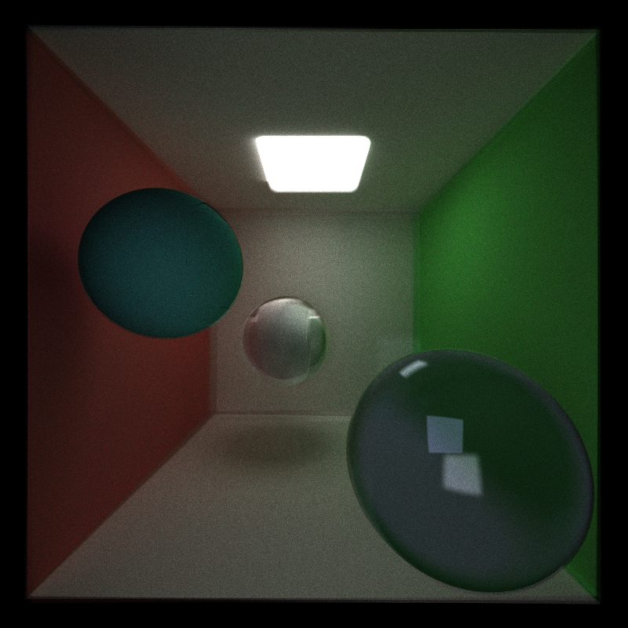

CUDA Path Tracer
================

**University of Pennsylvania, CIS 565: GPU Programming and Architecture, Project 3**

* Lindsay Smith
*  [LinkedIn](https://www.linkedin.com/in/lindsay-j-smith/), [personal website](https://lindsays-portfolio-d6aa5d.webflow.io/).
* Tested on: Windows 10, i7-11800H 144Hz 16GB RAM, GeForce RTX 3060 512GB SSD (Personal Laptop)

## Features
* Basic pathtracer
* Refractive, Reflective, and Diffused surfaces
* Anti-Aliasing
* OBJ Loading (work in progress)
* Depth of Field (work in progress)

This pathtracer utilized [Physically Based Rendering](https://pbr-book.org/) for reference

### Materials
Diffused: The diffused material randomly selects a direction for the ray to bounce.

Specular (Reflective): The specular material reflects the ray across the normal, so there is a set direction that the ray will bounce in every time.

Refractive: The refractive material was implemented using Schlick's approximation for Fresnel effects. 

### Anti-Aliasing
In the first photo we can see the step-like edge of the sphere, but in the second one where anti-aliasing has been implemented it appears more smooth. This was implemented by slightly jittering the ray origin when calculating the direction. This provides the slight blur that we see around the edges of the sphere.

 

### OBJ Loading
My OBJ loader is still a work in progress, but I was able to load a cube obj and have it appear in this simple example as an emmissive surface (light source). When dealing
with more complicated surfaces there are issues with the way the shapes appear. I believe this is due to the way the triangles are being loaded, but I am not entirely sure how to fix it yet. I used [tinyObj](https://github.com/tinyobjloader/tinyobjloader) to implement this.

### Depth of Field
For the depth of field we want to be able to shift the focus of our camera so that only certain parts of the image appear in focus. My implementation for this is not without flaws, but we can see how some areas are blurred. There is a slight distortion of the shapes that I am still working on fixing.

A bit too far:

