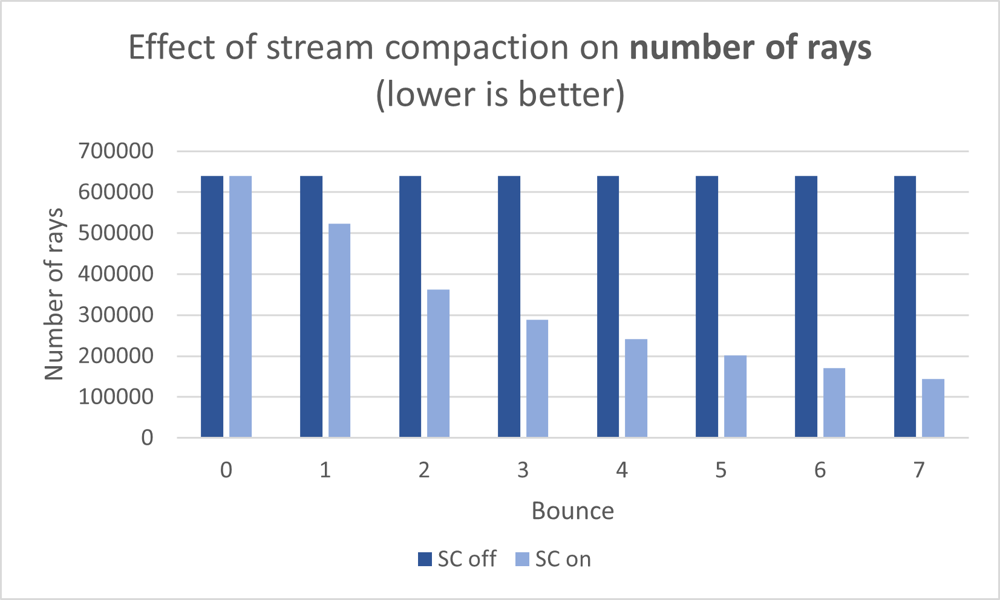

**University of Pennsylvania, CIS 565: GPU Programming and Architecture**
# Project 3 - CUDA Path Tracer

* Jonas Oppenheim ([LinkedIn](https://www.linkedin.com/in/jonasoppenheim/), [GitHub](https://github.com/oppenheimj/), [personal](http://www.jonasoppenheim.com/))
* Tested on: Windows 10, Ryzen 9 5950x, 32GB, RTX 3080 (personal machine)

<figure>

<figcaption align="center"><b>Image 1: Abduction A</b></figcaption>
</figure>

<figure>

<figcaption align="center"><b>Image 2: Abduction B </b></figcaption>
</figure>

## Introduction

In the simulation that we call reality, photon [waves/particles](https://en.wikipedia.org/wiki/Double-slit_experiment) flow from light sources and bounce around the physical world. If we're interested in generating photo-realistic images by modeling this behavior of light, then it is most efficient to only model the few photons that reach our eyeballs. This is the idea behind path tracing. The procedure is as follows. Every iteration, fire one ray into the scene for every pixel. Allow each of these rays to bounce around the scene a certain number of times (depth). At every bounce, change the ray's color and direction based on the material it hit. If a ray hits a light source, stop bouncing it. So there is a notion of _iterations_, which is the number of times a set of rays is shot into the scene, and of _depth_, which is how many bounces are permitted per ray per iteraton. Multiple iterations are required because for a given pixel, the ray's path from iteration to iteration will likely be different because rays do not reflect from most materials deterministically. The following three images show a section of pixels after 1, 10, and 100 iterations. It is seen that over time, each pixel converges to its "correct" color.

<center>

| 1 iteration | 10 iterations | 100 iterations |
|---|---|---|
||||

</center>

The following image shows the variety of features implemented in this project. The next section covers qualitative and quantitative descriptions of these features.

<figure>

<figcaption align="center"><b>Image 3: Feature list</b></figcaption>
</figure>

## Description and analysis of features

<figure align="center">

<figcaption align="center"><b>Image 4: Test image for stream compaction, material sorting, and first-bounce caching</b></figcaption>
</figure>

### Stream compaction
The purpose of stream compaction is to efficiently remove elements matching a particlar criteria from an array. Stream compaction is essentially high performacne filtering. This is useful in the context of path tracing because if a ray has zero bounces left, then that ray no longer needs to be processed.

Stream compaction performance analysis was test on Image 3 using `thrust::stable_partition`. The canvas was 800x800 pixels and the bounce depth was eight. Invocations of both the `computeIntersections` and `shadeMaterial` kernels were timed for each bounce of each iteration between iteratons 30 and 50, which warmed up the cache and smoothed the results.

Within a particular iteration, rays bounce around up to a certain number of times, but are terminated early if they don't hit anything. The expectation was that removing these early terminated rays would result in smaller and therefore faster kernel invocations. Indeed, Figure 1 shows that kernels run faster with stream compaction and Figure 2 shows why: later bounces have fewer and fewer rays.

It is worth mentioning that stream compaction itself took approximately 13,000 microseconds, which is far longer than it took any of the kernels to run. For a scene the size of the one tested, there is a net performance loss. For a larger image, though, there improvement in kernel performance is likely to outweigh the cost of running stream compaction every bounce.

<figure align="center">

<figcaption align="center"><b>Figure 1</b></figcaption>
</figure>

<figure align="center">

<figcaption align="center"><b>Figure 2</b></figcaption>
</figure>

### Material sorting
The idea behind material sorting is to sort our rays and intersections by the material that was hit. This way, threads within warps are more likely to take similar logical paths through kernel conditionals and there will be fewer warp divergences. Figure 3 shows that indeed, when material sorting is enabled, performance improves for both kernels.

It is obvious why sorting by material made the shadeMaterials kernel run faster. The shadeMaterials kernel represents the BSDF that has a bunch of if-else statements depending on the material type. But within an iteration, the material sorting actually happens _after_ computeIntersections, so it was surprising to see such an improvement. I believe that running computeIntersections during subsequent bounces benefits for the same reason, namely that rays that hit the same material are likely to intersect with similar objects later in the scene.

It is noteworthy that running `thrust::stable_sort_by_key` takes 50,167 microseconds, which means that it results in a net decrease in performance. Still, it was useful to implement to see that it speeds up these kernel calls.

<figure align="center">

<figcaption align="center"><b>Figure 3</b></figcaption>
</figure>

### Cache first bounce
Recall that path tracing involves many iterations of shooting rays into the scene and those rays bounce up to a certain number of times. The reason to cache the first bounce is that every iteration, the initial bounce of each ray will be the every time. It is only later bonuces that are non-deterministic, since some materials reflect light randomly. We can save time by caching the first bounce into a separate buffer of global memory during the first iteration and then loading that cache during subsequent iterations.

The following values are based on Image 2. The first iteration's invocation of computeIntersections and subsequent writing to the cache took 295 and 114 microseconds, respectively. Later iterations only took 154 microseconds to load the first bounce from the cache. So based on the image tested, it takes twice as long to compute the intersections as it does to load from the cache. This difference would be even greater if the scene included a more complex mesh. Obviously, the benefits of first-bounce caching become harder and harder to detect as the number of bounces increase because more and more time is spent having to run computeIntersections anyway.


### Arbitrary mesh loading
The initial codebase supported spawning only cubes and spheres. These shapes were generated without loading `.obj` files and without any representation of vertices, faces, triangles, or anything in memory. Instead, the code simply used the geometric properties of cubes and spheres to determine whether a ray headed in a particular direction from a particular location would intersect the object. The goal of this feature was to be able to spawn objects in the scene using `.obj` files.

The [tinyobjloader](https://github.com/tinyobjloader/tinyobjloader) library was used to parse an `.obj` file into a set of `Triangle` structs (each `Triangle` is 60 bytes). The cow mesh has 5,803 triangles and the UFO mesh has 3,854 triangles. These triangles are organized into an octree before being loaded onto the GPU, which is detailed next.
<figure align="center">

<figcaption align="center"><b>Image 5: Meshes loaded</b></figcaption>
</figure>

### Octree

An [octree](https://en.wikipedia.org/wiki/Octree#:~:text=An%20octree%20is%20a%20tree,three%2Ddimensional%20analog%20of%20quadtrees.) is a space partitioning data structure that makes it faster to determine if a ray intersects a mesh of triangles, and if so, which exact triangle. The tree root represents the entire bounding box around the mesh. The root's eight children represent eight subdivisions of the mesh's bounding box. These subdivisons are recursively subdivided a chosen number of times. Then, each triangle in the mesh is associated with one or more boxes that the triangle intersects.

In order to quickly find the triangle(s) intersected by a particular ray, start at the root and test whether the ray intersects the bounding box. If yes, do the same check on each child bounding box. Repeat this, recursively, until you reach some number of leaf nodes. At that point, you can see whether the ray intersects any of those triangles that the leaf nodes point to. This is a major improvement because the number of triangles searched grows logarithmically instead of linearly.

<figure align="center">

<figcaption align="center"><b>Figure 4</b></figcaption>
</figure>

After generating the set of `Triangle` structs, the goal was to build an octree and then insert each `Triangle`, associating it with one or more leaf nodes.

The octree was represented linearly, as an array, where the eight children of node `i` are found starting at position `8*i+1`. For example, the root is stored at index `0` and its children are at indices `1` through `8`. In addition, an octree of depth `d` has `(8^d-1)/7` nodes, so an octree of depth 1 is just the root which represents the bounding box. Octrees of depth `2`, `3`, and `4` have `9`, `73`, and `585`, nodes respectively.

The process of inserting the `Triangle` structs is similar to the process described for querying for intersections; we recursively ask whether a node contains the triangle. If yes, query each of the child nodes. Repeat until one or more leaf is reached.

I'd like to share one particularly pernicious bug that stumped me for longer than I am willing to admit. While inserting triangles into the tree, you have to have some way of determining if a node _contains_ that triangle. My initial approach was to determine whether the node contained any of the three points representing the triangle. If yes, associate the triangle with the node. Image 7 shows the result of this approach for a tree of depth 5. The problem got worse the deeper I made the tree. I thought it might be a stack or heap size issue because I used recurison in my computeIntersection kernel.

<figure align="center">

<figcaption align="center"><b>Image 7: Octree bug</b></figcaption>
</figure>

It turns out that as the node volumes got smaller and smaller, certain triangles were intersecting nodes _but didn't have any point in the node_, so they weren't getting associated properly. The solution was to _yoink_ and adapt the triangle-cube intersection formula from [here](https://github.com/juj/MathGeoLib/blob/master/src/Geometry/Triangle.cpp#L697). Live and learn.

Image 6 shows the scene used to test various octree depths. Figure 5 shows that there is a significant beneift to adding depth (granularity) to the tree until a depth of three, and then the querying becomes burdensome. I suspect that this result could have to do with thread stack size, since the recursion depth gets deeper the deeper the tree gets. Also, the deeper the tree, the more nodes a single triangle intersects, so there end up actually being a lot of node checks.

<figure align="center">

<figcaption align="center"><b>Image 6: Test image for octree</b></figcaption>
</figure>

<figure align="center">

<figcaption align="center"><b>Figure 5</b></figcaption>
</figure>

### Refraction with Fresnel effect
Refraction was fun and relatively painless to implement. Using `glm::refract()` made it pretty easy. The most interesting part was realizing how to determine if a ray was intersecting a mesh triangle from the "inside" or "outside". The solution is to compute the angle between the triangle's normal and the ray's direction. If this angle is greater than 90 degrees, then the ray must have hit the outside of the triangle. This handy dandy formula takes care of it:
```
float ang = glm::acos(glm::dot(r.direction, normal) / (glm::length(r.direction) * glm::length(normal)));
bool outside = glm::degrees(ang) > 90;
```

<figure align="center">

<figcaption align="center"><b>Image 7: Refraction with Fresnel effect</b></figcaption>
</figure>

As for the Fresnel effect, I used the function that I found [here](https://blog.demofox.org/2017/01/09/raytracing-reflection-refraction-fresnel-total-internal-reflection-and-beers-law/) and then did probabilistic thresholding using R.

### Custom Python script for generating scene files
It became tiresome editing the scene `.txt` files and making sure the various objects pointed to the correct materials, and making sure the numbering on objects and materials was correct. I wrote a Python script, located in `/scenes/scenegenerator.py`, which made it much easier to automatically generate these files and retain sanity.


## Concluding thoughts

<figure align="center">

<figcaption align="center"><b>me irl</b></figcaption>
</figure>

## Refrences
- Ray-triangle intersection function from [here](https://en.wikipedia.org/wiki/M%C3%B6ller%E2%80%93Trumbore_intersection_algorithm)
- Triangle-box intersection function from [here](https://github.com/juj/MathGeoLib/blob/master/src/Geometry/Triangle.cpp#L697)
- Fresnel effect function from [here](https://blog.demofox.org/2017/01/09/raytracing-reflection-refraction-fresnel-total-internal-reflection-and-beers-law/)
- How to actually use `thrust` from [here](https://stackoverflow.com/questions/12047961/cuda-thrust-how-to-realize-partition-that-supports-stencil)