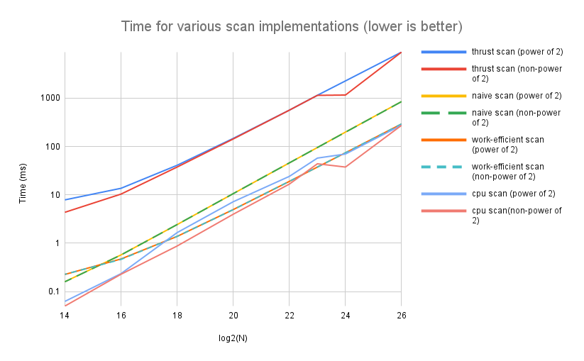
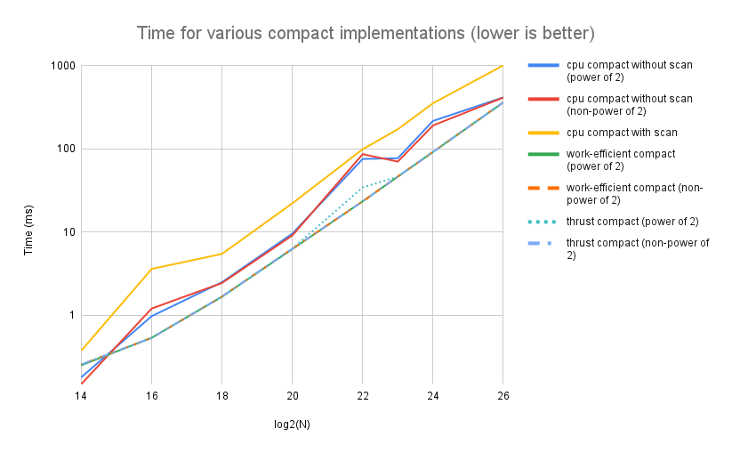
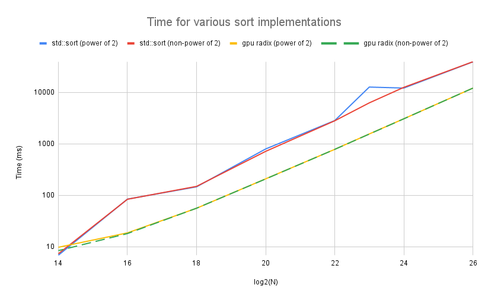

CUDA Stream Compaction and Radix Sort
========================================

**University of Pennsylvania, CIS 565: GPU Programming and Architecture, Project 2**

* Kaan Erdogmus
  * [LinkedIn](https://linkedin.com/in/kaanberk), [personal website](https://kaan9.github.io)
* Tested on: Windows 10, i7-8850H @ 2.592GHz 24GB, Quadro P1000

## Project Overview
This project parallelized several sequential but associative array operations on the GPU. These operations, at first glance,
are highly sequential but can be made parallel by effectively breaking them up to smaller terms, calculating the results on the
subarrays and joining them by taking advantage of the associative nature of the operation.

The most fundamental of these operations is `scan`. `scan` is like the familiar `reduce` operation from functional languages but
also produces intermediary calculations that can be used for other algorithms. Such an operation implemented
in this project is `compact`, which removes elements from an array satisfying a specified predicate. The `scan`
operation can also be used to implement sorting, with `radix sort`, which is also implemented as a part of this project.

Another potential application of `scan` (and `compact`) is decoding/encoding UTF-8 text (implementation work-in-progress), which is detailed below.

This project contains a custom templating library `cVec.h` written to provide an easier to use abstraction over CUDA memory management calls.

## Features Implemented
* Scan CPU implementation
* Compact CPU implementation
* Naive GPU Scan implementation `O(n log n)`
* Optimized Work-Efficient GPU Scan implementation `O(n)`
* GPU Stream Compaction
* `thrust`'s implementation of scan and compact (for comparison)
* Radix Sort
* UTF-8 decoding (work-in-progress)
* Templating library for GPU memory `cVec.h`
* Naive CPU-parallel scan implementation (written in Go)

## Scan
The scan algorithm for an array `a, b, c, ...` produces an array of partial sums `0, a, a+b, a+b+c, ...` (for exclusive-scan) or
`a,a+b, a+b+c,...` (for inclusive-scan) where `+` is an arbitrary associative operator and `0` is the zero value for the type of the elements.

The CPU implementation simply iterates over the array, keeping a sum of all elements thus far, saves it to the appropriate location in a new array and adds the next element from the source array. As such, it has `O(n)` operations performed.

The naive GPU implementation, in parallel, for each element adds the value preceding it, then the value 2 before it, then 4 before
it, and so on. This produces an inclusive scan. There are `log(n)` steps and each step performs `n-1`, `n-2`, `n-3`, etc. operations so there are `O(n log(n))` operations performed.

The work efficient scan implementation, in parallel, first adds to every other position the value that immediately precedes it, then to every 4th position, the value that precedes it by 2, then to every 8th position the value that precedes it by 4 elements and so on. This (for arrays whose length is a power of 2), results in the final element being the sum of all original elements. The structure is similar to a binary tree where only the left child's value is preserved (and the right child becomes the element itself). To produce an array of partial sums, a down-sweep operation is performed which, after setting the top of the tree (the last element) to 0, goes down the tree, moving the value of the left child to the current node and adding the (previous) value of the current node to the left child. The down-sweep is parallelized for each layer of the tree.

The implementation of scan is templated to allow for both int and byte input arrays (byte array used for UTF-8 decoding).

### Performance Analysis


As shown in the diagram, the CPU implementation of scan is measured to clearly dominate for array sizes smaller than `2^16` with the Work-efficient implementation fully catching up at `2^26`. Furthermore, there is a clear difference in performance between the naive and work-efficient scans as expected since the naive implementation performs an asymptotically greater number of operations.

## Compact
The compact operation, given an input array and a predicate on the elements, produces an array of all elements not satisfying the
predicate, effectively removing elements not fitting a criteria. This is performed by first mapping the input to an array of bools (where an element to be kept produces `true`), scanning the array of bools which yields the indices the kept elements should go
in the compacted array, and finally scattering the original elements into the new array by using the indices calculated (and performing a write only if the element does not satisfy the predicate).

### Performance Analysis


Starting with a size of `2^16`, the GPU implementations are clearly superior to the CPU implementations of compact and the work-efficient implementation of compact closely matches `thrust`'s implementation.

## Radix Sort
Radix sort is a sorting algorithm for elements that can be readily grouped together into chunks. Specifically, this implementation
considers the bits 0 through 31 of the integers of the input array (negative values not considered). For a given bit, radix sort moves the elements of the array so that they are sorted with respect to that bit. Performing this through all the bits produces an
array of integers that is fully sorted.

To sort a particular bit, the `split` operations is performed which extracts and inverts the relevant bit of each element into an array of bools, then scans this array, calculates the number of total false bits from the last element of this array. Then, a new array of positionsis constructed where if the selected bit is false for an element, it is mapped to the scanned value. Otherwise it is mapped to `index - f + total_false` where `f` is the scanned array.  This produces an array of (unique) positions, which we
can use to scatter the original inputs to places where they are sorted with respect to the bit.

This implementation of radix sort operates on the entire array at once, not using shared memory.

### Performance Analysis


Starting with array sizes of `2^16`, the radix sort implementation is distinctly faster than the comparison-based `std::sort` implementation.

## UTF-8 encoding (work-in-progress)
The following is (to the best of my knowledge) a novel method for decoding/encoding UTF-8 using CUDA, inspired by a [branchless UTF-8 Decoder](https://nullprogram.com/blog/2017/10/06/) on the CPU.

For background regarding UTF-8 representation and encoding, refer to https://en.wikipedia.org/wiki/UTF-8.

### Decode
UTF-8 text is represented as a sequence of bytes where the start of each code-point has a special binary representation, distinct from other bytes (this allows UTF-8 to be _self-synchronizing_). Furthmore, each code-point uses 1 to 4 bytes and the structure of first byte in each code-point also indicates the number of bytes in that code-point. As such, we can use a mapping followed by a scan to distribute the code-points to an expanded array of groups of 4 bytes, where each code-point is distributed to a group of 4 bytes with the leading bytes zeroed (e.g. a code-point consisting of a single byte is mapped to a group of 4 where the first 3 bytes are 0 and the last byte is the code-point's byte). Then, these groups of 4 bytes can be converted to the decoded int32 representation in parallel. The algorithm is as follows:
1. Map each byte to the offset it should have from the previous byte in the expanded (4-byte) representation. For example,
a byte of the form `0xxxxxxx` is a code-point with just one byte, and therefore maps to 4 (as it occupies the 4th position of the 4 bytes with the preceding 3 empty). Similarly the non-leading bytes `10xxxxxx` map to 1, the 2-byte code-point's first byte
`110xxxxx` maps to 3 and so on.
2. Perform an inclusive scan on the offsets to get the global offsets of each element (with respect to -1).
3. Zero out an array large enough to contain the expanded (4-byte) representation and scatter each byte of the input using the
global offsets calculated.
4. For every pair of 4-bytes, convert them from the expanded representation to the numerical value of the code-point (ideally by using the branchless-decode algorithm).

Steps 1-3 are currently implemented. The 4th step in particular can be made more efficient by producing a second array of lengths of the code-points (can also be implemented using scan), then using the lengths to find the byte (of the 4-bytes) where the expanded code-point begins and performing the branchless UTF-8 decode, storing the result in an array of `uint`s.

For an input size of `n`, the decoder performs `O(n)` total operations.

The current design could be extended to error handling. Specifically, we could have a kernel spawned per byte of input,
which analyzes the byte to check if it is at the start of a code-point and if so, checks if the following bytes complete
the code-point in a valid way and if that's the case, writes a 1 to a corresponding array of bools. Then, we could invert the array of bools and using it as a key, run compact on the input array to remove the
bytes that are not part of valid code-points, producing a valid UTF-8 array. The difference in length between the
original and compacted array gives the number of invalid bytes removed.

Alternatively, it might be more desirable to explicitly show the incorrect bytes in the output, for example by
substituting the Unicode Replacement Character � (U+FFFD). This can be accomplished by first determining all invalid
bytes in the input as described above, then selecting the expansion offset as +4 (similar to the original algorithm),
and then modifying the subsequent kernel call that compacts the bits so that it checks for invalid input and
substitutes the U+FFFD character.

### Encoder (not yet implemented)

UTF-8 encode can also be performed using compact. Parallelize on the level of code-point (one kernel per code-point).
The kernel should read the code-point, determine how many bytes (1 to 4) are needed for its UTF-8
representation, and always output 4 bytes, substituting 0xFFFF (an invalid sequence in unicode) for the leading extra bytes, then compact can be run on the output (with a predicate of matching 0xFFFF) to remove this padding, producing a valid UTF-8 representation.

As an added bonus, the encoder can quite trivially detect invalid characters (any numerical value larger than 0x10FFFF, corresponding to code-point U+10FFFF) and substitute the Unicode Replacement character � (U+FFFD).


## Test Output
N = 2^24
```
****************
** SCAN TESTS **                                                                                                        ****************
[  40  24   0  29  16  10   6   0  10  10   7  10  15 ...  38   0 ]
==== cpu scan, power-of-two ====
elapsed time: 54.4685ms    (std::chrono Measured)
[   0  40  64  64  93 109 119 125 125 135 145 152 162 ... 386716816 386716854 ]
==== cpu scan, non-power-of-two ====                                                                                       
elapsed time: 67.3799ms    (std::chrono Measured)                                                                       
[   0  40  64  64  93 109 119 125 125 135 145 152 162 ... 386716768 386716800 ]                                         
passed                                                                                                              
==== naive scan, power-of-two ====                                                                                         
elapsed time: 197.895ms    (CUDA Measured)                                                                               
passed                                                                                                              
==== naive scan, non-power-of-two ====                                                                                     
elapsed time: 197.504ms    (CUDA Measured)                                                                               
passed                                                                                                              
==== work-efficient scan, power-of-two ====                                                                                
elapsed time: 74.3567ms    (CUDA Measured)                                                                               
passed                                                                                                              
==== work-efficient scan, non-power-of-two ====                                                                            
elapsed time: 74.111ms    (CUDA Measured)                                                                                
passed                                                                                                              
==== thrust scan, power-of-two ====                                                                                        
elapsed time: 2229.07ms    (CUDA Measured)                                                                               
passed                                                                                                              
==== thrust scan, non-power-of-two ====                                                                                    
elapsed time: 2224.75ms    (CUDA Measured)                                                                               
passed                                                                                                                              
*****************************                                                                                           
** STREAM COMPACTION TESTS **   
*****************************                                                                                               
[   0   1   2   0   0   2   2   3   0   0   0   0   3 ...   0   0 ]                                                 
==== cpu compact without scan, power-of-two ====                                                                           
elapsed time: 167.942ms    (std::chrono Measured)                                                                        
[   1   2   2   2   3   3   2   1   3   2   2   1   2 ...   3   2 ]                                                     
passed                                                                                                              
==== cpu compact without scan, non-power-of-two ====                                                                       
elapsed time: 267.453ms    (std::chrono Measured)                                                                        
[   1   2   2   2   3   3   2   1   3   2   2   1   2 ...   1   3 ]                                                     
passed                                                                                                              
==== cpu compact with scan ====                                                                                            
elapsed time: 364.678ms    (std::chrono Measured)                                                                        
[   1   2   2   2   3   3   2   1   3   2   2   1   2 ...   3   2 ]                                                     
passed                                                                                                              
==== work-efficient compact, power-of-two ====                                                                             
elapsed time: 92.2182ms    (CUDA Measured)                                                                               
passed                                                                                                              
==== work-efficient compact, non-power-of-two ====                                                                         
elapsed time: 91.914ms    (CUDA Measured)                                                                                
passed                                                                                                              
==== thrust compact, power-of-two ====                                                                                     
elapsed time: 91.914ms    (CUDA Measured)                                                                                
passed                                                                                                              
==== thrust compact, non-power-of-two ====                                                                         
elapsed time: 91.914ms    (CUDA Measured)                                                                                
passed                   

*****************************                                                                                           
** RADIX SORT TEST **                                                                                                 
*****************************    
[ 2176510 238971848 427268424 345874100 22071882 53876664 93690960 91803616 16555815 541773164 18448217 67772704 508518232 ... 32860010 272354542 ]
==== cpu radix using std::sort, power of two ====                                                                          
elapsed time: 13524.7ms    (std::chrono Measured)                                                                        
[   0   0   0   0   0   0   0   0   0   0   0   0   0 ... 1072890000 1072988290 ]                                   
==== cpu radix using std::sort, non-power of two ====                                                                      
elapsed time: 12362.3ms    (std::chrono Measured)                                                                        
[   0   0   0   0   0   0   0   0   0   0   0   0   0 ... 1072890000 1072988290 ]                                   
==== gpu radix, power of two ====                                                                                         
elapsed time: 3073.04ms    (CUDA Measured)                                                                               
[   0   0   0   0   0   0   0   0   0   0   0   0   0 ... 1072890000 1072988290 ]                                
passed                                                                                                        
==== gpu radix, non-power of two ====                                                                        
elapsed time: 3074.25ms    (CUDA Measured)                                                                  
[   0   0   0   0   0   0   0   0   0   0   0   0   0 ... 1072890000 1072988290 ]                        
passed

```
Notes
---------
CMakeLists.txt has been edited to add the new dependencies `radix_sort.h`, `radix_sort.cu`, `utf-8.h`, and `utf-8.cu`.
